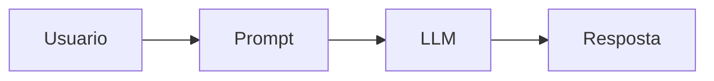
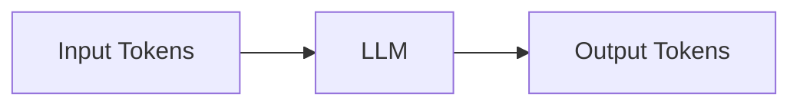
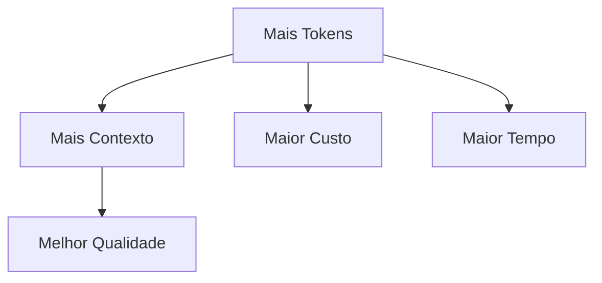
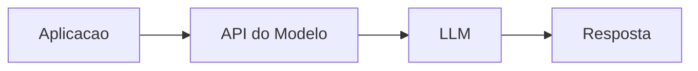

## O que é engenharia de prompt?

Engenharia de prompt é o processo de estruturar instruções para que modelos de IA produzam respostas melhores, mais consistentes e mais úteis.

Embora pareça algo simples, pequenas mudanças na forma de escrever um prompt podem alterar significativamente o comportamento do modelo.

### Fluxo básico



---

## Como escrever prompts melhores

Uma das principais boas práticas é evitar prompts vagos.

Modelos respondem melhor quando recebem:

* contexto;
* objetivos claros;
* restrições;
* formato esperado;
* exemplos.

---

## Estrutura recomendada

Uma abordagem eficiente é separar o prompt em blocos.

### Estrutura comum

| Bloco    | Objetivo                         |
| -------- | -------------------------------- |
| Papel    | Define o comportamento do modelo |
| Contexto | Explica o cenário                |
| Regras   | Restrições e prioridades         |
| Formato  | Estrutura esperada da resposta   |

---

## Exemplo de prompt estruturado

```text
Você é um especialista em marketing digital para SaaS.

Contexto:
- Produto: aplicativo financeiro
- Público: iniciantes

Regras:
- Seja direto
- Dê exemplos práticos
- Evite teoria desnecessária

Responda no formato:
- Estratégia:
- Exemplo:
- Prioridade:
```

---

## Boas práticas para prompts

### Seja específico

Prompts muito genéricos normalmente geram respostas genéricas.

Quanto mais contexto relevante o modelo recebe, maior tende a ser a qualidade da resposta.

---

### Use linguagem imperativa

Exemplos:

```text
Você é um especialista em infraestrutura.
```

```text
Explique em passos curtos.
```

---

### Divida instruções em tópicos

Estruturas organizadas funcionam melhor do que textos longos e confusos.

---

### Reforce regras importantes

Se determinada regra for crítica, vale repetir.

Exemplo:

```text
Não invente informações.
```

---

### Diga o que não fazer

Restrições negativas ajudam bastante.

Exemplo:

```text
Evite respostas muito teóricas.
```

---

## Técnicas de engenharia de prompt

Existem diversas técnicas utilizadas para melhorar respostas.

---

## Few-shot prompting

No *few-shot prompting*, fornecemos exemplos antes da tarefa principal.

Isso ajuda o modelo a entender:

* formato;
* estilo;
* comportamento esperado.

### Exemplo

```text
Entrada: Produto simples
Saída: Explicação objetiva

Entrada: Produto avançado
Saída: Explicação técnica
```

---

## Chain-of-thought

A técnica *chain-of-thought* incentiva o modelo a resolver problemas passo a passo.

### Exemplo

```text
Explique o raciocínio em etapas.
```

---

## Prompt refinement

Prompt refinement consiste em melhorar prompts progressivamente.

### Fluxo


---

## Output format control

Outra técnica importante é controlar o formato da saída.

### Exemplo

```text
Responda no formato:
- Problema
- Solução
- Exemplo
```

Isso facilita:

* automação;
* leitura;
* integração entre sistemas.

---

## Context injection

Context injection consiste em fornecer contexto adicional relevante.

### Exemplo

```text
Considere que o sistema possui milhares de usuários simultâneos.
```

---

## Como evitar respostas genéricas

Se a resposta estiver muito superficial:

* adicione contexto;
* seja mais específico;
* forneça exemplos;
* limite ambiguidades.

---

## Como reduzir alucinações

Modelos podem inventar informações.

Algumas técnicas ajudam a reduzir esse problema.

### Estratégias

| Estratégia           | Objetivo                   |
| -------------------- | -------------------------- |
| Restrições negativas | Evitar invenções           |
| Prioridades          | Precisão > criatividade    |
| Contexto específico  | Reduz ambiguidades         |
| Structured outputs   | Respostas mais controladas |

---

## O que são tokens?

Tokens são unidades de texto utilizadas pelos modelos para processar entrada e saída.

Tokens não representam exatamente palavras.

Eles podem representar:

* partes de palavras;
* símbolos;
* espaços;
* números.

### Exemplo simplificado

```text
"programação"
```

pode ser dividido em múltiplos tokens.

---

## Tokens de entrada e saída

### Input tokens

Incluem:

* prompt;
* código;
* arquivos;
* histórico da conversa.

---

### Output tokens

Representam a resposta gerada pelo modelo.

---

## Fluxo de tokens



---

## Janela de contexto

Cada modelo possui um limite máximo de tokens.

Esse limite é chamado de:

```text
Janela de contexto
```

Ela representa quanto o modelo consegue “lembrar” durante a conversa.

---

## Mais tokens nem sempre é melhor

Mais contexto pode melhorar respostas, mas também aumenta:

* custo;
* tempo de processamento;
* latência.

### Relação entre tokens



---

## Como otimizar tokens

### 1. Seja específico

Prompts enormes nem sempre melhoram respostas.

---

### 2. Defina limite de resposta

Exemplo:

```text
Responda em no máximo 5 tópicos.
```

---

### 3. Use novos chats para novos contextos

Conversas muito longas podem degradar qualidade.

---

### 4. Escolha o modelo adequado

Nem toda tarefa exige modelos avançados.

---

## Structured Outputs

Structured Outputs forçam o modelo a responder em formatos estruturados.

Exemplos:

* JSON;
* XML;
* schemas.

Isso reduz ambiguidades e facilita integração entre sistemas.

---

## Onde structured outputs são utilizados?

### Casos comuns

* APIs;
* automação;
* pipelines;
* classificação;
* extração de dados;
* workflows;
* integração com banco de dados.

---

## Exemplo JSON

```json
{
  "problema": "Erro de autenticação",
  "causa": "Token expirado",
  "solucao": "Gerar novo token"
}
```

---

## Fluxo de structured outputs


---

## Integração via API

LLMs normalmente são utilizados através de APIs.

O fluxo básico funciona assim:

1. Aplicação envia prompt;
2. Modelo processa;
3. API retorna resposta.

---

## Fluxo de integração



---

## Casos de uso comuns

### Aplicações práticas

* geração de código;
* automação de tarefas;
* chatbots;
* extração de dados;
* classificação textual;
* análise de documentos.

---

## Boas práticas para APIs

### Structured outputs

Utilize respostas estruturadas sempre que possível.

---

### Validação no backend

Nunca confie totalmente na resposta do modelo.

---

### Controle de tokens

Limitar tokens ajuda a reduzir custos.

---

### Tratamento de erros

Implemente retries e validações.

---

### Escolha adequada do modelo

Use modelos simples para tarefas simples.

---

## Parâmetros importantes

### Max tokens

Limita o tamanho da resposta.

#### Exemplo

```text
max_output_tokens=250
```

---

### Frequency penalty

Reduz repetição de palavras.

#### Exemplo

```text
frequency_penalty=0.3
```

---

### Presence penalty

Incentiva respostas mais variadas.

#### Exemplo

```text
presence_penalty=0.2
```

---

## Temperatura

Temperatura controla criatividade e previsibilidade.

### Temperatura baixa

```text
0.1 - 0.3
```

Mais precisa e determinística.

Indicada para:

* respostas técnicas;
* dados factuais;
* automação.

---

### Temperatura média

```text
0.5 - 0.7
```

Equilíbrio entre criatividade e coerência.

---

### Temperatura alta

```text
1.0+
```

Mais criatividade e aleatoriedade.

Útil para:

* brainstorming;
* escrita criativa.

Entretanto, aumenta risco de alucinações.

---

## Diferenças entre modelos

Cada modelo possui características diferentes.

Alguns focam em:

* raciocínio;
* velocidade;
* geração de código;
* multimodalidade;
* análise de documentos.

Além disso, modelos evoluem rapidamente.

Por isso, mais importante do que decorar rankings é entender:

* qual tarefa precisa ser resolvida;
* custo;
* velocidade;
* qualidade esperada.

---

## Overthinking em IA

Nem toda tarefa exige modelos extremamente avançados.

Usar modelos complexos para tarefas simples pode:

* aumentar custo;
* aumentar latência;
* desperdiçar recursos.

Escolher o modelo correto para cada tarefa é uma das práticas mais importantes.

---

## Conclusão

LLMs se tornaram ferramentas extremamente importantes para desenvolvimento moderno de software.

Entretanto, obter bons resultados depende não apenas do modelo utilizado, mas também da qualidade dos prompts, controle de tokens, estrutura das respostas e integração adequada.

Compreender conceitos como:

* engenharia de prompt;
* structured outputs;
* APIs;
* tokens;
* parâmetros do modelo;

ajuda a construir aplicações mais eficientes, previsíveis e escaláveis.

Além disso, saber equilibrar contexto, custo e qualidade se tornou uma habilidade importante no uso de IA generativa.

---

## Referências

### Engenharia de prompt

* [https://www.promptingguide.ai/pt/introduction/examples](https://www.promptingguide.ai/pt/introduction/examples)
* [https://medium.com/@habbema/engenharia-de-prompt-c422c12cbd21](https://medium.com/@habbema/engenharia-de-prompt-c422c12cbd21)

### Tokens

* [https://ai.google.dev/gemini-api/docs/tokens?hl=pt-br&lang=python](https://ai.google.dev/gemini-api/docs/tokens?hl=pt-br&lang=python)
* [https://help.openai.com/pt-br/articles/4936856-what-are-tokens-and-how-to-count-them](https://help.openai.com/pt-br/articles/4936856-what-are-tokens-and-how-to-count-them)

### Structured outputs

* [https://developers.openai.com/api/docs/guides/structured-outputs](https://developers.openai.com/api/docs/guides/structured-outputs)
* [https://platform.claude.com/docs/en/build-with-claude/structured-outputs](https://platform.claude.com/docs/en/build-with-claude/structured-outputs)
* [https://ai.google.dev/gemini-api/docs/structured-output](https://ai.google.dev/gemini-api/docs/structured-output)

### APIs

* [https://developers.openai.com/api/docs](https://developers.openai.com/api/docs)
* [https://ai.google.dev/api?hl=pt-br](https://ai.google.dev/api?hl=pt-br)

### Temperatura

* [https://gpt.space/pt/blog/how-to-use-openai-model-temperature-for-better-ai-chat-responses](https://gpt.space/pt/blog/how-to-use-openai-model-temperature-for-better-ai-chat-responses)
