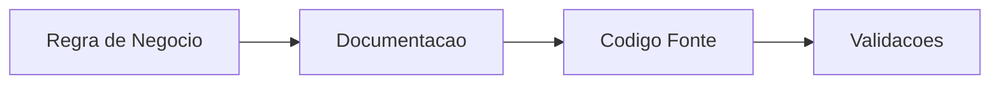
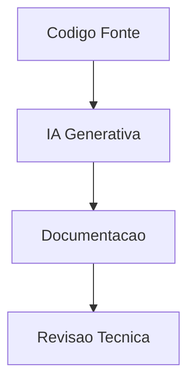
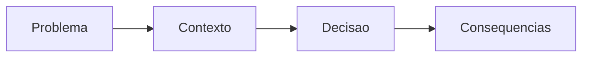
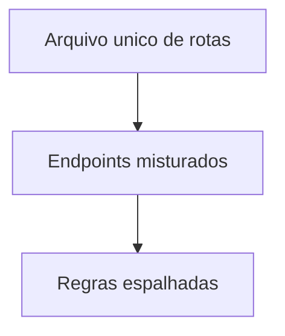
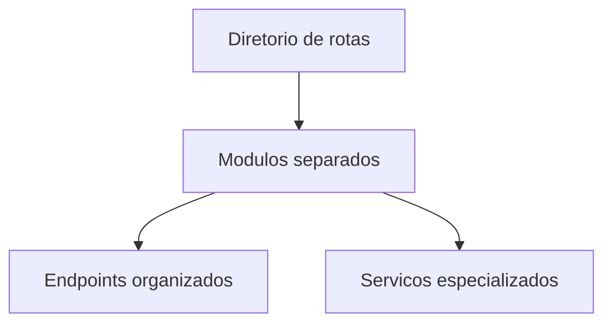
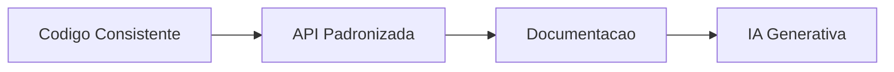

## O problema da documentação em aplicações reais

Muitos sistemas possuem regras importantes implementadas diretamente na lógica da aplicação, mas sem documentação centralizada.

Isso pode gerar problemas como:

* dificuldade de manutenção;
* quebra de regras durante refatorações;
* retrabalho;
* onboarding mais lento;
* inconsistência entre módulos;
* dependência de conhecimento informal.

Em aplicações maiores, regras de negócio frequentemente ficam espalhadas entre:

* models;
* services;
* rotas;
* validações;
* middlewares;
* testes.

Sem uma documentação clara, entender o comportamento real do sistema pode exigir bastante leitura de código.

---

## Documentação de regras de negócio

Uma alternativa interessante é criar uma documentação voltada especificamente para desenvolvedores.

O objetivo não é substituir documentação de usuário, mas centralizar regras importantes do sistema.

### Exemplo de regra

> Um cupom de desconto só pode ser utilizado em compras acima de R$100. Caso o cupom seja do tipo frete grátis, ele não pode ser combinado com outros descontos.

Essa regra pode impactar:

* validações;
* cálculo de preços;
* checkout;
* integração com pagamentos.

Sem documentação centralizada, esse tipo de comportamento pode passar despercebido durante futuras alterações.

---

## Rastreabilidade entre documentação e código

Uma prática útil é criar rastreabilidade entre:

* o que a regra faz;
* onde ela é aplicada.

Isso facilita localizar:

* arquivos relacionados;
* validações;
* serviços;
* regras críticas.

### Estrutura proposta



---

## Estrutura sugerida para documentação

Uma possibilidade é:

1. Criar uma pasta `docs/`;
2. Criar arquivos Markdown específicos para regras de negócio;
3. Manter documentação enxuta;
4. Facilitar revisão;
5. Evitar excesso de informações irrelevantes.

---

## Modelo de documentação

| Campo          | Objetivo              |
| -------------- | --------------------- |
| Nome           | Identificação rápida  |
| Regra          | Explicação objetiva   |
| Quando ocorre  | Contexto da regra     |
| Onde no código | Arquivos relacionados |
| Impactos       | Áreas afetadas        |

---

## Exemplo prático

```markdown
## Uso de cupom promocional

### Regra
Cupons promocionais só podem ser utilizados em compras acima de R$100.

### Exceções
Cupons de frete grátis não podem ser combinados com outros descontos.

### Onde no código
- services/payment_service.py
- validators/coupon_validator.py
- models/order.py
```

---

## Benefícios da documentação técnica

Documentação de regras de negócio pode trazer diversos benefícios.

### Principais vantagens

| Benefício    | Impacto                                |
| ------------ | -------------------------------------- |
| Onboarding   | Novos devs entendem regras rapidamente |
| Refatoração  | Menor risco de quebrar regras          |
| Manutenção   | Regras centralizadas                   |
| Reutilização | Consultas rápidas                      |
| Comunicação  | Melhor alinhamento técnico             |

---

## IA generativa aplicada à documentação

Ferramentas de IA generativa podem ajudar bastante no processo de documentação técnica.

A IA pode auxiliar em:

* geração de docstrings;
* revisão de documentação;
* criação de diagramas;
* geração de fluxos;
* atualização de arquivos Markdown;
* estruturação de ADRs;
* comparação entre documentação e código.

---

## Exemplos de uso de IA

### Docstrings automáticas

Uma possibilidade é pedir para IA documentar módulos importantes.

#### Exemplo

```text
Documenta a API pública de services/payment_service.py
```

---

### Diagramas e fluxos

A IA também pode auxiliar na criação de diagramas Mermaid.

#### Exemplo

```text
Descreva o fluxo de finalização de compra em Mermaid.
```

---

### Atualização de documentação durante refatoração

Outro uso interessante:

```text
Refatora o módulo de pagamentos e atualiza README e docs/regras-de-negocio.md caso alguma regra seja alterada.
```

---

## Revisão automática de documentação

Também é possível utilizar IA para comparar documentação com código.

### Exemplo

```text
Compare docs/regras-de-negocio.md com services/ e validators/ e informe possíveis inconsistências.
```

---

## Fluxo de documentação com IA



---

## AGENTS.md e instruções para IA

Alguns projetos utilizam arquivos como `AGENTS.md` para orientar ferramentas de IA sobre:

* padrões do projeto;
* convenções;
* organização;
* boas práticas;
* regras importantes.

Entretanto, existe um cuidado importante:

⚠️ Quanto mais especificações forem adicionadas, maior tende a ser o consumo de tokens.

Por isso, a recomendação é manter regras:

* objetivas;
* reutilizáveis;
* enxutas;
* relevantes.

---

## ADRs e documentação arquitetural

ADRs (*Architecture Decision Records*) ajudam a registrar decisões técnicas importantes.

Eles documentam:

* problema;
* contexto;
* decisão tomada;
* consequências;
* alternativas consideradas.

### Estrutura de um ADR



---

## IA e Design Docs

Design Docs também podem ser fortalecidos com IA.

A IA pode:

* estruturar documentos;
* resumir discussões;
* gerar diagramas;
* explicar impactos arquiteturais;
* transformar reuniões em documentação.

Isso ajuda bastante em:

* planejamento;
* revisão técnica;
* comunicação entre equipes.

---

## Padronização de APIs

Outro ponto importante é a padronização das APIs.

Antes de uma boa documentação, é importante que o código possua consistência.

Boas práticas comuns incluem:

* modularização;
* padronização de respostas;
* organização de rotas;
* tratamento consistente de erros;
* nomenclaturas previsíveis.

---

## Exemplo de modularização de rotas

### Antes



---

### Depois



Outras melhorias comuns em APIs incluem:

* versionamento;
* padronização de endpoints;
* nomenclaturas consistentes;
* documentação Swagger/OpenAPI;
* padronização de retornos;
* automação CLI.

Entretanto, alterações em APIs precisam ser realizadas com cautela, principalmente quando existem integrações externas.

---

## Relação entre documentação e APIs

Documentação e padronização caminham juntas.

APIs inconsistentes dificultam:

* manutenção;
* onboarding;
* automação;
* geração de documentação;
* integração entre sistemas.

### Fluxo ideal



---

## Conclusão

Documentação técnica não deve ser vista apenas como complemento do projeto.

Em aplicações maiores, documentar regras de negócio, fluxos e decisões arquiteturais ajuda diretamente na manutenção e evolução do sistema.

Além disso, ferramentas de IA generativa podem contribuir significativamente na criação, atualização e revisão de documentação.

Entretanto, IA não substitui revisão técnica humana. O ideal é utilizar IA como ferramenta auxiliar para acelerar processos e melhorar consistência.

Por fim, documentação, padronização de APIs e organização arquitetural formam uma base importante para projetos sustentáveis e de longo prazo.

---

## Links

* [https://medium.com/@jhonywalkeer/guia-completo-sobre-architecture-decision-records-adr-defini%C3%A7%C3%A3o-e-melhores-pr%C3%A1ticas-f63e66d33e6](https://medium.com/@jhonywalkeer/guia-completo-sobre-architecture-decision-records-adr-defini%C3%A7%C3%A3o-e-melhores-pr%C3%A1ticas-f63e66d33e6)
* [https://medium.com/@zarantonello/padroniza%C3%A7%C3%A3o-de-api-18164ff980a7](https://medium.com/@zarantonello/padroniza%C3%A7%C3%A3o-de-api-18164ff980a7)
* [https://dev.to/diegobrandao/padronizacao-de-respostas-de-erro-em-apis-com-rfc-9457-implementando-no-spring-framework-4kk0](https://dev.to/diegobrandao/padronizacao-de-respostas-de-erro-em-apis-com-rfc-9457-implementando-no-spring-framework-4kk0)
