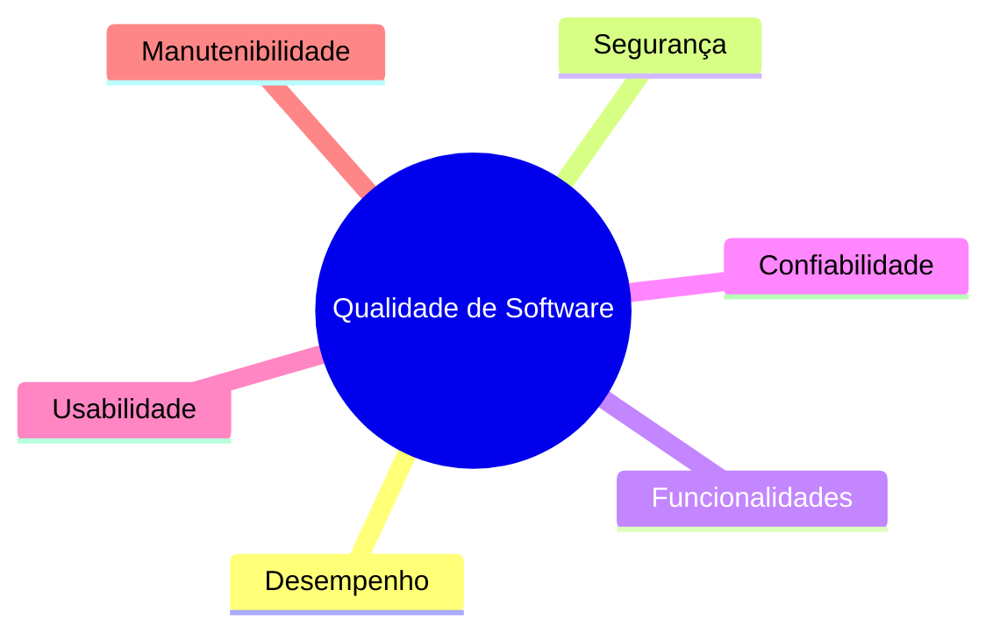
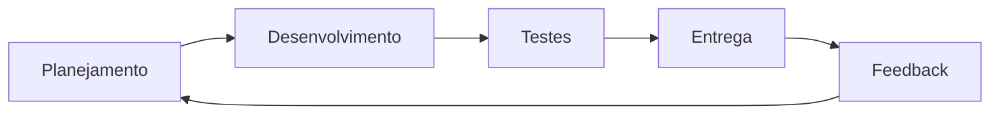
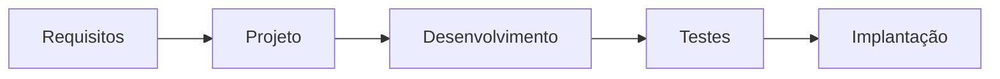
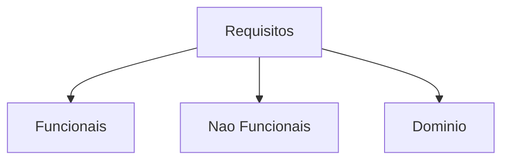
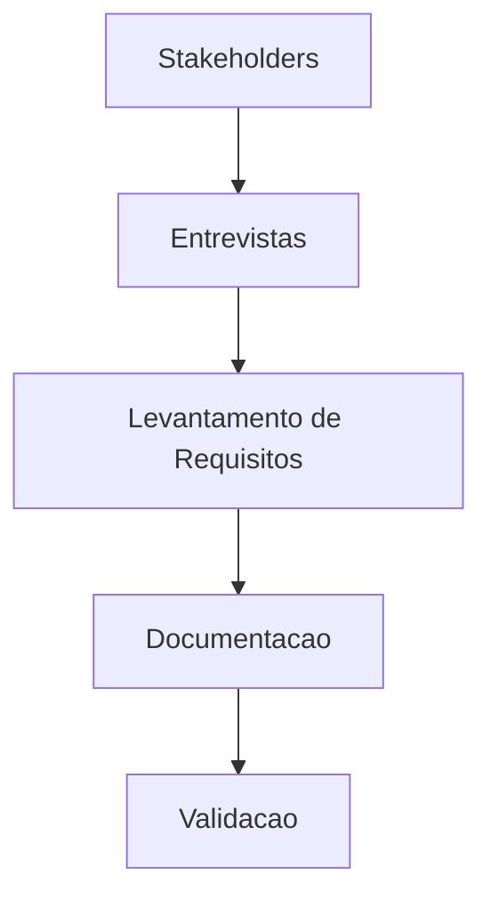
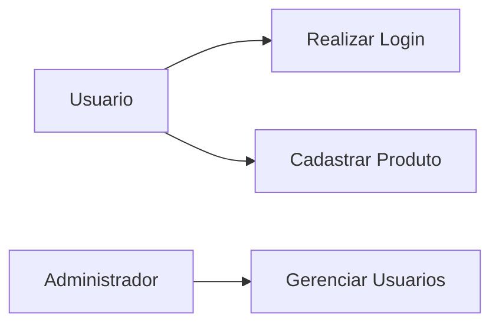
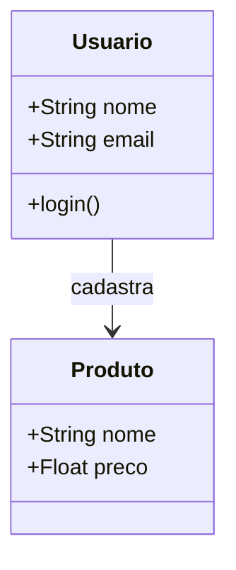
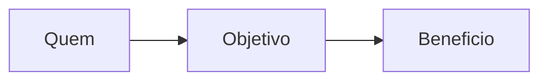
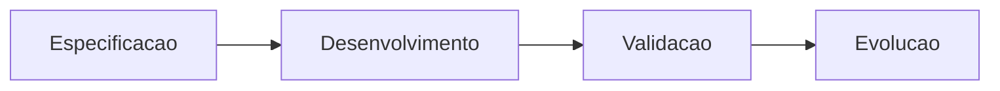
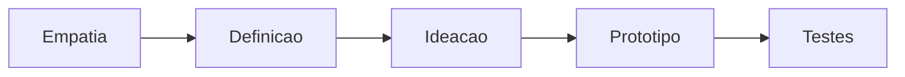

A engenharia de software surgiu como resposta à crescente complexidade dos sistemas computacionais. Conforme empresas e usuários passaram a depender cada vez mais de software no cotidiano, tornou-se necessário organizar processos, definir padrões e criar metodologias capazes de garantir qualidade, segurança e eficiência durante o desenvolvimento.

Hoje, a engenharia de software não envolve apenas programação. Ela engloba planejamento, comunicação com stakeholders, levantamento de requisitos, validação, documentação, manutenção e evolução contínua dos sistemas.

Neste artigo, vamos explorar os principais conceitos da engenharia de software, suas metodologias, tipos de requisitos e como ocorre o processo de desenvolvimento de um software.

---

## O que é Engenharia de Software?

A engenharia de software é o conjunto de métodos, práticas e ferramentas utilizadas para desenvolver software de maneira organizada, previsível e sustentável.

Ela surgiu para resolver problemas comuns em projetos de tecnologia, como:

* atrasos em entregas;
* estouro de orçamento;
* falta de documentação;
* baixa qualidade dos sistemas;
* dependência excessiva de um único desenvolvedor;
* dificuldade de manutenção.

Além disso, a área busca garantir que o software atenda às necessidades dos usuários e mantenha qualidade ao longo de todo o seu ciclo de vida.

> Um software não deve apenas funcionar: ele precisa ser confiável, seguro, utilizável e fácil de evoluir.

---

## Qualidade de Software

Quando falamos em qualidade de software, não estamos nos referindo apenas à ausência de bugs.

A qualidade está relacionada a diversos fatores importantes:

| Aspecto          | Descrição                                                 |
| ---------------- | --------------------------------------------------------- |
| Desempenho       | O sistema responde de maneira rápida e eficiente          |
| Funcionalidades  | O software entrega o que foi prometido                    |
| Segurança        | Os dados e operações estão protegidos                     |
| Confiabilidade   | O sistema funciona corretamente de forma consistente      |
| Usabilidade      | O usuário consegue utilizar o sistema com facilidade      |
| Manutenibilidade | O software pode ser atualizado e corrigido com facilidade |

### Relação entre os pilares da qualidade

---

## Regras de negócio

As regras de negócio representam normas, padrões e restrições que o software deve seguir.

Essas regras definem como o sistema deve funcionar dentro do contexto da empresa ou organização.

### Exemplos de regras de negócio

* um cliente não pode realizar compras sem cadastro;
* um boleto só pode ser gerado após aprovação do pagamento;
* um usuário menor de idade não pode acessar determinados conteúdos;
* contratos possuem cláusulas específicas que precisam ser respeitadas.

As regras de negócio são fundamentais porque conectam a tecnologia às necessidades reais da empresa.

---

## Metodologias de Desenvolvimento

Existem diferentes formas de organizar o desenvolvimento de software. Essas abordagens são conhecidas como metodologias.

### Metodologias Ágeis

As metodologias ágeis surgiram para tornar o desenvolvimento mais rápido, flexível e adaptável.

Entre as metodologias mais populares estão:

* Scrum
* Kanban
* XP (Extreme Programming)

### Principais características do modelo ágil

* ciclos curtos de desenvolvimento;
* entregas rápidas e frequentes;
* comunicação constante;
* adaptação a mudanças;
* foco no cliente.

### Fluxo simplificado de um processo ágil

---

### Modelo Cascata

O modelo cascata segue uma abordagem sequencial.

Nesse modelo, cada etapa precisa ser concluída antes que a próxima seja iniciada.

Apesar de mais rígido, o modelo cascata ainda é utilizado em projetos que exigem alta previsibilidade e documentação detalhada.

---

## Requisitos de Software

Os requisitos definem o que o sistema precisa fazer e quais restrições ele deve seguir.

Essa etapa é extremamente importante, porque erros na definição de requisitos podem comprometer todas as fases seguintes do projeto.

### Tipos de requisitos

| Tipo                  | Objetivo                                  |
| --------------------- | ----------------------------------------- |
| Funcionais            | Definem o que o sistema faz               |
| Não funcionais        | Definem como o sistema deve funcionar     |
| Requisitos de domínio | Representam regras específicas do negócio |

### Estrutura dos requisitos

### Exemplos

#### Requisito funcional

> O sistema deve permitir login de usuários.

#### Requisito não funcional

> O sistema deve responder em até 2 segundos.

#### Requisito de domínio

> Apenas administradores podem excluir usuários.

---

## Engenharia de Requisitos

A engenharia de requisitos é a área responsável por compreender as necessidades dos usuários e stakeholders.

Seu objetivo é garantir que o sistema seja desenvolvido corretamente desde o início.

### Técnicas de levantamento de requisitos

Algumas técnicas muito utilizadas são:

* entrevistas;
* questionários;
* observação do usuário;
* workshops;
* análise documental.

### Processo simplificado de levantamento

### Por que essa etapa é importante?

Quanto mais cedo um erro é encontrado, menor o custo para corrigi-lo.

Problemas descobertos apenas durante o desenvolvimento ou após a entrega podem gerar retrabalho, atrasos e prejuízos.

---

## UML e documentação

Antes de desenvolver um sistema, é comum utilizar diagramas para representar visualmente sua estrutura e comportamento.

A UML (Unified Modeling Language) é uma das linguagens mais utilizadas para modelagem de software.

### Alguns diagramas comuns da UML

| Diagrama               | Objetivo                                          |
| ---------------------- | ------------------------------------------------- |
| Caso de uso            | Representar interações do usuário com o sistema   |
| Diagrama de classes    | Mostrar a estrutura das classes e relacionamentos |
| Diagrama de sequência  | Demonstrar a comunicação entre objetos            |
| Diagrama de atividades | Representar fluxos de processos                   |

### Exemplo simplificado de caso de uso

### Exemplo simplificado de diagrama de classes

A documentação ajuda equipes a manterem o entendimento do sistema mesmo após muitos anos de evolução.

---

## Histórias de Usuário

As histórias de usuário são descrições simples das funcionalidades sob a perspectiva do usuário.

Elas ajudam a compreender:

* objetivos;
* expectativas;
* funcionalidades necessárias.

### Exemplo

> Como cliente, quero recuperar minha senha para conseguir acessar minha conta novamente.

### Estrutura da história de usuário

Esse formato facilita a comunicação entre equipe técnica e negócio.

---

## Processo de Software

O processo de software representa todas as etapas envolvidas no desenvolvimento e evolução de um sistema.

## Fluxo geral do processo

### 1. Especificação

Nesta etapa são definidos os requisitos do sistema.

### 2. Desenvolvimento

O software é implementado com base na especificação.

Aqui também pode surgir um MVP (Produto Mínimo Viável), utilizado para validar ideias rapidamente.

### 3. Validação

O sistema passa por testes para verificar se atende aos requisitos definidos.

### 4. Evolução

Após a entrega, o software continua evoluindo com melhorias, correções e novas funcionalidades.

---

## Design Thinking e inovação

O Design Thinking é uma abordagem focada em empatia, colaboração e experimentação.

Seu objetivo é compreender profundamente os problemas dos usuários antes de propor soluções.

Essa metodologia incentiva:

* criatividade;
* prototipação;
* testes rápidos;
* aprendizado contínuo.

### Etapas do Design Thinking

Ela é muito utilizada no desenvolvimento de produtos digitais modernos.

---

## Conclusão

A engenharia de software é essencial para criar sistemas confiáveis, organizados e sustentáveis.

Mais do que programar, desenvolver software envolve entender pessoas, processos, regras de negócio e necessidades reais.

Conceitos como requisitos, qualidade, documentação, metodologias ágeis e validação são fundamentais para garantir que um projeto tenha sucesso.

Com a evolução constante da tecnologia, a engenharia de software continua sendo uma das áreas mais importantes para transformar ideias em soluções digitais eficientes.

---

# Referências

* Sommerville, Ian. *Engenharia de Software*. Pearson.
* Pressman, Roger S. *Engenharia de Software: Uma Abordagem Profissional*. McGraw-Hill.
* IEEE Software Engineering Standards.
* Agile Manifesto — [https://agilemanifesto.org/](https://agilemanifesto.org/)
* UML Specification — [https://www.uml.org/](https://www.uml.org/)
* Martin Fowler — [https://martinfowler.com/](https://martinfowler.com/)
