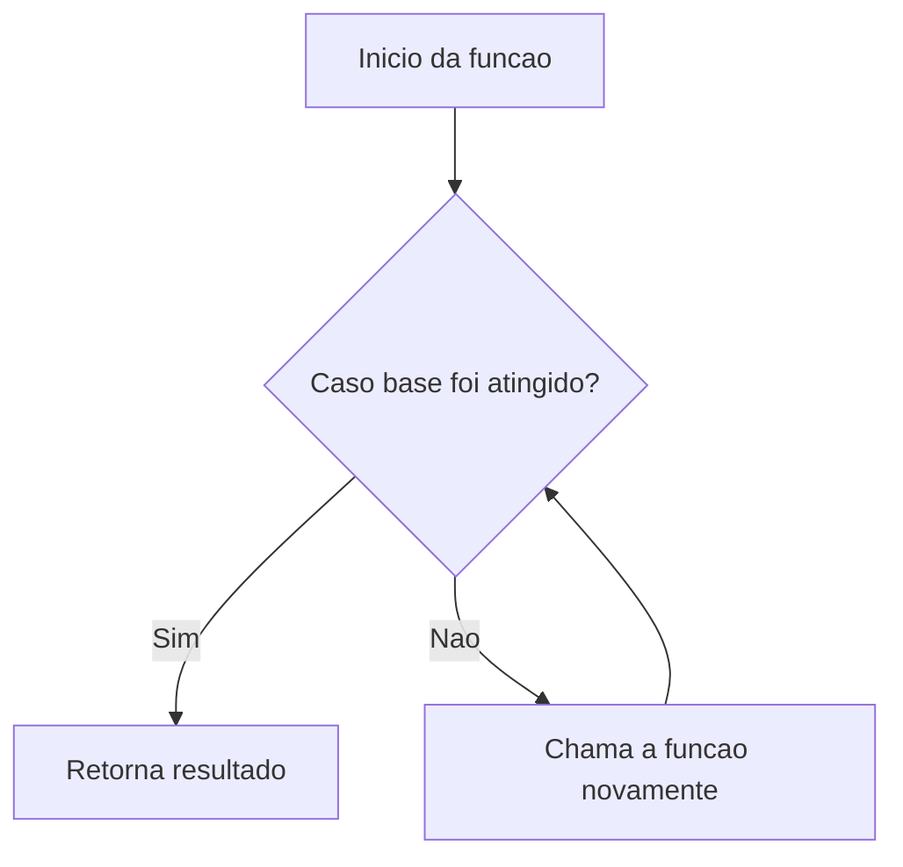
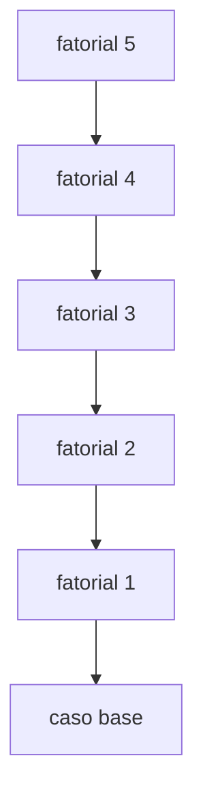
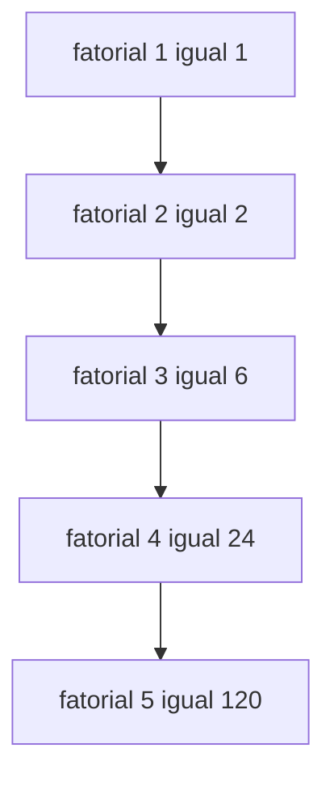
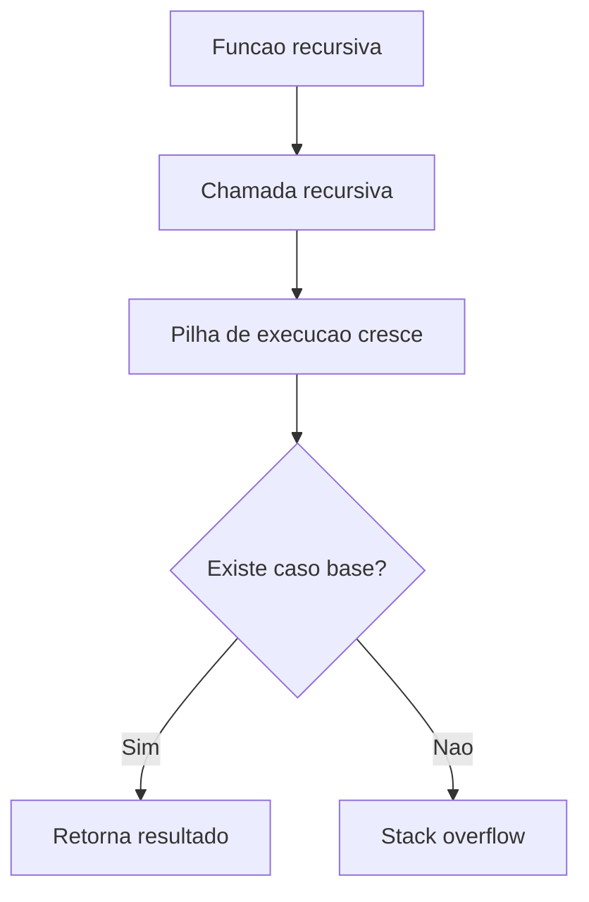

## O que é recursividade?

Podemos entender uma função recursiva como uma função que entra nela mesma a cada execução.

Para visualizar melhor, imagine caixas dentro de caixas. A primeira função representa a caixa maior. Dentro dela existe uma caixa menor, e dentro dessa caixa existe outra ainda menor. Esse processo continua até chegar na menor caixa possível.


Essa analogia representa bem a recursividade: a função continua chamando ela mesma até atingir uma condição que encerra o processo.

---

## Estrutura de uma função recursiva

Toda função recursiva precisa ter duas partes principais:

* **caso base**: condição que encerra a recursão;
* **chamada recursiva**: momento em que a função chama ela mesma novamente.



Sem o caso base, a função continuaria sendo chamada indefinidamente, causando erro por excesso de chamadas na pilha de execução.

---

## Qual é a vantagem da recursividade?

A recursividade pode facilitar bastante a resolução de alguns problemas.

Em muitos casos, funções recursivas permitem escrever soluções menores, mais organizadas e mais intuitivas do que estruturas de repetição tradicionais.

Ela é especialmente útil quando um problema pode ser dividido em versões menores dele mesmo.

### Principais vantagens

| Vantagem                | Descrição                                       |
| ----------------------- | ----------------------------------------------- |
| Código mais limpo       | Reduz estruturas repetitivas complexas          |
| Melhor legibilidade     | Algumas soluções ficam mais fáceis de entender  |
| Divisão de problemas    | O problema é quebrado em partes menores         |
| Estruturas hierárquicas | Muito útil em árvores, grafos e diretórios      |
| Soluções matemáticas    | Facilita implementação de problemas matemáticos |

---

## Onde a recursividade é utilizada?

Funções recursivas aparecem frequentemente em:

* cálculo de fatorial;
* sequência de Fibonacci;
* algoritmos de busca;
* árvores binárias;
* percorrer diretórios;
* compiladores;
* inteligência artificial;
* algoritmos de divisão e conquista.

---

## Exemplo básico: cálculo fatorial

O cálculo de um número fatorial é um exemplo clássico para estudar funções recursivas.

Um número fatorial é representado por `n!`.

Para calcular o fatorial, multiplicamos o número pelos seus antecessores até chegar em `1`.

Exemplo:

```text
5! = 5 x 4 x 3 x 2 x 1
5! = 120
```

Observe que o cálculo vai reduzindo o número a cada etapa. Isso combina muito bem com a ideia de recursividade.

---

## Algoritmo do fatorial recursivo

```text
funcao fatorial(n)
inicio
    se n <= 1 entao
        retorne 1
    senao
        retorne n * fatorial(n - 1)
fim
```

Nesse algoritmo:

* se `n <= 1`, a função retorna `1`;
* caso contrário, ela retorna `n * fatorial(n - 1)`;
* a cada chamada, o valor de `n` diminui;
* quando `n` chega em `1`, o caso base é atingido.

---

## Como a função recursiva funciona?

Para entender melhor, vamos calcular o fatorial de `5`.

Primeiro, a função chama ela mesma várias vezes até chegar no caso base.

```text
fatorial(5)
fatorial(4)
fatorial(3)
fatorial(2)
fatorial(1)
```

Esse processo é chamado de **empilhamento das chamadas**.



---

## Pilha de chamadas

A pilha de chamadas armazena temporariamente cada execução da função.

No exemplo do fatorial de `5`, as chamadas são empilhadas assim:

```text
fatorial(5 - 1) retorna fatorial(4)
    fatorial(4 - 1) retorna fatorial(3)
        fatorial(3 - 1) retorna fatorial(2)
            fatorial(2 - 1) retorna fatorial(1)
                fatorial(1) = 1
```

Quando o caso base é encontrado, a função para de chamar ela mesma.

---

## Retorno das chamadas

Depois que o caso base é atingido, as chamadas começam a retornar na ordem inversa.

```text
fatorial(1) = 1
fatorial(2) = 2 * 1 = 2
fatorial(3) = 3 * 2 = 6
fatorial(4) = 4 * 6 = 24
fatorial(5) = 5 * 24 = 120
```

Esse processo é chamado de **desempilhamento**.



Ao final do desempilhamento, temos o resultado:

```text
5! = 120
```

---

## Visualizando com a analogia das caixas

De forma visual, podemos lembrar da analogia das caixas e aplicar ao cálculo fatorial.

Cada chamada recursiva abre uma nova caixa menor. Quando a menor caixa é encontrada, começamos a retornar os resultados.


---

## Exemplo da função fatorial em Java

```java
public int calcularFatorial(int num) {
    if (num <= 1) {
        return 1;
    }

    return num * calcularFatorial(num - 1);
}
```

### Explicando o código

```java
if (num <= 1) {
    return 1;
}
```

Esse trecho representa o **caso base**.

Quando `num` for menor ou igual a `1`, a função retorna `1` e para de chamar ela mesma.

```java
return num * calcularFatorial(num - 1);
```

Esse trecho representa a **chamada recursiva**.

A função chama ela mesma passando `num - 1`, reduzindo o problema a cada execução.

---

## Recursão vs repetição

Toda função recursiva pode ser escrita usando estruturas de repetição.

A escolha entre recursão e repetição depende do problema, da clareza da solução e do desempenho esperado.

| Recursão                           | Repetição                       |
| ---------------------------------- | ------------------------------- |
| Usa chamadas de função             | Usa `for` ou `while`            |
| Pode deixar o código mais elegante | Costuma ser mais eficiente      |
| Usa pilha de execução              | Usa menos memória               |
| Pode causar estouro de pilha       | Evita muitas chamadas de função |

---

## Desvantagens da recursividade

Apesar de útil, a recursividade precisa ser usada com cuidado.

Quando uma função recursiva é chamada muitas vezes, cada chamada fica armazenada na pilha de execução. Isso pode consumir muita memória e prejudicar o desempenho do programa.

Além disso, se o caso base não for definido corretamente, a função pode continuar chamando ela mesma até causar um erro conhecido como **stack overflow**.



---

## Quando usar recursividade?

A recursividade pode ser uma boa escolha quando:

* o problema pode ser dividido em partes menores;
* existe uma condição de parada clara;
* a solução recursiva é mais simples de entender;
* o problema envolve estruturas hierárquicas, como árvores.

Por outro lado, se o problema puder ser resolvido de forma simples com um `for` ou `while`, talvez a solução iterativa seja mais eficiente.

---

## Conclusão

Funções recursivas são uma forma poderosa de resolver problemas em programação.

Elas funcionam chamando a própria função repetidamente até atingir um caso base. Depois disso, as chamadas retornam na ordem inversa, formando o processo de desempilhamento.

Apesar de serem muito úteis, é importante usar recursividade com cuidado, pois chamadas excessivas podem consumir memória e causar estouro da pilha de execução.

Compreender recursividade ajuda a entender melhor algoritmos complexos e estruturas de dados.
