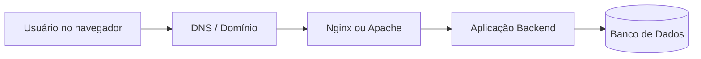

Depois que uma aplicação web é desenvolvida, ela precisa ser disponibilizada na internet para que usuários possam acessá-la com segurança, desempenho e estabilidade.

Esse processo envolve diversos conceitos importantes, como infraestrutura, servidores, máquinas virtuais, serviços em nuvem, SSH, servidores HTTP e deploy.

Com a evolução da computação em nuvem, hospedar aplicações ficou mais acessível e escalável. Atualmente, desenvolvedores conseguem publicar sistemas completos utilizando serviços como AWS, Azure e DigitalOcean.

Neste artigo vamos entender os principais conceitos envolvidos na hospedagem de aplicações web e como diferentes tecnologias trabalham juntas para manter um sistema online.

---

# Infraestrutura

Toda aplicação web precisa de uma infraestrutura capaz de suportar usuários, armazenamento de dados e processamento de requisições.

Dependendo do tamanho do sistema, será necessário considerar fatores como:

* quantidade de memória RAM;
* capacidade de processamento;
* velocidade da rede;
* armazenamento;
* segurança;
* disponibilidade;
* escalabilidade.

Essa infraestrutura pode ser construída utilizando:

* servidores físicos;
* máquinas virtuais (VMs);
* containers;
* serviços em nuvem.

---

## Servidores físicos vs máquinas virtuais

Um servidor físico é uma máquina dedicada exclusivamente para execução de aplicações.

Já as máquinas virtuais (VMs) utilizam virtualização para criar múltiplos ambientes independentes dentro de um único hardware físico.

### Comparação

| Servidor físico         | Máquina virtual           |
| ----------------------- | ------------------------- |
| Hardware dedicado       | Compartilha hardware      |
| Maior controle          | Maior flexibilidade       |
| Custo mais alto         | Menor custo               |
| Escalabilidade limitada | Escalabilidade facilitada |
| Configuração manual     | Provisionamento rápido    |

Ferramentas populares para virtualização:

* [VirtualBox](https://www.virtualbox.org/)
* [VMware](https://www.vmware.com/)

---

## Fluxo básico de uma aplicação web



Nesse fluxo:

1. o usuário acessa um domínio;
2. o DNS localiza o servidor;
3. o servidor web recebe a requisição;
4. a aplicação backend processa os dados;
5. o banco de dados armazena e retorna informações.

---

# Computação em nuvem

Grande parte da hospedagem moderna utiliza computação em nuvem.

Nesse modelo, empresas alugam recursos computacionais sob demanda sem precisar manter infraestrutura física própria.

## Principais provedores cloud

* [Amazon Web Services (AWS)](https://aws.amazon.com/pt/)
* [Microsoft Azure](https://azure.microsoft.com/pt-br/)
* [Google Cloud Platform](https://cloud.google.com/)
* [DigitalOcean](https://www.digitalocean.com/)

### Vantagens da computação em nuvem

* escalabilidade;
* alta disponibilidade;
* backup;
* segurança;
* automação;
* redução de custos;
* provisionamento rápido.

---

# Containers e Docker

Uma das tecnologias mais utilizadas atualmente para deploy é o Docker.

Containers permitem empacotar aplicações junto com todas as suas dependências, garantindo que funcionem da mesma forma em qualquer ambiente.

## Vantagens do Docker

* isolamento;
* portabilidade;
* facilidade de deploy;
* padronização do ambiente;
* escalabilidade.

## Fluxo simplificado com Docker


Em aplicações maiores, ferramentas como Kubernetes podem ser utilizadas para orquestração de containers.

---

# Servidores web

Os servidores web são responsáveis por receber requisições HTTP dos usuários e encaminhá-las para aplicações backend.

## Principais servidores HTTP

* [Apache](https://httpd.apache.org/)
* [Nginx](https://nginx.org/)
* [Gunicorn](https://gunicorn.org/)

Aprenda a configurar um servidor Apache 2 em máquina virtual: [tutorials/apache](/tutorials/apache)

---

## Nginx e proxy reverso

O Nginx é amplamente utilizado como:

* servidor web;
* proxy reverso;
* balanceador de carga.

Ele recebe requisições dos usuários e encaminha para aplicações backend, como Flask, Django ou Node.js.

### Fluxo utilizando proxy reverso


---

# Configuração e acesso ao servidor

A maioria dos servidores Linux não possui interface gráfica.

Por isso, toda administração costuma ser realizada através da linha de comando.

## Informações básicas do servidor

* usuário;
* endereço IP;
* domínio;
* porta;
* autenticação.

---

# SSH

O SSH (Secure Shell) permite acessar servidores remotamente de forma segura.

## Clientes SSH

* Linux e macOS: [OpenSSH](https://www.openssh.com/)
* Windows: [PuTTY](https://www.putty.org/)

## Exemplo de acesso via SSH

```bash
ssh usuario@ip-do-servidor
```

---

# Segurança do servidor

Manter um servidor seguro é fundamental.

Algumas práticas comuns incluem:

* controle de permissões;
* autenticação por chave SSH;
* firewall;
* atualizações do sistema;
* HTTPS/SSL.

## Firewall UFW

O UFW (Uncomplicated Firewall) ajuda a controlar o tráfego da rede.

```bash
sudo ufw allow 80
sudo ufw allow 443
sudo ufw enable
```

---

# Aplicações web

Uma aplicação web normalmente é dividida em frontend e backend.

## Frontend

O frontend representa a interface visual acessada pelo usuário.

### Tecnologias frontend

* HTML
* CSS
* JavaScript
* React
* Vue
* Angular

---

## Backend

O backend é responsável pela lógica do sistema, autenticação, APIs, regras de negócio e comunicação com bancos de dados.

### Linguagens backend

* Python
* JavaScript
* PHP

### Frameworks backend

* Flask
* Django
* Laravel
* Express

---

# Banco de dados

Aplicações web geralmente precisam armazenar informações.

## Bancos relacionais

* PostgreSQL
* MySQL
* MariaDB

---

# Git e GitHub

O Git é um sistema de controle de versão utilizado para organizar alterações no código-fonte.

Já o GitHub é uma plataforma de hospedagem de repositórios Git.

Essas ferramentas facilitam:

* colaboração;
* versionamento;
* backup;
* integração contínua;
* deploy automatizado.

---

# Deploy da aplicação

Deploy é o processo de publicar uma aplicação em um servidor para que ela fique acessível pela internet.

Esse processo normalmente envolve:

1. envio do código-fonte;
2. instalação de dependências;
3. configuração do ambiente;
4. execução da aplicação;
5. configuração do servidor web;
6. monitoramento.

## Fluxo simplificado de deploy


Ferramentas modernas de CI/CD, como GitHub Actions e GitLab CI, ajudam a automatizar deploys e testes.

---

# CDN e escalabilidade

Em aplicações maiores, serviços de CDN (Content Delivery Network) ajudam a distribuir arquivos estáticos em servidores espalhados pelo mundo.

Isso melhora:

* desempenho;
* cache;
* disponibilidade;
* tempo de resposta.

---

# Conclusão

Hospedar uma aplicação web envolve muito mais do que simplesmente colocar um sistema online.

É necessário compreender conceitos de infraestrutura, redes, servidores, segurança, deploy e escalabilidade.

Com o avanço da computação em nuvem e de ferramentas modernas como Docker e CI/CD, o processo de deploy ficou mais acessível, automatizado e eficiente.

Entender esses conceitos é fundamental para qualquer desenvolvedor que deseja criar aplicações modernas e preparadas para produção.

---

# Links úteis

* [https://nginx.org/](https://nginx.org/)
* [https://httpd.apache.org/](https://httpd.apache.org/)
* [https://gunicorn.org/](https://gunicorn.org/)
* [https://docs.docker.com/](https://docs.docker.com/)
* [https://aws.amazon.com/pt/](https://aws.amazon.com/pt/)
* [https://azure.microsoft.com/pt-br/](https://azure.microsoft.com/pt-br/)
* [https://cloud.google.com/](https://cloud.google.com/)
* [https://www.digitalocean.com/](https://www.digitalocean.com/)
* [https://www.openssh.com/](https://www.openssh.com/)
* [https://git-scm.com/](https://git-scm.com/)
* [https://github.com/](https://github.com/)
* [https://developer.mozilla.org/pt-BR/](https://developer.mozilla.org/pt-BR/)
