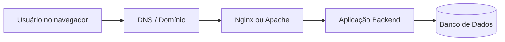

---

date: 2024-07-11T00:15:06-03:00
lastmod: 2026-05-12
showTableOfContents: true
tags: ["web", "servidores", "hospedagem", "deploy", "cloud"]
title: "Como funciona a hospedagem de aplicações web"
type: "post"
------------

# Como funciona a hospedagem de aplicações web

Depois que uma aplicação web é desenvolvida, ela precisa ser disponibilizada na internet para que usuários consigam acessá-la.

Esse processo envolve muito mais do que apenas “subir um site”.

Por trás de aplicações modernas existem vários componentes trabalhando juntos:

* servidores;
* redes;
* containers;
* bancos de dados;
* proxies;
* serviços em nuvem;
* pipelines de deploy.

Neste artigo vamos imaginar o seguinte cenário:

> Desenvolvemos uma aplicação backend utilizando Flask e agora precisamos colocá-la online de forma segura, escalável e organizada.

A partir desse exemplo vamos entender como diferentes tecnologias se conectam durante o processo de hospedagem de aplicações web.

---

# O que acontece quando acessamos um site?

Quando um usuário acessa uma aplicação no navegador, uma sequência de processos acontece até que a página seja carregada.

## Fluxo básico de uma aplicação web



Nesse fluxo:

1. o usuário acessa um domínio;
2. o DNS localiza o servidor;
3. o servidor web recebe a requisição;
4. o backend processa os dados;
5. o banco de dados retorna as informações.

Esse é o funcionamento básico de grande parte das aplicações modernas.

---

# Infraestrutura

Para que tudo isso funcione, precisamos de infraestrutura.

Toda aplicação web depende de recursos computacionais para:

* executar código;
* armazenar arquivos;
* processar requisições;
* atender usuários.

Dependendo do tamanho do sistema, fatores como desempenho e escalabilidade se tornam extremamente importantes.

## Recursos importantes

* memória RAM;
* processador;
* armazenamento;
* velocidade da rede;
* segurança;
* disponibilidade.

Essa infraestrutura pode ser construída utilizando:

* servidores físicos;
* máquinas virtuais;
* containers;
* serviços cloud.

---

# Servidores físicos vs máquinas virtuais

Historicamente, aplicações eram hospedadas diretamente em servidores físicos.

Com o avanço da virtualização, máquinas virtuais passaram a ser amplamente utilizadas.

Uma máquina virtual (VM) cria ambientes independentes dentro de um mesmo hardware físico.

## Comparação

| Servidor físico         | Máquina virtual           |
| ----------------------- | ------------------------- |
| Hardware dedicado       | Compartilha hardware      |
| Maior controle          | Maior flexibilidade       |
| Configuração manual     | Provisionamento rápido    |
| Custo mais alto         | Menor custo               |
| Escalabilidade limitada | Escalabilidade facilitada |

---

# Virtualização

Ferramentas de virtualização ajudam bastante no aprendizado de infraestrutura.

## Ferramentas populares

* [VirtualBox](https://www.virtualbox.org/)
* [VMware](https://www.vmware.com/)

Essas ferramentas permitem simular servidores localmente.

---

# Computação em nuvem

Depois da virtualização, o próximo passo da evolução da infraestrutura foi a computação em nuvem.

Em vez de comprar servidores físicos, empresas passaram a alugar recursos sob demanda.

Hoje, grande parte das aplicações modernas roda em cloud.

## Principais provedores

* [AWS](https://aws.amazon.com/pt/)
* [Microsoft Azure](https://azure.microsoft.com/pt-br/)
* [Google Cloud Platform](https://cloud.google.com/)
* [DigitalOcean](https://www.digitalocean.com/)

---

# Vantagens da cloud

A computação em nuvem trouxe várias vantagens:

* escalabilidade;
* alta disponibilidade;
* automação;
* backup;
* segurança;
* provisionamento rápido.

Isso tornou a hospedagem muito mais acessível.

---

# Provisionando um servidor

Agora imagine que criamos uma VPS Linux em um provedor cloud.

Depois da criação do servidor, precisamos administrá-lo remotamente.

É aqui que entra o SSH.

---

# SSH

O SSH (*Secure Shell*) permite acessar servidores remotamente de forma segura.

A maior parte da administração de servidores Linux é realizada através da linha de comando.

## Clientes SSH

* Linux e macOS: [OpenSSH](https://www.openssh.com/)
* Windows: [PuTTY](https://www.putty.org/)

## Exemplo de acesso

```bash
ssh usuario@ip-do-servidor
```

---

# Segurança do servidor

Depois de acessar o servidor, precisamos garantir que ele esteja protegido.

Aplicações em produção precisam de:

* controle de permissões;
* autenticação segura;
* firewall;
* HTTPS;
* atualizações constantes.

---

# Firewall UFW

O UFW (*Uncomplicated Firewall*) ajuda a controlar o tráfego do servidor.

## Exemplo

```bash
sudo ufw allow 80
sudo ufw allow 443
sudo ufw enable
```

Nesse caso:

* porta 80 → HTTP;
* porta 443 → HTTPS.

---

# Aplicações web

Com o servidor configurado, precisamos executar nossa aplicação.

Uma aplicação web normalmente é dividida em frontend e backend.

---

# Frontend

O frontend representa a interface visual acessada pelo usuário.

## Tecnologias frontend

* HTML;
* CSS;
* JavaScript;
* React;
* Vue;
* Angular.

---

# Backend

O backend é responsável por:

* regras de negócio;
* autenticação;
* APIs;
* processamento;
* comunicação com banco de dados.

## Linguagens backend

* Python;
* JavaScript;
* PHP.

## Frameworks backend

* Flask;
* Django;
* Laravel;
* Express.

No nosso exemplo, vamos imaginar uma aplicação Flask.

---

# Banco de dados

Grande parte das aplicações precisa armazenar informações.

## Bancos relacionais populares

* PostgreSQL;
* MySQL;
* MariaDB.

O backend é responsável por se comunicar com esses bancos.

---

# Servidores web

Agora surge outro componente importante.

O Flask sozinho não costuma ficar exposto diretamente na internet.

Normalmente utilizamos um servidor web intermediário.

## Servidores HTTP populares

* [Apache](https://httpd.apache.org/)
* [Nginx](https://nginx.org/)
* [Gunicorn](https://gunicorn.org/)

Aprenda a configurar um servidor Apache 2 em máquina virtual: [tutorials/apache](/tutorials/apache)

---

# Nginx e proxy reverso

O Nginx frequentemente atua como proxy reverso.

Ele recebe requisições dos usuários e encaminha para a aplicação backend.

## Fluxo utilizando proxy reverso


Essa abordagem melhora:

* segurança;
* desempenho;
* gerenciamento de conexões.

---

# Containers e Docker

Depois de configurar servidor e backend, surge outro desafio:

> Como garantir que a aplicação funcione da mesma forma em qualquer ambiente?

É aqui que containers entram.

Docker permite empacotar aplicações junto com todas as suas dependências.

---

# Vantagens do Docker

* isolamento;
* portabilidade;
* padronização;
* facilidade de deploy;
* escalabilidade.

---

# Fluxo simplificado com Docker


Com containers, a aplicação pode ser executada praticamente da mesma forma em:

* desenvolvimento;
* testes;
* produção.

---

# Kubernetes e orquestração

Em aplicações maiores, múltiplos containers precisam ser gerenciados.

Ferramentas como Kubernetes ajudam na:

* escalabilidade;
* distribuição;
* alta disponibilidade;
* automação.

---

# Git e GitHub

Antes do deploy, o código normalmente é armazenado em repositórios Git.

## Funções do Git

* versionamento;
* colaboração;
* histórico;
* rollback.

## Plataformas populares

* GitHub;
* GitLab.

---

# Deploy da aplicação

Agora finalmente podemos publicar nossa aplicação.

Deploy é o processo de disponibilizar o sistema em produção.

Esse processo geralmente envolve:

1. envio do código;
2. instalação de dependências;
3. configuração do ambiente;
4. execução da aplicação;
5. configuração do servidor web;
6. monitoramento.

---

# Fluxo moderno de deploy


Nesse fluxo:

* o código é enviado para o GitHub;
* pipelines automatizados executam testes;
* containers são gerados;
* a aplicação é implantada automaticamente.

---

# CI/CD

Ferramentas de CI/CD ajudam a automatizar:

* testes;
* build;
* deploy;
* validações.

## Exemplos

* GitHub Actions;
* GitLab CI;
* Jenkins.

---

# CDN e escalabilidade

À medida que aplicações crescem, surge a necessidade de melhorar desempenho global.

É aqui que entram CDNs.

CDNs (*Content Delivery Networks*) distribuem arquivos em servidores espalhados pelo mundo.

---

# Benefícios de CDN

* cache;
* menor latência;
* alta disponibilidade;
* redução de carga no servidor.

---

# Escalabilidade

Aplicações modernas precisam suportar crescimento.

Escalabilidade significa conseguir atender mais usuários sem comprometer desempenho.

## Estratégias comuns

* load balancing;
* containers;
* múltiplos servidores;
* cache;
* CDN.

---

# Conclusão

Hospedar uma aplicação web envolve muito mais do que apenas colocar um sistema online.

Infraestrutura moderna conecta várias tecnologias trabalhando juntas:

* cloud;
* Linux;
* SSH;
* servidores web;
* backend;
* bancos de dados;
* Docker;
* CI/CD;
* escalabilidade.

Com o avanço da computação em nuvem e das ferramentas modernas de deploy, aplicações se tornaram mais acessíveis, automatizadas e escaláveis.

Entender como essas peças se conectam é fundamental para qualquer desenvolvedor que deseja trabalhar com aplicações modernas em produção.

---

# Links úteis

* [https://nginx.org/](https://nginx.org/)
* [https://httpd.apache.org/](https://httpd.apache.org/)
* [https://gunicorn.org/](https://gunicorn.org/)
* [https://docs.docker.com/](https://docs.docker.com/)
* [https://aws.amazon.com/pt/](https://aws.amazon.com/pt/)
* [https://azure.microsoft.com/pt-br/](https://azure.microsoft.com/pt-br/)
* [https://cloud.google.com/](https://cloud.google.com/)
* [https://www.digitalocean.com/](https://www.digitalocean.com/)
* [https://www.openssh.com/](https://www.openssh.com/)
* [https://git-scm.com/](https://git-scm.com/)
* [https://github.com/](https://github.com/)
* [https://developer.mozilla.org/pt-BR/](https://developer.mozilla.org/pt-BR/)
