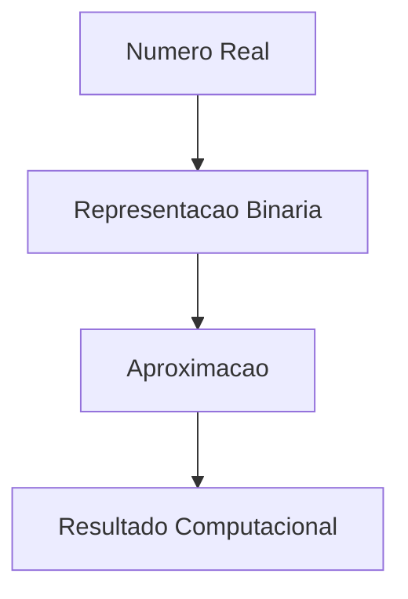
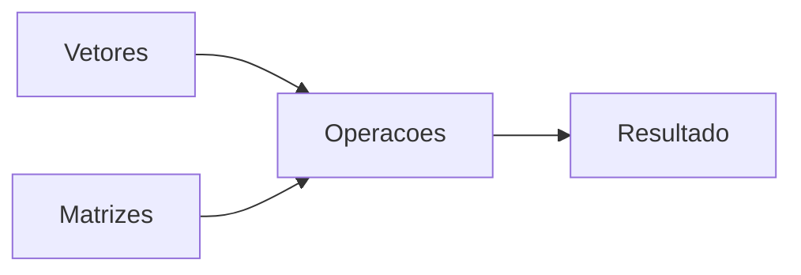
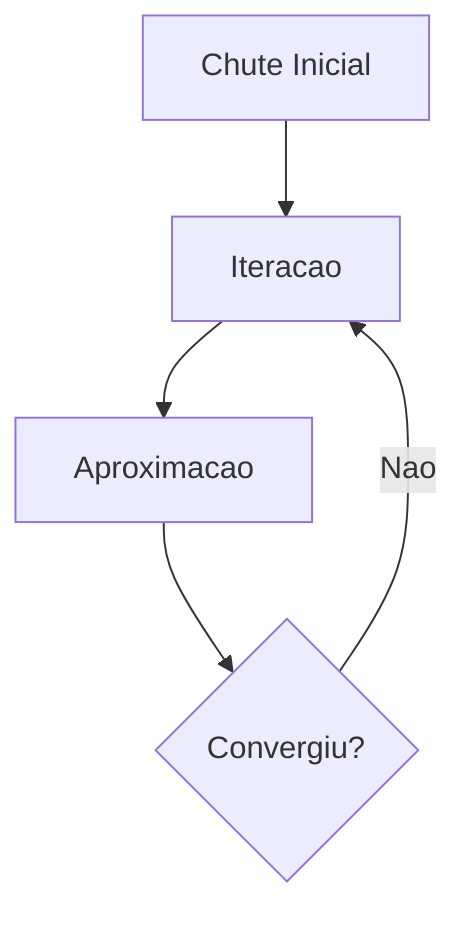
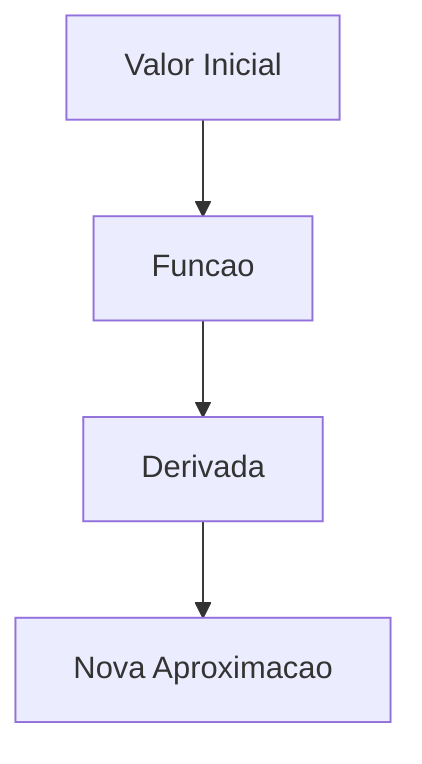
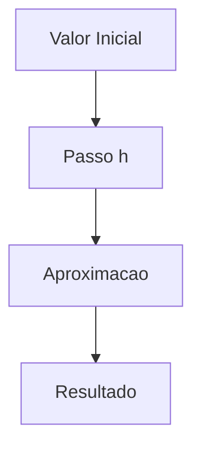
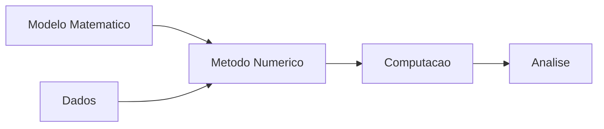

---

date: 2025-01-23
lastmod: 2025-01-23
showTableOfContents: true
tags: ["Python", "métodos numéricos", "computação científica", "matemática", "algoritmos"]
title: "Métodos numéricos com Python: fundamentos da computação científica"
description: "Uma introdução aos principais métodos numéricos utilizados em computação científica, engenharia e ciência de dados."
type: "post"
------------

## Métodos numéricos com Python: fundamentos da computação científica

Grande parte dos problemas modernos da computação depende de aproximações matemáticas.

Em diversas situações:

* soluções analíticas são complexas;
* equações não possuem solução exata;
* cálculos seriam inviáveis manualmente.

É nesse contexto que entram os métodos numéricos.

Métodos numéricos são técnicas matemáticas utilizadas para resolver problemas através de aproximações computacionais.

Eles estão presentes em:

* engenharia;
* física;
* machine learning;
* gráficos computacionais;
* modelagem científica;
* simulações;
* ciência de dados.

Neste artigo vamos explorar os principais conceitos e métodos utilizados em computação numérica utilizando Python.

---

## O que é computação numérica?

Computação numérica é a área responsável por resolver problemas matemáticos utilizando algoritmos computacionais.

Em vez de trabalhar apenas com soluções exatas, métodos numéricos trabalham com:

* aproximações;
* estimativas;
* convergência;
* precisão.

---

## Fluxo da computação numérica


---

## Representação numérica em computadores

Computadores representam números utilizando bits.

Por isso, nem todos os valores reais conseguem ser armazenados exatamente.

### Exemplo clássico

```python
print(0.1 + 0.2)
```

Resultado:

```text
0.30000000000000004
```

---

## Erros numéricos

Métodos computacionais sempre possuem algum nível de erro.

### Tipos comuns

| Tipo                   | Descrição                |
| ---------------------- | ------------------------ |
| Erro absoluto          | Diferença direta         |
| Erro relativo          | Diferença proporcional   |
| Erro de truncamento    | Aproximações matemáticas |
| Erro de arredondamento | Limitação computacional  |

---

## Fluxo de erro numérico



---

## Python e computação científica

Python possui um ecossistema extremamente forte para computação numérica.

### Bibliotecas principais

| Biblioteca | Objetivo             |
| ---------- | -------------------- |
| NumPy      | Computação numérica  |
| SciPy      | Métodos científicos  |
| Matplotlib | Visualização         |
| SymPy      | Matemática simbólica |

---

## Instalando bibliotecas

```bash
pip install numpy scipy matplotlib sympy
```

---

## Vetores e matrizes

Grande parte da computação numérica depende de vetores e matrizes.

### Exemplo com NumPy

```python
import numpy as np

vetor = np.array([1,2,3])
```

---

## Matrizes

```python
matriz = np.array([
    [1,2],
    [3,4]
])
```

---

## Álgebra linear

Álgebra linear é fundamental em:

* machine learning;
* gráficos computacionais;
* física;
* engenharia.

---

## Fluxo da álgebra linear



---

## Sistemas lineares

Um dos problemas mais comuns da computação científica é resolver sistemas lineares.

### Exemplo

$$
\begin{cases}
2x + y = 8 \\
\newline
x + 3y = 13
\end{cases}
$$

---

## Resolvendo sistemas com NumPy

```python
A = np.array([
    [2,1],
    [1,3]
])

b = np.array([8,13])

x = np.linalg.solve(A, b)

print(x)
```

---

## Métodos iterativos

Métodos iterativos trabalham através de aproximações sucessivas.

### Exemplos

* Jacobi;
* Gauss-Seidel;
* Newton-Raphson.

---

## Método de Jacobi

O método de Jacobi utiliza aproximações sucessivas para resolver sistemas lineares.

### Fluxo simplificado



---

## Método de Newton-Raphson

O método de Newton é utilizado para encontrar raízes de funções.

### Fórmula

$$
x_{n+1} = x_n - \frac{f(x_n)}{f'(x_n)}
$$

---

## Fluxo do método de Newton



---

## Exemplo em Python

```python
import math

x = 1

for i in range(5):
    x = x - ((x**2 - 2)/(2*x))

print(x)
```

---

## Interpolação

Interpolação busca estimar valores intermediários.

### Aplicações

* gráficos;
* simulações;
* modelagem;
* processamento de sinais.

---

## Interpolação linear

A interpolação linear utiliza uma reta entre dois pontos.

$$
f(x) = f(x_0) + \frac{f(x_1) - f(x_0)}{x_1 - x_0}(x - x_0)
$$

---

## Integração numérica

Nem sempre integrais possuem solução analítica simples.

Por isso, métodos numéricos são utilizados.

### Métodos comuns

| Método      | Característica      |
| ----------- | ------------------- |
| Trapézios   | Aproximação simples |
| Simpson     | Maior precisão      |
| Monte Carlo | Probabilístico      |

---

## Método dos trapézios

$$
\int_a^b f(x)\,dx \approx \frac{h}{2}\bigl(f(a) + f(b)\bigr)
$$

---

## Fluxo da integração numérica


---

## Derivação numérica

Também podemos aproximar derivadas.

### Aproximação simples

$$
f'(x) \approx \frac{f(x + h) - f(x)}{h}
$$

---

## Equações diferenciais

Equações diferenciais aparecem em:

* física;
* engenharia;
* biologia;
* economia.

---

## Método de Euler

O método de Euler é utilizado para aproximar soluções de equações diferenciais.

### Fórmula

$$
y_{n+1} = y_n + h\,f(x_n, y_n)
$$

---

## Fluxo do método de Euler



---

## Visualização de resultados

Visualização é extremamente importante em computação científica.

### Exemplo com Matplotlib

```python
import matplotlib.pyplot as plt

plt.plot([1,2,3],[1,4,9])
plt.show()
```

---

## Simulações

Métodos numéricos são muito utilizados em simulações.

### Áreas comuns

* clima;
* física;
* engenharia;
* IA;
* modelagem científica.

---

## Pipeline científico



---

## Computação numérica e machine learning

Grande parte do machine learning moderno depende diretamente de métodos numéricos.

### Exemplos

* gradiente descendente;
* otimização;
* álgebra linear;
* derivadas;
* funções de custo.

---

## Conceitos importantes aprendidos

Projetos de computação numérica ajudam bastante no aprendizado de:

* matemática aplicada;
* álgebra linear;
* otimização;
* algoritmos científicos;
* modelagem computacional.

---

## Possíveis evoluções

Depois dos conceitos básicos, várias áreas podem ser exploradas.

### Exemplos

* machine learning;
* computação paralela;
* CUDA;
* simulações físicas;
* computação científica avançada.

---

## Conclusão

Métodos numéricos são fundamentais para a computação moderna.

Grande parte das aplicações científicas, gráficas e de inteligência artificial depende de aproximações computacionais.

Mesmo estudos introdutórios ajudam bastante no entendimento de:

* modelagem matemática;
* algoritmos científicos;
* precisão computacional;
* otimização.

Além disso, computação numérica cria uma excelente base para áreas como ciência de dados, IA, engenharia e computação científica.

---

## Referências

* [https://cn.ect.ufrn.br/](https://cn.ect.ufrn.br/)
* [https://numpy.org/](https://numpy.org/)
* [https://scipy.org/](https://scipy.org/)
* [https://matplotlib.org/](https://matplotlib.org/)
* [https://www.sympy.org/](https://www.sympy.org/)
* [https://github.com/MariaCarolinass/computacao-numerica](https://github.com/MariaCarolinass/computacao-numerica)
