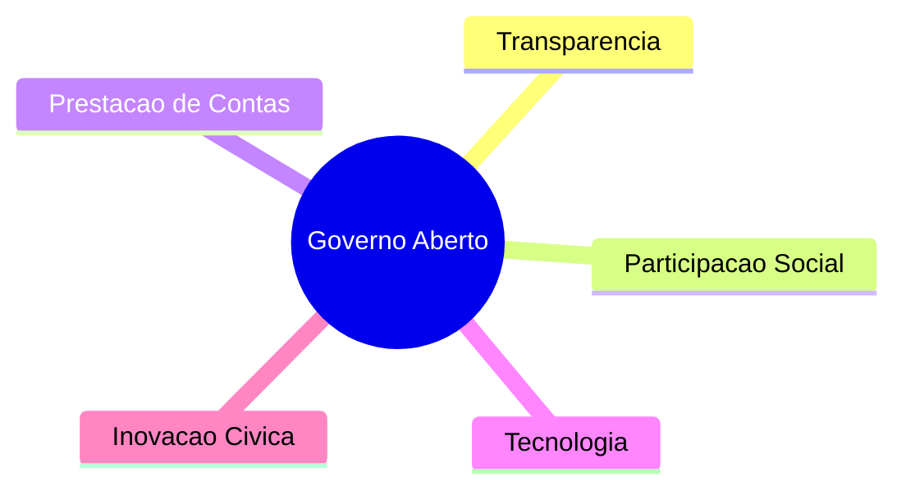
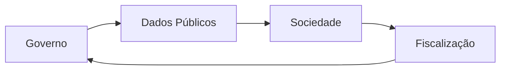
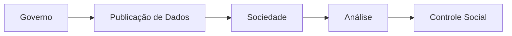

O conceito de governo aberto vem ganhando destaque nas últimas décadas como uma forma de aproximar a sociedade da administração pública.

Mais do que apenas disponibilizar informações governamentais, o governo aberto busca promover transparência, participação social, inovação cívica e colaboração entre cidadãos e instituições públicas.

Na prática, isso significa criar mecanismos que permitam à população acompanhar decisões governamentais, fiscalizar gastos públicos e participar ativamente da construção de políticas públicas.

Apesar dos avanços obtidos nos últimos anos, ainda existem diversos desafios relacionados à implementação efetiva desses princípios no Brasil.

---

# O que é governo aberto?

O governo aberto é um modelo de gestão pública baseado em:

* transparência;
* participação cidadã;
* prestação de contas;
* colaboração;
* uso de tecnologia e inovação.

O objetivo é tornar a administração pública mais acessível, eficiente e democrática.

## Principais pilares do governo aberto

Esses princípios incentivam uma relação mais próxima entre governo e sociedade, permitindo que cidadãos acompanhem ações públicas de maneira mais transparente.

---

# Transparência pública

A transparência é um dos pilares centrais do governo aberto.

Ela envolve a disponibilização de informações públicas de forma clara, acessível e compreensível.

Isso inclui:

* gastos públicos;
* contratos;
* dados orçamentários;
* indicadores sociais;
* licitações;
* projetos governamentais.

No Brasil, iniciativas como o [Portal da Transparência](https://www.portaltransparencia.gov.br/) representam avanços importantes nesse processo.

---

# Participação social

Outro princípio fundamental do governo aberto é a participação social.

A ideia é permitir que cidadãos participem mais ativamente da tomada de decisões públicas.

Isso pode acontecer através de:

* consultas públicas;
* audiências públicas;
* plataformas digitais;
* votação participativa;
* observatórios sociais.

## Relação entre governo e sociedade

Esse ciclo fortalece mecanismos democráticos e amplia o controle social sobre a administração pública.

---

# Tecnologia e inovação cívica

A tecnologia possui papel fundamental na construção de governos mais transparentes.

Ferramentas digitais permitem:

* automatizar serviços públicos;
* disponibilizar dados abertos;
* ampliar o acesso à informação;
* facilitar a comunicação com cidadãos;
* criar plataformas de fiscalização pública.

O conceito de inovação cívica está relacionado ao uso da tecnologia para resolver problemas sociais e melhorar serviços públicos.

Aplicações de visualização de dados, mapas interativos e plataformas de monitoramento governamental são alguns exemplos.

---

# Os desafios do governo aberto no Brasil

Embora o Brasil tenha avançado em iniciativas de transparência pública, muitos desafios ainda dificultam a implementação prática do governo aberto.

## Falta de acessibilidade dos dados

Grande parte das bases governamentais ainda apresenta problemas como:

* formatos complexos;
* dados desorganizados;
* baixa padronização;
* dificuldade de interpretação.

Muitas vezes, o acesso aos dados exige conhecimentos técnicos avançados, dificultando o uso por grande parte da população.

---

## Baixo conhecimento da população

Mesmo existindo ferramentas públicas importantes, muitas pessoas desconhecem sua existência.

O Portal da Transparência, por exemplo, ainda é pouco utilizado pela maioria da população brasileira.

Sem educação digital e incentivo à participação cidadã, a transparência pública acaba ficando limitada apenas ao aspecto técnico.

---

## Distância entre teoria e prática

Em muitos casos, os princípios de governo aberto aparecem em discursos institucionais, mas possuem baixa aplicação prática.

Isso acontece devido a fatores como:

* burocracia;
* baixa participação popular;
* dificuldades tecnológicas;
* resistência institucional;
* falta de investimento em educação cívica.

---

# Dados abertos e cidadania

O conceito de dados abertos está diretamente ligado ao governo aberto.

Dados públicos abertos devem ser:

* acessíveis;
* gratuitos;
* reutilizáveis;
* legíveis por máquinas;
* transparentes.

## Exemplo de fluxo de dados abertos

Quando bem estruturados, os dados abertos permitem:

* pesquisas;
* fiscalização pública;
* jornalismo de dados;
* desenvolvimento de aplicações;
* produção científica.

---

# O papel da educação digital

Para que o governo aberto funcione de maneira efetiva, não basta apenas disponibilizar dados.

É necessário que a população saiba:

* acessar informações públicas;
* interpretar dados;
* utilizar ferramentas digitais;
* compreender gastos públicos;
* participar de processos democráticos.

A educação digital e cidadã é fundamental para ampliar a participação social e fortalecer a democracia.

---

# Conclusão

O governo aberto representa um importante avanço na construção de administrações públicas mais transparentes, participativas e eficientes.

Apesar dos avanços obtidos no Brasil, ainda existem desafios relacionados à acessibilidade dos dados públicos, participação social e inclusão digital.

A tecnologia pode atuar como uma ferramenta poderosa nesse processo, mas sua efetividade depende da capacidade da sociedade de compreender e utilizar as informações disponibilizadas.

Fortalecer a educação digital, ampliar a transparência e incentivar a participação cidadã são passos essenciais para transformar os princípios de governo aberto em práticas efetivas.

---

# Referências

* [https://www.portaltransparencia.gov.br/](https://www.portaltransparencia.gov.br/)
* [https://www.gov.br/cgu/pt-br/governo-aberto](https://www.gov.br/cgu/pt-br/governo-aberto)
* [https://www.gov.br/cgu/pt-br/governo-aberto/central-de-conteudo/videos/videos-home/governo-aberto-participacao-prestacao-de-contas-e-transparencia](https://www.gov.br/cgu/pt-br/governo-aberto/central-de-conteudo/videos/videos-home/governo-aberto-participacao-prestacao-de-contas-e-transparencia)
* [https://www.colab.re/conteudo/o-que-e-governo-aberto](https://www.colab.re/conteudo/o-que-e-governo-aberto)
