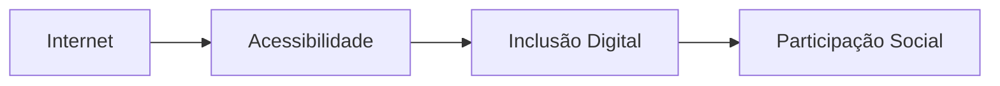
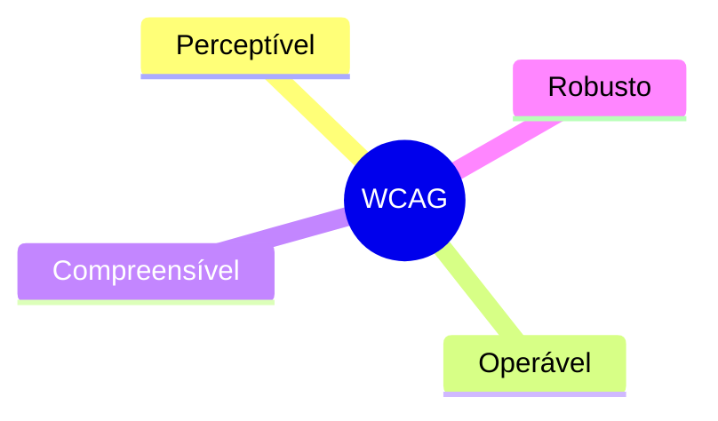
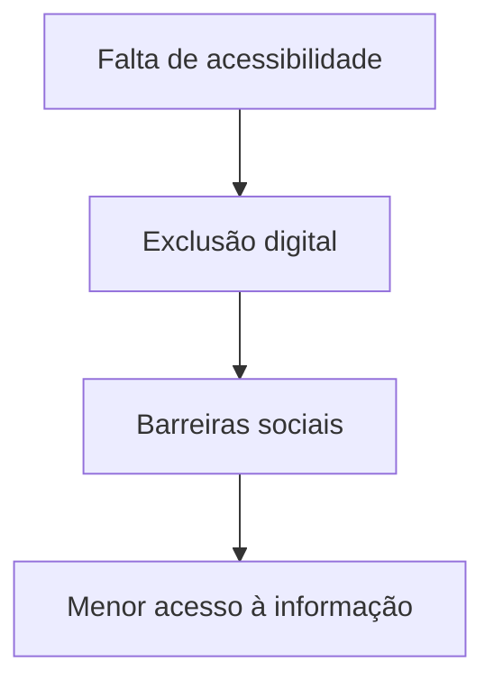
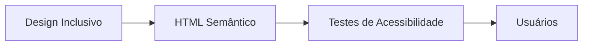

# O que é acessibilidade na web?

A acessibilidade na web consiste em desenvolver sites, sistemas e conteúdos digitais que possam ser utilizados pelo maior número possível de pessoas, independentemente de suas limitações físicas, cognitivas ou tecnológicas.

Isso inclui usuários com:

* deficiência visual;
* deficiência auditiva;
* deficiência motora;
* deficiência cognitiva;
* limitações temporárias;
* conexão lenta;
* dispositivos antigos.

O objetivo é garantir que todas as pessoas consigam navegar, compreender e interagir com conteúdos digitais de maneira autônoma.

---

# A web como um espaço coletivo

A governança da internet é construída coletivamente.

Isso significa que a web deve ser um ambiente aberto, democrático e acessível para todos os grupos sociais.

O acesso à informação é considerado um direito universal e, portanto, barreiras digitais representam também formas de exclusão social.

## Relação entre acessibilidade e inclusão digital

Quando um site não é acessível, parte da população fica impedida de acessar serviços, informações e oportunidades.

---

# O papel da W3C

A [W3C](https://www.w3.org/) (World Wide Web Consortium) é uma organização internacional responsável pela criação de padrões para a web.

Entre suas iniciativas mais importantes estão as diretrizes de acessibilidade conhecidas como WCAG (Web Content Accessibility Guidelines).

Essas diretrizes ajudam desenvolvedores a criarem sites mais acessíveis e compatíveis com diferentes tecnologias assistivas.

## Alguns princípios das WCAG

### Exemplos práticos

* utilização correta de HTML semântico;
* contraste adequado entre texto e fundo;
* navegação por teclado;
* descrição de imagens com atributo `alt`;
* compatibilidade com leitores de tela;
* formulários acessíveis.

---

# Acessibilidade digital no Brasil

No Brasil, a acessibilidade digital é respaldada pela Lei Brasileira de Inclusão (LBI).

A legislação determina que sites públicos e privados devem garantir acessibilidade para pessoas com deficiência.

## Lei Brasileira de Inclusão

A LBI estabelece que:

* conteúdos digitais devem ser acessíveis;
* serviços online precisam respeitar diretrizes de acessibilidade;
* plataformas devem garantir autonomia aos usuários.

Mesmo com avanços legislativos, a aplicação prática ainda enfrenta muitos desafios.

---

# O cenário atual da acessibilidade na web

Diversos estudos mostram que grande parte dos sites brasileiros ainda não atende requisitos básicos de acessibilidade.

Entre os problemas mais comuns estão:

* baixa compatibilidade com leitores de tela;
* navegação inconsistente;
* ausência de descrição em imagens;
* formulários inacessíveis;
* contraste inadequado;
* excesso de elementos visuais.

Além disso, muitos portais governamentais apresentam:

* lentidão;
* problemas de usabilidade;
* falhas estruturais;
* dificuldades de navegação.

## Impactos da falta de acessibilidade

A ausência de acessibilidade limita o acesso à educação, serviços públicos, oportunidades de trabalho e participação social.

---

# HTML semântico e acessibilidade

Grande parte da acessibilidade começa na estrutura correta do HTML.

O HTML semântico ajuda navegadores e tecnologias assistivas a interpretarem corretamente o conteúdo de uma página.

## Exemplos de elementos semânticos

| Elemento    | Função                |
| ----------- | --------------------- |
| `<header>`  | Cabeçalho da página   |
| `<nav>`     | Navegação             |
| `<main>`    | Conteúdo principal    |
| `<section>` | Seções da página      |
| `<article>` | Conteúdo independente |
| `<footer>`  | Rodapé                |

Uma estrutura semântica melhora:

* acessibilidade;
* SEO;
* organização do código;
* experiência do usuário.

---

# Tecnologias assistivas

As tecnologias assistivas permitem que pessoas com deficiência consigam utilizar dispositivos digitais.

Alguns exemplos incluem:

* leitores de tela;
* ampliadores de tela;
* navegação por teclado;
* reconhecimento de voz;
* teclados adaptados.

Por isso, acessibilidade não deve ser tratada como um recurso opcional, mas como parte essencial do desenvolvimento web.

---

# O papel dos desenvolvedores

Desenvolvedores possuem responsabilidade importante na construção de uma web mais inclusiva.

Criar interfaces acessíveis exige:

* boas práticas de desenvolvimento;
* testes com acessibilidade;
* uso correto de HTML;
* preocupação com experiência do usuário;
* validações constantes.

## Fluxo de desenvolvimento acessível

A acessibilidade deve estar presente desde o planejamento do projeto.

---

# Conclusão

Construir uma internet mais acessível é um desafio coletivo que envolve tecnologia, legislação, educação digital e responsabilidade social.

Embora existam normas e diretrizes importantes, grande parte da web ainda apresenta barreiras que dificultam o acesso de milhões de pessoas.

A acessibilidade digital não beneficia apenas pessoas com deficiência. Sites acessíveis também oferecem melhor experiência de uso, melhor organização de conteúdo e maior inclusão digital.

Criar aplicações acessíveis é contribuir para uma internet mais democrática, aberta e humana.

---

# Referências

* [https://www.w3.org/](https://www.w3.org/)
* [https://www.w3.org/WAI/standards-guidelines/wcag/](https://www.w3.org/WAI/standards-guidelines/wcag/)
* [http://www.planalto.gov.br/ccivil_03/_ato2015-2018/2015/lei/l13146.htm](http://www.planalto.gov.br/ccivil_03/_ato2015-2018/2015/lei/l13146.htm)
* [https://developer.mozilla.org/pt-BR/docs/Web/Accessibility](https://developer.mozilla.org/pt-BR/docs/Web/Accessibility)
* [https://revistagalileu.globo.com/Tecnologia/noticia/2019/10/menos-de-1-dos-sites-brasileiros-sao-acessiveis-para-pessoas-com-deficiencia.html](https://revistagalileu.globo.com/Tecnologia/noticia/2019/10/menos-de-1-dos-sites-brasileiros-sao-acessiveis-para-pessoas-com-deficiencia.html)
