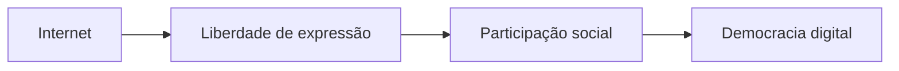
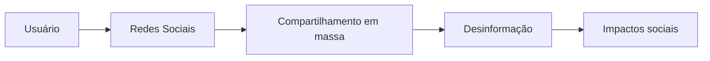
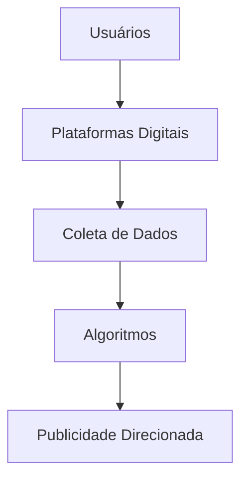
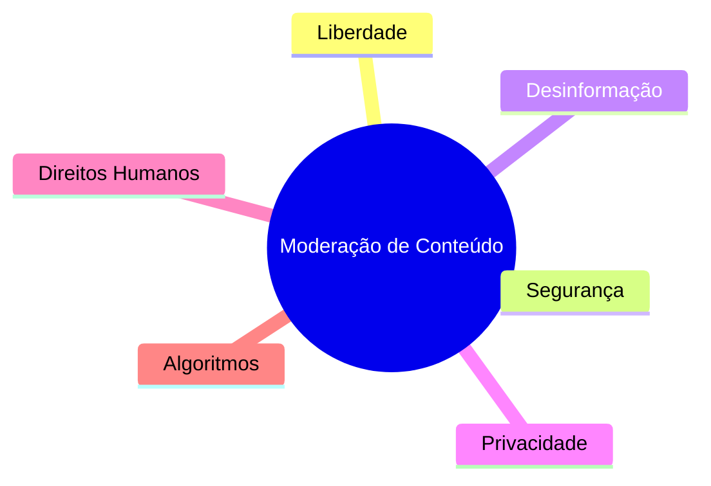

## Governança da internet e direitos humanos

A governança da internet envolve princípios, normas e processos relacionados ao funcionamento da rede e à participação de diferentes setores da sociedade.

Em 2014, a Declaração Multissetorial do NETmundial destacou princípios importantes relacionados aos direitos humanos e aos valores compartilhados pelos usuários da internet.

Entre esses princípios está a liberdade de expressão.

### Liberdade de expressão na rede

A liberdade de expressão garante que pessoas possam:

* opinar;
* compartilhar ideias;
* publicar informações;
* participar de debates públicos;
* exercer participação política e social.

### Relação entre internet e liberdade de expressão

A internet ampliou a possibilidade de comunicação global e fortaleceu movimentos sociais, produção independente de conteúdo e acesso à informação.

---

## O lado problemático da liberdade irrestrita

Embora a liberdade de expressão seja um direito fundamental, sua utilização no ambiente digital também levanta questões importantes.

O anonimato, a velocidade de disseminação de conteúdo e o alcance das redes sociais criaram um ambiente propício para abusos.

Entre os principais problemas estão:

* discursos de ódio;
* assédio virtual;
* perseguições;
* desinformação;
* propagação de notícias falsas;
* manipulação política;
* extremismo digital.

### Fluxo de disseminação de desinformação

Em muitos casos, conteúdos falsos se espalham rapidamente antes mesmo de serem verificados.

---

## Desinformação e redes sociais

As redes sociais transformaram profundamente a circulação de informações.

Plataformas digitais utilizam algoritmos que priorizam conteúdos com maior engajamento, independentemente de sua veracidade.

Isso favorece:

* polarização;
* viralização de notícias falsas;
* manipulação de opinião pública;
* campanhas de desinformação.

Além disso, conteúdos sensacionalistas costumam gerar maior alcance e compartilhamento.

---

## Liberdade e privacidade digital

Outro ponto importante envolve coleta de dados e vigilância digital.

Relatórios internacionais sobre liberdade na internet apontam crescimento de práticas relacionadas a:

* monitoramento de usuários;
* coleta de dados sensíveis;
* publicidade direcionada;
* manipulação comportamental;
* rastreamento digital.

### Relação entre plataformas e dados pessoais

Esse cenário levanta discussões importantes sobre privacidade, ética e responsabilidade das plataformas digitais.

---

## O contexto brasileiro

No Brasil, o debate sobre desinformação ganhou destaque principalmente durante o período eleitoral de 2018.

As campanhas políticas foram fortemente impactadas pela circulação de conteúdos falsos em redes sociais e aplicativos de mensagens.

Além disso, jornalistas independentes, pesquisadores e ativistas que buscavam combater desinformação enfrentaram:

* ataques virtuais;
* perseguições;
* campanhas de difamação;
* ameaças.

Esse contexto demonstra como a liberdade de expressão pode ser utilizada tanto para fortalecimento democrático quanto para amplificação de violência digital.

---

## Os desafios da moderação de conteúdo

Um dos maiores desafios atuais é encontrar equilíbrio entre:

* liberdade de expressão;
* combate à desinformação;
* proteção de direitos fundamentais.

As plataformas digitais enfrentam dificuldades relacionadas à moderação de conteúdo, especialmente devido à escala global da internet.

### Dilemas da moderação

A ausência de regulação pode favorecer abusos, enquanto regulações excessivas podem gerar censura e limitação de direitos.

---

## Educação digital e pensamento crítico

Além de políticas públicas e mecanismos de moderação, a educação digital possui papel fundamental no enfrentamento da desinformação.

Usuários precisam desenvolver:

* pensamento crítico;
* alfabetização midiática;
* capacidade de verificar informações;
* consciência sobre privacidade digital.

Uma sociedade digitalmente consciente tende a ser menos vulnerável à manipulação informacional.

---

## Conclusão

A liberdade de expressão é um direito fundamental e um dos pilares da internet aberta.

Entretanto, o ambiente digital também potencializa problemas relacionados à desinformação, discursos de ódio e manipulação social.

O grande desafio contemporâneo está em equilibrar liberdade, responsabilidade e proteção de direitos sem comprometer princípios democráticos.

Construir uma internet mais saudável exige participação coletiva, educação digital, transparência das plataformas e fortalecimento da cidadania digital.

---

## Referências

* [https://netmundial.br/](https://netmundial.br/)
* [https://freedomhouse.org/report/freedom-net](https://freedomhouse.org/report/freedom-net)
* [https://www.poder360.com.br/tecnologia/liberdade-na-internet-cai-globalmente-aponta-relatorio/](https://www.poder360.com.br/tecnologia/liberdade-na-internet-cai-globalmente-aponta-relatorio/)
* [https://www.cgi.br/](https://www.cgi.br/)
