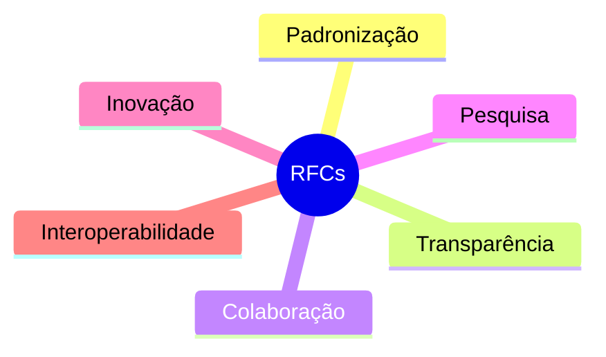
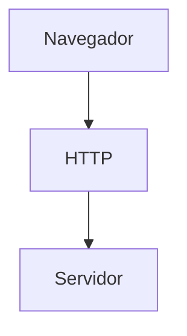

## O que são RFCs?

As RFCs (Request for Comments) são documentos técnicos utilizados para descrever protocolos, padrões, recomendações e processos relacionados à internet e às redes de computadores.

Esses documentos surgiram inicialmente durante o desenvolvimento da ARPANET, rede que serviu como base para a criação da internet moderna.

Com o crescimento da rede, tornou-se necessário centralizar e padronizar informações técnicas para garantir compatibilidade entre diferentes sistemas.

### Objetivos das RFCs

As RFCs ajudam a:

* documentar protocolos;
* padronizar tecnologias;
* registrar decisões técnicas;
* facilitar interoperabilidade;
* organizar a evolução da internet.

---

## Como as RFCs contribuem para a Internet

Grande parte das tecnologias utilizadas diariamente dependem de especificações definidas em RFCs.

Entre os principais protocolos documentados estão:

* HTTP;
* HTTPS;
* TCP/IP;
* SMTP;
* DNS;
* FTP.

### Relação entre protocolos e RFCs

Esses padrões permitem que dispositivos diferentes consigam se comunicar utilizando regras comuns.

---

## O papel da IETF

As RFCs são desenvolvidas e discutidas dentro da IETF (Internet Engineering Task Force).

A IETF é uma organização internacional aberta composta por:

* engenheiros;
* pesquisadores;
* fabricantes;
* desenvolvedores;
* universidades;
* empresas de tecnologia.

Seu principal objetivo é melhorar o funcionamento da internet através da colaboração técnica.

---

## Como funciona o processo de criação de uma RFC

O desenvolvimento de uma RFC ocorre através de discussões abertas entre especialistas da comunidade técnica.

### Fluxo simplificado

Esse modelo colaborativo ajuda a garantir:

* transparência;
* revisão coletiva;
* qualidade técnica;
* evolução contínua.

---

## RFCs e colaboração aberta

Um dos aspectos mais importantes das RFCs é seu caráter aberto.

Os documentos podem ser acessados publicamente, permitindo que estudantes, pesquisadores e profissionais consultem especificações técnicas da internet.

Esse modelo incentiva:

* compartilhamento de conhecimento;
* inovação;
* pesquisa acadêmica;
* desenvolvimento de tecnologias compatíveis.

### Cultura colaborativa da internet

A abertura desses documentos ajudou a consolidar a internet como um ambiente global e interoperável.

---

## Exemplos importantes de RFCs

Diversos protocolos fundamentais foram formalizados através de RFCs.

### HTTP

O protocolo HTTP define como navegadores e servidores trocam informações na web.

### TCP/IP

O conjunto TCP/IP estabelece a base da comunicação entre dispositivos conectados à internet.

### SMTP

O SMTP é responsável pelo envio de e-mails.

### DNS

O DNS converte nomes de domínio em endereços IP.

---

## A importância da padronização

A padronização é essencial para garantir que diferentes sistemas consigam funcionar juntos.

Sem RFCs, cada fabricante poderia implementar protocolos de maneira incompatível, dificultando a comunicação global.

### Exemplo de interoperabilidade

Graças aos padrões definidos em RFCs, navegadores diferentes conseguem acessar os mesmos sites utilizando protocolos padronizados.

---

## RFCs e o futuro da Internet

A internet está em constante evolução.

Novos desafios relacionados a:

* segurança;
* privacidade;
* computação em nuvem;
* inteligência artificial;
* Internet das Coisas (IoT);
* escalabilidade.

continuam exigindo criação e atualização de RFCs.

Esses documentos seguem sendo fundamentais para garantir estabilidade e evolução tecnológica da internet.

---

## Conclusão

As RFCs desempenham papel essencial na construção e manutenção da internet moderna.

Mais do que simples documentos técnicos, elas representam um modelo colaborativo de padronização que possibilita interoperabilidade, transparência e evolução contínua da rede.

Através da IETF e da participação aberta da comunidade técnica, as RFCs ajudam a transformar ideias em padrões globais utilizados diariamente por bilhões de pessoas.

Compreender a importância desses documentos também ajuda a entender como a internet funciona de maneira organizada e colaborativa.

---

## Referências

* [https://www.rfc-editor.org/](https://www.rfc-editor.org/)
* [https://www.ietf.org/](https://www.ietf.org/)
* [https://pt.wikipedia.org/wiki/Internet_Engineering_Task_Force](https://pt.wikipedia.org/wiki/Internet_Engineering_Task_Force)
* [https://developer.mozilla.org/pt-BR/docs/Web/HTTP](https://developer.mozilla.org/pt-BR/docs/Web/HTTP)
* [https://blog.ccna.com.br/2015/09/07/voce-sabe-o-que-e-rfc-e-para-que-serve-uma-rfc/](https://blog.ccna.com.br/2015/09/07/voce-sabe-o-que-e-rfc-e-para-que-serve-uma-rfc/)
