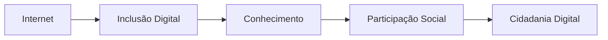
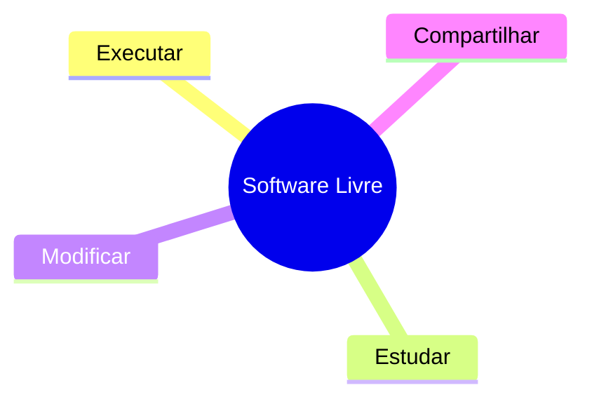
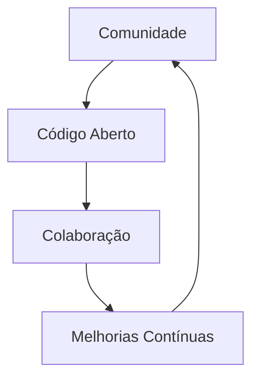
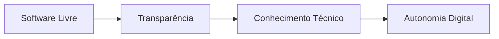
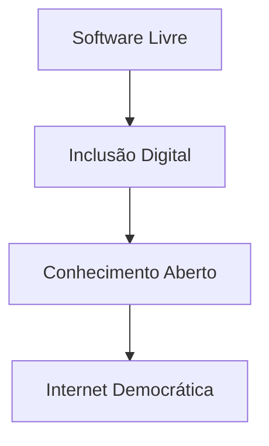

# O que é inclusão digital?

A inclusão digital envolve garantir que todas as pessoas consigam acessar, compreender e utilizar tecnologias digitais de maneira efetiva.

Isso inclui:

* acesso à internet;
* acesso à informação;
* alfabetização digital;
* uso de ferramentas tecnológicas;
* participação em ambientes digitais.

Mais do que disponibilizar computadores ou conexão, inclusão digital significa permitir que indivíduos participem ativamente da sociedade digital.

## Inclusão digital e cidadania

A exclusão digital pode ampliar desigualdades sociais e limitar o acesso à educação, trabalho e serviços públicos.

---

# O que é software livre?

O software livre é um modelo de desenvolvimento baseado em liberdade, colaboração e compartilhamento.

Segundo o Projeto GNU, um software é considerado livre quando usuários possuem liberdade para:

* executar o programa;
* estudar seu funcionamento;
* modificar o código-fonte;
* distribuir cópias;
* compartilhar melhorias.

## As quatro liberdades do software livre

Esse modelo incentiva construção coletiva de conhecimento e desenvolvimento aberto de tecnologias.

---

# Software livre e colaboração

O movimento do software livre possui forte relação com colaboração comunitária.

Projetos livres geralmente são desenvolvidos por comunidades distribuídas ao redor do mundo.

Isso permite que:

* pessoas contribuam com código;
* erros sejam corrigidos coletivamente;
* funcionalidades sejam aprimoradas;
* conhecimento técnico seja compartilhado.

## Modelo colaborativo do software livre

Esse modelo ajudou no desenvolvimento de tecnologias amplamente utilizadas atualmente. Confira o artigo: [Como o modelo colaborativo do software livre transformou a tecnologia](/posts/modelo-software-livre).

---

# Como o software livre contribui para inclusão digital

O software livre reduz barreiras econômicas e tecnológicas relacionadas ao acesso digital.

Ferramentas abertas e gratuitas permitem que pessoas, escolas, universidades e organizações utilizem tecnologias sem depender de licenças proprietárias caras.

## Benefícios do software livre

| Benefício                 | Impacto                        |
| ------------------------- | ------------------------------ |
| Gratuidade                | Redução de custos              |
| Código aberto             | Transparência                  |
| Compartilhamento          | Democratização do conhecimento |
| Independência tecnológica | Autonomia digital              |
| Comunidade                | Aprendizado colaborativo       |

Além disso, o software livre permite compreender melhor como sistemas funcionam, promovendo educação tecnológica e pensamento crítico.

---

# Transparência e autonomia digital

Softwares proprietários normalmente possuem código fechado, limitando o entendimento sobre funcionamento interno, coleta de dados e privacidade.

Já no software livre, o código pode ser auditado pela comunidade.

Isso favorece:

* transparência;
* segurança;
* auditoria pública;
* privacidade;
* independência tecnológica.

## Relação entre software livre e autonomia

Esse aspecto é especialmente importante em projetos públicos de inclusão digital.

---

# Software livre e educação

O software livre também possui forte impacto educacional.

Ferramentas abertas permitem que estudantes e instituições tenham acesso a tecnologias sem altos custos de licenciamento.

Além disso, estudantes conseguem:

* estudar código-fonte;
* modificar aplicações;
* experimentar tecnologias;
* aprender de maneira prática.

Isso estimula:

* criatividade;
* aprendizado colaborativo;
* inovação;
* formação técnica.

---

# O problema da dependência de softwares proprietários

Projetos de inclusão digital frequentemente utilizam softwares proprietários com:

* restrições de uso;
* custos elevados;
* licenças limitadas;
* dependência tecnológica.

Esse cenário pode gerar exclusão e dificultar acesso contínuo às ferramentas digitais.

Por isso, muitas iniciativas defendem adoção de soluções abertas em:

* escolas;
* universidades;
* órgãos públicos;
* projetos sociais.

---

# GNU/Linux e cultura de software livre

O GNU/Linux é um dos maiores exemplos de software livre.

Distribuições Linux são utilizadas em:

* servidores;
* universidades;
* empresas;
* supercomputadores;
* ambientes acadêmicos.

## Distribuições populares

* Debian
* Ubuntu
* Fedora
* Arch Linux
* Linux Mint

O uso dessas tecnologias fortalece a cultura de compartilhamento e desenvolvimento aberto.

---

# Ferramentas livres e alternativas abertas

Atualmente existem alternativas livres para diversas ferramentas proprietárias.

Alguns exemplos:

| Proprietário     | Alternativa Livre |
| ---------------- | ----------------- |
| Adobe Photoshop  | GIMP              |
| Microsoft Office | LibreOffice       |
| Windows          | GNU/Linux         |
| Adobe Premiere   | Kdenlive          |
| Google Chrome    | Firefox           |

Plataformas como [AlternativeTo](https://alternativeto.net/) ajudam usuários a encontrar alternativas livres para softwares populares.

---

# Inclusão digital como construção coletiva

A inclusão digital não depende apenas de infraestrutura tecnológica.

Ela também envolve:

* acesso ao conhecimento;
* liberdade tecnológica;
* educação digital;
* participação coletiva.

## Relação entre software livre e democratização da internet

O movimento do software livre contribui para construção de tecnologias mais abertas, acessíveis e colaborativas.

---

# Conclusão

O software livre desempenha papel importante na construção de uma internet mais inclusiva e democrática.

Além de reduzir barreiras econômicas, ele promove compartilhamento de conhecimento, autonomia tecnológica e participação coletiva.

Mais do que uma questão técnica, o software livre representa também um movimento social baseado em colaboração, liberdade e acesso aberto ao conhecimento.

Fortalecer a inclusão digital passa não apenas por ampliar acesso à internet, mas também por incentivar o uso de tecnologias abertas que permitam às pessoas compreender, modificar e participar ativamente da construção do ambiente digital.

---

# Referências

* [https://www.gnu.org/philosophy/free-sw.pt-br.html](https://www.gnu.org/philosophy/free-sw.pt-br.html)
* [https://www.gnu.org/](https://www.gnu.org/)
* [https://www.fsf.org/](https://www.fsf.org/)
* [https://alternativeto.net/](https://alternativeto.net/)
* [https://www.debian.org/](https://www.debian.org/)
