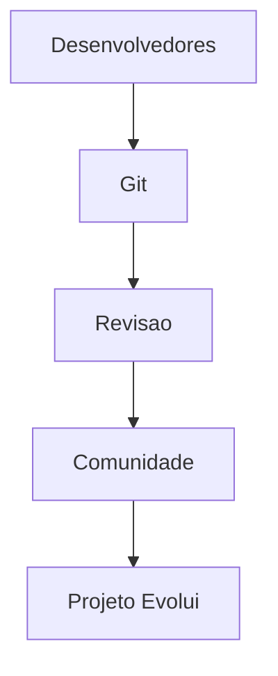

# O modelo colaborativo

O desenvolvimento de software livre normalmente funciona a partir de uma construção coletiva.

---

# Linux

Um dos maiores exemplos é o Linux.

O kernel Linux é utilizado em:

* servidores;
* supercomputadores;
* Android;
* sistemas embarcados;
* nuvem;
* IoT.

Grandes empresas como Google, Amazon, Microsoft e Meta utilizam Linux em suas infraestruturas.

---

# Android

O Android é baseado no kernel Linux.

Atualmente, bilhões de dispositivos utilizam Android.

Isso mostra como projetos abertos podem alcançar escala global.

---

# Internet e servidores

Grande parte da infraestrutura da Internet utiliza tecnologias open source.

## Exemplos

| Tecnologia | Objetivo             |
| ---------- | -------------------- |
| Apache     | Servidor web         |
| Nginx      | Proxy e servidor web |
| PostgreSQL | Banco de dados       |
| MySQL      | Banco de dados       |
| PHP        | Backend web          |

---

# Linguagens de programação

Diversas linguagens amplamente utilizadas possuem desenvolvimento aberto.

## Exemplos

* Python;
* JavaScript;
* PHP;
* Ruby;
* Go;
* Rust.

---

# Python e ciência de dados

Python se tornou uma das linguagens mais importantes da computação moderna.

Grande parte desse crescimento aconteceu por causa da comunidade open source.

## Bibliotecas populares

* NumPy;
* Pandas;
* TensorFlow;
* PyTorch;
* Scikit-learn.

---

# Inteligência artificial

O avanço da IA também depende fortemente de software livre.

## Frameworks importantes

| Framework    | Área             |
| ------------ | ---------------- |
| TensorFlow   | Machine learning |
| PyTorch      | Deep learning    |
| Keras        | Redes neurais    |
| Hugging Face | IA generativa    |

---

# Navegadores

Projetos open source também ajudaram no desenvolvimento da web moderna.

## Exemplos

* Chromium;
* Firefox;
* WebKit.

---

# Git e colaboração

O Git revolucionou o desenvolvimento colaborativo.

Ele foi criado por Linus Torvalds, o mesmo criador do Linux.

Hoje, plataformas como GitHub e GitLab dependem fortemente desse modelo.

---

# Fluxo colaborativo

---

# Cloud computing

Grande parte da computação em nuvem utiliza software livre.

## Tecnologias importantes

* Docker;
* Kubernetes;
* Linux;
* OpenStack.

---

# Segurança e transparência

Projetos open source permitem auditoria pública do código.

Isso ajuda em:

* segurança;
* correção de bugs;
* confiabilidade;
* transparência.

---

# Comunidade e aprendizado

Outro ponto importante é o compartilhamento de conhecimento.

Projetos open source ajudam pessoas a:

* aprender programação;
* estudar arquitetura;
* entender sistemas reais;
* colaborar globalmente.

---

# Desenvolvimento contínuo

Uma das maiores forças do software livre é a evolução contínua.

---

# Impacto do software livre

O modelo colaborativo ajudou diretamente no avanço de:

* Internet;
* IA;
* computação em nuvem;
* ciência de dados;
* desenvolvimento web;
* dispositivos móveis;
* DevOps.

---

# Conclusão

O software livre não representa apenas código aberto.

Ele representa um modelo de desenvolvimento baseado em:

* colaboração;
* transparência;
* compartilhamento;
* inovação coletiva.

Grande parte das tecnologias modernas utilizadas diariamente só evoluiu tão rapidamente graças ao modelo colaborativo open source.

Hoje, desde servidores até inteligência artificial, o software livre continua sendo uma das principais bases da tecnologia moderna.

# Links:

- [Como colaborar com Software Livre](/posts/colaborar-software-livre)