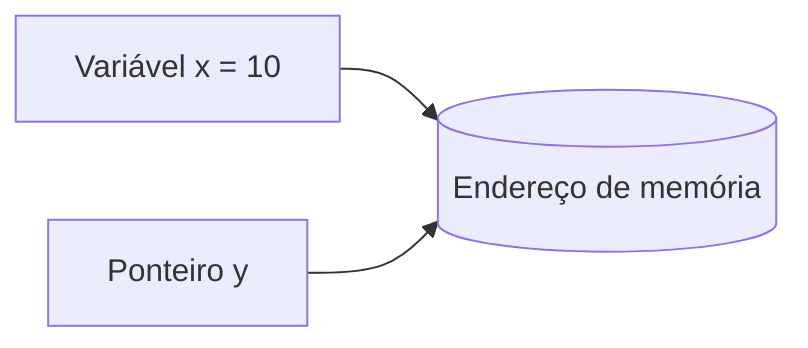
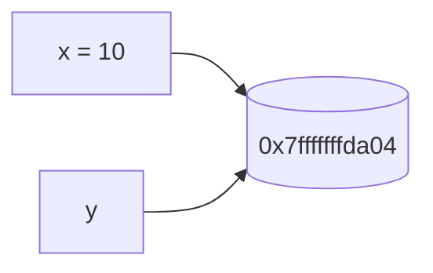
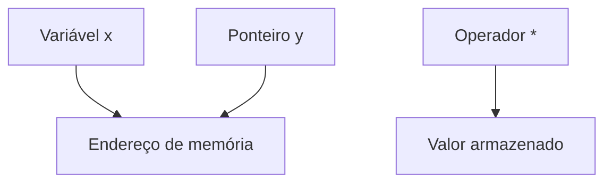

## O que são ponteiros?

Um ponteiro é uma variável capaz de armazenar o endereço de memória de outra variável.

Enquanto variáveis comuns armazenam valores, ponteiros armazenam referências para locais da memória.

### Relação entre variável e ponteiro



Isso permite acessar e modificar valores indiretamente através do endereço armazenado.

---

## Endereços de memória

Toda variável criada em um programa ocupa um espaço na memória.

Esse espaço possui um endereço único.

Na linguagem C, utilizamos o operador `&` para obter o endereço de memória de uma variável.

### Exemplo

```c
int x = 10;
printf("%p", &x);
```

A saída será algo semelhante a:

```text
0x7fffffffda04
```

O valor exato varia dependendo da execução do programa e do sistema operacional.

---

## Declarando ponteiros

Para declarar um ponteiro utilizamos o operador `*`.

### Estrutura básica

```c
int *ponteiro;
```

Nesse caso:

* `int` indica o tipo armazenado;
* `*` indica que a variável é um ponteiro;
* `ponteiro` é o nome da variável.

---

## Primeiro exemplo com ponteiros

```c
#include <stdio.h>

int main(void) {
    int x = 10;
    int *y;

    y = &x;

    printf("x = %d\n", x);
    printf("*y = %d\n", *y);
    printf("y = %p\n", y);

    return 0;
}
```

---

### O que acontece nesse código?

#### 1. Variável comum

```c
int x = 10;
```

A variável `x` é criada e recebe o valor `10`.

---

#### 2. Criação do ponteiro

```c
int *y;
```

O ponteiro `y` é declarado.

Ele será capaz de armazenar o endereço de uma variável do tipo `int`.

---

#### 3. Associação do ponteiro

```c
y = &x;
```

Aqui utilizamos `&x` para obter o endereço de memória da variável `x`.

Esse endereço é armazenado em `y`.

---

### Visualização da memória



O ponteiro `y` agora aponta para o mesmo endereço de memória de `x`.

---

## Operador de dereferência

O operador `*` também é utilizado para acessar o valor armazenado no endereço apontado pelo ponteiro.

### Exemplo

```c
printf("%d", *y);
```

Nesse caso:

* `y` contém o endereço de memória;
* `*y` acessa o valor armazenado naquele endereço.

Portanto, `*y` será igual a `10`.

---

## Alterando valores através do ponteiro

Uma das características mais importantes dos ponteiros é permitir modificar valores indiretamente.

### Exemplo

```c
#include <stdio.h>

int main(void) {
    int x = 10;
    int *y;

    y = &x;

    x = 20;

    printf("x = %d\n", x);
    printf("*y = %d\n", *y);
    printf("y = %p\n", y);

    return 0;
}
```

---

### Resultado esperado

```text
x = 20
*y = 20
y = 0x7fffffffda04
```

O endereço armazenado em `y` continua sendo o mesmo.

Como `y` aponta para `x`, qualquer alteração em `x` também será refletida em `*y`.

---

## Alterando a variável pelo ponteiro

Também é possível alterar diretamente o valor da variável utilizando o ponteiro.

### Exemplo

```c
#include <stdio.h>

int main(void) {
    int x = 10;
    int *y = &x;

    *y = 50;

    printf("x = %d\n", x);

    return 0;
}
```

### Saída

```text
x = 50
```

Nesse caso:

```c
*y = 50;
```

modifica diretamente o valor armazenado no endereço de `x`.

---

## Fluxo de funcionamento dos ponteiros



---

## Ponteiros e memória

Ponteiros são muito utilizados para:

* manipulação de memória;
* alocação dinâmica;
* arrays;
* strings;
* estruturas;
* funções;
* sistemas operacionais;
* desenvolvimento embarcado.

Grande parte da eficiência da linguagem C está relacionada ao controle direto da memória.

---

## Cuidados importantes

Apesar de poderosos, ponteiros exigem atenção.

Problemas comuns incluem:

| Problema                  | Descrição                    |
| ------------------------- | ---------------------------- |
| Ponteiro nulo             | Ponteiro sem endereço válido |
| Ponteiro não inicializado | Endereço aleatório           |
| Vazamento de memória      | Memória não liberada         |
| Segmentation fault        | Acesso inválido à memória    |

### Exemplo de ponteiro nulo

```c
int *p = NULL;
```

Inicializar ponteiros corretamente ajuda a evitar erros difíceis de identificar.

---

## Ponteiros e arrays

Arrays possuem forte relação com ponteiros.

O nome de um array representa o endereço do primeiro elemento.

### Exemplo

```c
int numeros[3] = {1, 2, 3};

printf("%d", *numeros);
```

Saída:

```text
1
```

---

## Conclusão

Ponteiros são um dos conceitos mais importantes da linguagem C.

Eles permitem manipulação direta da memória e fornecem grande flexibilidade para criação de programas eficientes.

Embora possam parecer difíceis inicialmente, compreender endereços de memória, dereferência e associação entre variáveis torna o funcionamento dos ponteiros muito mais intuitivo.

Dominar ponteiros é essencial para trabalhar com estruturas avançadas, sistemas operacionais, programação embarcada e desenvolvimento de software de baixo nível.

---

## Exercícios

* [https://github.com/MariaCarolinass/c-cpp/tree/main/c/ponteiros/src](https://github.com/MariaCarolinass/c-cpp/tree/main/c/ponteiros/src)

---

## Referências

* [https://en.cppreference.com/w/c/language/pointer](https://en.cppreference.com/w/c/language/pointer)
* [https://www.gnu.org/software/gnu-c-manual/](https://www.gnu.org/software/gnu-c-manual/)
* [https://learn.microsoft.com/pt-br/cpp/c-language/](https://learn.microsoft.com/pt-br/cpp/c-language/)
* [https://devdocs.io/c/](https://devdocs.io/c/)
