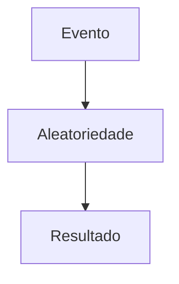

## O que é a biblioteca random?

A biblioteca `random` é um módulo nativo do Python responsável por gerar valores pseudoaleatórios.

Ela já vem instalada por padrão.

---

## Importando o módulo

### Exemplo

```python
import random
```

---

## O que são números pseudoaleatórios?

Computadores normalmente não geram números verdadeiramente aleatórios.

Os valores são produzidos através de algoritmos matemáticos.

Por isso, o termo correto costuma ser:

```text
Pseudoaleatório
```

---

## Fluxo simplificado


---

## Gerando números inteiros

Uma das funções mais utilizadas é `randint()`.

### Exemplo

```python
import random

numero = random.randint(1, 10)

print(numero)
```

---

## Como funciona randint?

A função gera um número inteiro dentro de um intervalo.

### Estrutura

```python
random.randint(inicio, fim)
```

---

## Exemplo prático

```python
random.randint(1, 100)
```

Pode gerar:

```text
15
82
47
```

---

## Gerando números decimais

Também podemos gerar números de ponto flutuante.

### Exemplo

```python
random.random()
```

---

## Resultado esperado

```text
0.73452
```

A função retorna um número entre:

```text
0.0 e 1.0
```

---

## Trabalhando com intervalos decimais

### Exemplo

```python
random.uniform(1, 10)
```

---

## Escolhendo elementos aleatórios

Outra funcionalidade muito útil é selecionar elementos de listas.

### Exemplo

```python
nomes = ['Ana', 'Carlos', 'Maria']

print(random.choice(nomes))
```

---

## Fluxo de escolha aleatória


---

## Embaralhando listas

Também podemos embaralhar elementos.

### Exemplo

```python
cartas = [1,2,3,4,5]

random.shuffle(cartas)
```

---

## Antes e depois

| Antes       | Depois      |
| ----------- | ----------- |
| [1,2,3,4,5] | [3,1,5,2,4] |

---

## Selecionando múltiplos valores

### Exemplo

```python
numeros = [1,2,3,4,5]

random.sample(numeros, 2)
```

---

## Resultado esperado

```text
[2,5]
```

---

## Sorteios simples

A biblioteca `random` é muito utilizada em sorteios.

### Exemplo

```python
participantes = ['Ana', 'Carlos', 'João']

vencedor = random.choice(participantes)

print(vencedor)
```

---

## Simulações

Números aleatórios também são utilizados em simulações.

### Exemplo de dado

```python
dado = random.randint(1, 6)
```

---

## Fluxo de simulação



---

## Jogos e aleatoriedade

Grande parte dos jogos depende de números aleatórios.

### Exemplos

* cartas;
* inimigos;
* mapas;
* loot;
* eventos;
* posições.

---

## Exemplo: jogo da adivinhação

Um uso clássico é em jogos da adivinhação.

### Exemplo

```python
numero_secreto = random.randint(1, 100)
```

Nesse caso, o jogador precisa descobrir o valor gerado.

---

## Seeds

A função `seed()` permite controlar a geração pseudoaleatória.

### Exemplo

```python
random.seed(10)
```

---

## Por que usar seed?

Seeds ajudam a reproduzir resultados.

Isso é útil em:

* testes;
* simulações;
* debugging;
* machine learning.

---

## Exemplo reproduzível

```python
random.seed(1)

print(random.randint(1, 10))
```

Executando novamente, o resultado será o mesmo.

---

## Segurança e random

A biblioteca `random` não é recomendada para aplicações criptográficas.

Para segurança, Python possui o módulo:

```python
secrets
```

---

## random vs secrets

| Biblioteca | Objetivo                 |
| ---------- | ------------------------ |
| random     | Jogos e simulações       |
| secrets    | Segurança e criptografia |

---

## Exemplo com secrets

```python
import secrets

numero = secrets.randbelow(10)
```

---

## Aplicações práticas

A biblioteca `random` pode ser utilizada em:

* jogos;
* sistemas de sorteio;
* testes automatizados;
* IA;
* simulações;
* embaralhamento de dados.

---

## Conceitos importantes aprendidos

Mesmo uma biblioteca simples ajuda bastante no aprendizado de:

* geração de dados;
* lógica de programação;
* manipulação de listas;
* estruturas de controle;
* simulações.

---

## Conclusão

A biblioteca `random` é uma das ferramentas mais simples e úteis do Python.

Mesmo sendo pequena, ela possui aplicações extremamente importantes em:

* jogos;
* automação;
* testes;
* simulações.

Além disso, é uma ótima biblioteca para iniciantes praticarem lógica de programação e experimentarem conceitos de aleatoriedade.

Com o tempo, conceitos simples como geração de números aleatórios podem evoluir para aplicações muito mais complexas envolvendo inteligência artificial, estatística e ciência de dados.

---

## Referências

* [https://docs.python.org/3/library/random.html](https://docs.python.org/3/library/random.html)
* [https://docs.python.org/3/library/secrets.html](https://docs.python.org/3/library/secrets.html)
* [https://realpython.com/python-random/](https://realpython.com/python-random/)
