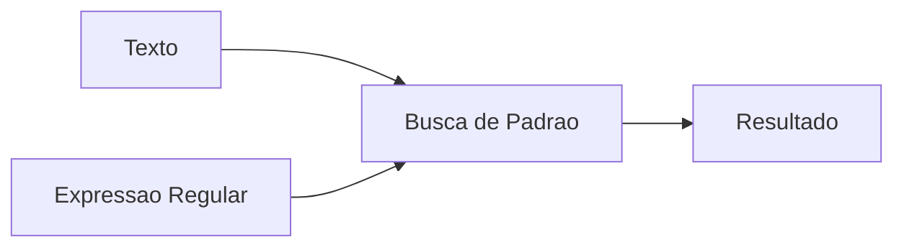
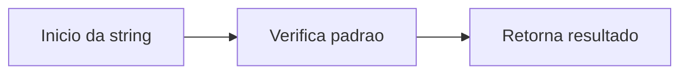

## O que é uma expressão regular?

Uma expressão regular é um padrão criado para identificar combinações específicas de caracteres dentro de um texto.

Esses padrões permitem:

* localizar palavras;
* validar formatos;
* substituir trechos;
* extrair informações.

### Exemplos de uso

| Situação         | Exemplo             |
| ---------------- | ------------------- |
| Validar e-mail   | `usuario@email.com` |
| Buscar números   | `12345`             |
| Encontrar datas  | `26/08/2024`        |
| Filtrar palavras | busca textual       |

---

## Importando o módulo `re`

No Python, expressões regulares são utilizadas através do módulo `re`.

### Importação

```python
import re
```

Esse módulo fornece funções para:

* buscar padrões;
* validar textos;
* substituir conteúdos;
* dividir strings.

---

## Escrevendo uma expressão regular

No Python, normalmente utilizamos a letra `r` antes da string da expressão regular.

### Exemplo

```python
padrao = r"expressao"
```

O prefixo `r` indica uma *raw string*.

Isso evita conflitos entre caracteres especiais do Python e caracteres especiais do RegEx.

Embora não seja obrigatório, o uso de `r` é altamente recomendado.

---

## Metacaracteres

As expressões regulares utilizam símbolos especiais chamados de **metacaracteres**.

Esses símbolos possuem significados específicos e definem como o padrão será interpretado.

### Principais metacaracteres

| Metacaractere | Significado              |             |
| ------------- | ------------------------ | ----------- |
| `.`           | Qualquer caractere       |             |
| `*`           | Zero ou mais ocorrências |             |
| `+`           | Uma ou mais ocorrências  |             |
| `?`           | Zero ou uma ocorrência   |             |
| `^`           | Início da string         |             |
| `$`           | Final da string          |             |
| `[]`          | Conjunto de caracteres   |             |
| `()`          | Grupo                    |             |
| `\`           | Escape                   |             |
| `{}`          | Quantificador            |             |

---

## Visualizando os metacaracteres


---

## Como o RegEx funciona



A expressão regular é comparada com o texto até encontrar padrões compatíveis.

---

## Principais funções do módulo `re`

O módulo `re` possui diversas funções importantes.

---

### `re.match()`

A função `re.match()` procura o padrão apenas no início da string.

### Exemplo

```python
import re

texto = "Python é incrível"
padrao = r"Python"

resultado = re.match(padrao, texto)

print(resultado)
```

#### Fluxo do `match`



---

### `re.search()`

A função `re.search()` procura o padrão em qualquer parte do texto.

### Exemplo

```python
import re

texto = "Eu estudo Python"
padrao = r"Python"

resultado = re.search(padrao, texto)

print(resultado)
```

---

### `re.findall()`

A função `re.findall()` retorna todas as ocorrências encontradas.

### Exemplo

```python
import re

texto = "Python Java Python JavaScript"
padrao = r"Python"

resultado = re.findall(padrao, texto)

print(resultado)
```

#### Saída

```python
['Python', 'Python']
```

---

### `re.sub()`

A função `re.sub()` substitui padrões encontrados no texto.

### Exemplo

```python
import re

texto = "Python é legal"
padrao = r"legal"

resultado = re.sub(padrao, "poderoso", texto)

print(resultado)
```

#### Saída

```python
Python é poderoso
```

---

## Exemplos práticos de RegEx

### Encontrando números

```python
import re

texto = "Pedido 12345 realizado"
padrao = r"\d+"

resultado = re.findall(padrao, texto)

print(resultado)
```

#### Saída

```python
['12345']
```

---

### Validando e-mail

```python
import re

email = "usuario@email.com"
padrao = r"^[\w\.-]+@[\w\.-]+\.\w+$"

resultado = re.match(padrao, email)

print(resultado)
```

#### Saída

```python
<re.Match object; span=(0, 17), match='usuario@email.com'>
```

---

### Encontrando palavras

```python
import re

texto = "Python Java C"
padrao = r"Python|Java"

resultado = re.findall(padrao, texto)

print(resultado)
```

#### Saída

```python
['Python', 'Java']
```

---

## Quantificadores

Os quantificadores definem quantas vezes um padrão pode aparecer.

| Quantificador | Significado           |
| ------------- | --------------------- |
| `*`           | Zero ou mais vezes    |
| `+`           | Uma ou mais vezes     |
| `?`           | Zero ou uma vez       |
| `{n}`         | Exatamente `n` vezes  |
| `{n,m}`       | Entre `n` e `m` vezes |

---

## Classes especiais

Algumas sequências possuem significados especiais.

| Classe | Significado       |
| ------ | ----------------- |
| `\d`   | Dígitos           |
| `\w`   | Letras e números  |
| `\s`   | Espaços em branco |
| `\D`   | Não dígitos       |
| `\W`   | Não alfanumérico  |

---

## Vantagens do RegEx

Expressões regulares podem simplificar bastante manipulações textuais.

### Benefícios

| Vantagem       | Descrição                          |
| -------------- | ---------------------------------- |
| Busca avançada | Encontrar padrões complexos        |
| Validação      | Verificar formatos de entrada      |
| Automação      | Processar grandes volumes de texto |
| Flexibilidade  | Adaptar padrões facilmente         |
| Reutilização   | Reaproveitar expressões            |

---

## Cuidados ao utilizar RegEx

Apesar de poderosas, expressões regulares podem se tornar difíceis de entender se forem muito complexas.

### Problemas comuns

* padrões difíceis de manter;
* expressões muito grandes;
* baixa legibilidade;
* desempenho ruim em textos muito extensos.

Por isso, é importante escrever expressões claras e documentadas.

---

## Quando utilizar RegEx?

RegEx é muito útil quando precisamos:

* validar entradas;
* procurar padrões;
* manipular textos;
* extrair informações;
* automatizar processamento textual.

Entretanto, nem todo problema textual precisa de expressão regular.

Em alguns casos, métodos simples de string podem ser mais legíveis.

---

## Conclusão

Expressões regulares são ferramentas extremamente poderosas para manipulação e análise de textos.

Com o módulo `re`, o Python fornece recursos simples e eficientes para trabalhar com padrões textuais.

Embora o RegEx possa parecer complicado inicialmente, compreender seus principais operadores e funções torna a manipulação de strings muito mais prática.

Dominar expressões regulares é uma habilidade bastante útil para desenvolvimento web, análise de dados, automação e processamento textual.

---

## Exercícios

* [https://github.com/MariaCarolinass/expressoes-regulares/tree/main/exercicios](https://github.com/MariaCarolinass/expressoes-regulares/tree/main/exercicios)

---

## Referências

* [https://docs.python.org/3/library/re.html](https://docs.python.org/3/library/re.html)
* [https://developer.mozilla.org/pt-BR/docs/Web/JavaScript/Guide/Regular_expressions](https://developer.mozilla.org/pt-BR/docs/Web/JavaScript/Guide/Regular_expressions)
* [https://regex101.com/](https://regex101.com/)
* [https://www.regular-expressions.info/](https://www.regular-expressions.info/)
