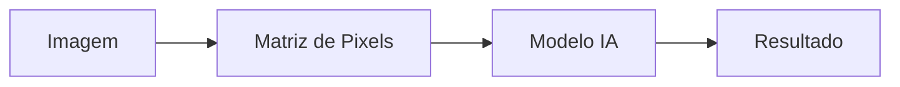
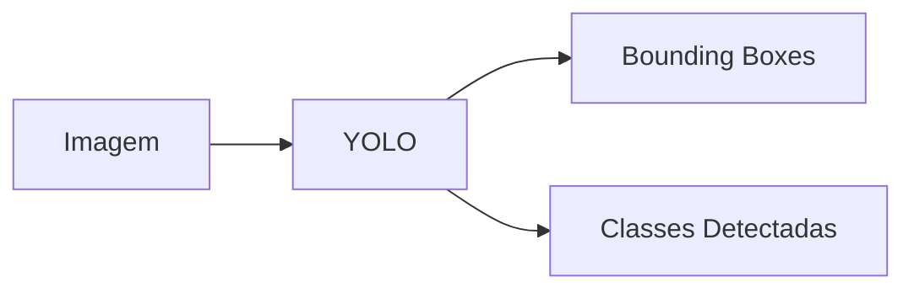
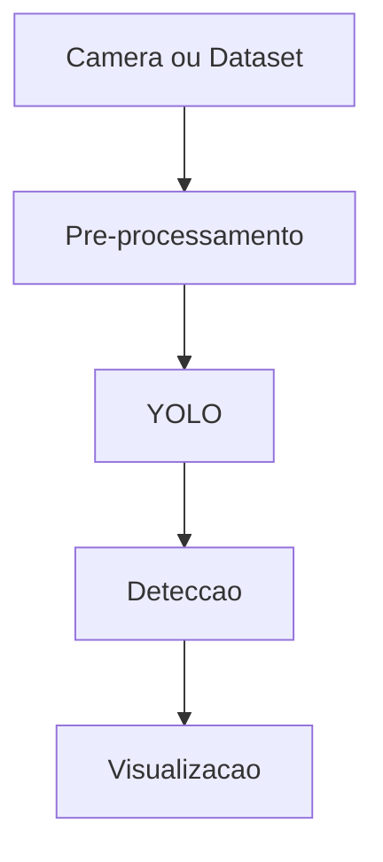
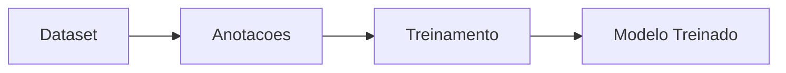

---

date: 2025-05-12
lastmod: 2025-05-12
showTableOfContents: true
tags: ["Python", "YOLO", "visão computacional", "machine learning", "OpenCV"]
title: "Visão computacional com YOLO: detecção de objetos em tempo real"
description: "Entenda como funciona visão computacional, detecção de objetos e modelos YOLO utilizando Python."
type: "post"
------------

## Visão computacional com YOLO: detecção de objetos em tempo real

A visão computacional é uma área da inteligência artificial focada em permitir que computadores interpretem imagens e vídeos.

Atualmente, aplicações de visão computacional estão presentes em:

* carros autônomos;
* monitoramento urbano;
* segurança;
* reconhecimento facial;
* medicina;
* drones;
* análise de trânsito;
* cidades inteligentes.

Nos últimos anos, modelos de detecção de objetos evoluíram bastante, principalmente com arquiteturas como YOLO (*You Only Look Once*), que se tornaram populares por sua velocidade e eficiência.

Neste artigo vamos entender:

* o que é visão computacional;
* como funciona detecção de objetos;
* conceitos do YOLO;
* pipelines de processamento;
* aplicações práticas.

---

## O que é visão computacional?

Visão computacional é o campo responsável por permitir que sistemas interpretem informações visuais.

Esses sistemas podem:

* identificar objetos;
* segmentar imagens;
* reconhecer padrões;
* detectar movimento;
* analisar vídeos;
* rastrear elementos.

---

## Como computadores enxergam imagens?

Imagens digitais são compostas por matrizes de pixels.

Cada pixel armazena informações de cor.

### Representação simplificada



---

## O que é detecção de objetos?

Detecção de objetos é a tarefa de localizar e identificar elementos dentro de imagens ou vídeos.

O modelo precisa:

1. identificar o objeto;
2. classificar o objeto;
3. localizar sua posição.

---

## Diferença entre classificação e detecção

| Técnica       | Objetivo                           |
| ------------- | ---------------------------------- |
| Classificação | Identificar o que existe na imagem |
| Detecção      | Identificar e localizar objetos    |
| Segmentação   | Delimitar regiões específicas      |

---

## Como funciona a detecção?

Modelos de detecção normalmente retornam:

* classe do objeto;
* confiança;
* coordenadas.

### Exemplo

```text
Objeto: carro
Confianca: 97%
Posicao: x=120 y=200
```

Além disso, o modelo desenha caixas ao redor dos elementos detectados.

Essas caixas são chamadas de *bounding boxes*.

---

## O que é YOLO?

YOLO (*You Only Look Once*) é uma família de modelos de detecção de objetos em tempo real.

A principal proposta do YOLO é realizar detecção utilizando apenas uma passagem pela rede neural.

Isso torna o modelo extremamente rápido em comparação com abordagens mais antigas.

### Pipeline simplificado do YOLO



---

## Bounding boxes

Bounding boxes são caixas utilizadas para marcar objetos detectados.

### Exemplo conceitual

```text
+-------------------+
|       carro       |
+-------------------+
```

O modelo retorna coordenadas indicando onde o objeto está localizado.

---

## Por que YOLO ficou popular?

YOLO ganhou destaque principalmente por:

* velocidade;
* eficiência;
* capacidade de tempo real;
* boa precisão;
* facilidade de integração.

Isso permitiu aplicações em:

* câmeras;
* drones;
* trânsito;
* monitoramento;
* edge computing.

---

## Evolução das versões do YOLO

A arquitetura YOLO passou por várias evoluções.

| Versão | Característica                |
| ------ | ----------------------------- |
| YOLOv3 | Popularização do modelo       |
| YOLOv5 | Facilidade de uso             |
| YOLOv7 | Melhorias de desempenho       |
| YOLOv8 | Integração moderna e flexível |

---

## Visão computacional em monitoramento urbano

Uma aplicação interessante para YOLO é o monitoramento urbano.

Modelos podem ser utilizados para detectar:

* veículos;
* enchentes;
* movimentação;
* objetos;
* riscos urbanos.

Projetos experimentais ajudam bastante no aprendizado de:

* processamento de imagens;
* machine learning;
* integração de sistemas;
* pipelines de dados.

Um exemplo é o projeto experimental:

* [Urban Disaster Monitor](https://github.com/MariaCarolinass/urban-disaster-monitor)

que explora conceitos relacionados a monitoramento urbano, processamento de dados e integração de sistemas.

---

## Exemplo visual de monitoramento

A imagem abaixo faz parte do projeto **Urban Disaster Monitor** e representa um cenário de monitoramento urbano.


Nesse tipo de aplicação, modelos de visão computacional podem ser utilizados para:

* detectar objetos;
* analisar movimentação;
* identificar padrões;
* auxiliar monitoramento em tempo real.

---

## Pipeline de visão computacional

Sistemas de visão computacional normalmente possuem múltiplas etapas.



---

## OpenCV e Python

OpenCV é uma das bibliotecas mais utilizadas em visão computacional.

Ela permite:

* leitura de imagens;
* captura de vídeo;
* processamento;
* filtros;
* integração com modelos.

---

## Exemplo simples com OpenCV

```python
import cv2

imagem = cv2.imread("imagem.jpg")

cv2.imshow("Imagem", imagem)
cv2.waitKey(0)
```

---

## Pré-processamento de imagens

Antes da inferência, normalmente é necessário tratar as imagens.

### Etapas comuns

* redimensionamento;
* normalização;
* remoção de ruído;
* conversão de cores.

---

## Dataset e treinamento

Modelos supervisionados precisam de datasets anotados.

As anotações geralmente incluem:

* classe;
* posição;
* bounding box.

---

## Fluxo de treinamento



---

## Métricas importantes

Em visão computacional, algumas métricas são bastante utilizadas.

| Métrica   | Objetivo                        |
| --------- | ------------------------------- |
| Precision | Quantidade de acertos           |
| Recall    | Capacidade de encontrar objetos |
| mAP       | Qualidade geral do detector     |
| FPS       | Velocidade de processamento     |

---

## Tempo real e desempenho

Aplicações de monitoramento frequentemente precisam processar vídeo em tempo real.

Isso exige atenção para:

* desempenho;
* uso de GPU;
* otimização;
* latência.

---

## CPU vs GPU

| CPU                      | GPU                                 |
| ------------------------ | ----------------------------------- |
| Processamento geral      | Processamento paralelo              |
| Mais lenta para IA       | Muito melhor para deep learning     |
| Boa para tarefas simples | Ideal para treinamento e inferência |

---

## Desafios em visão computacional

Projetos de visão computacional possuem vários desafios.

| Desafio              | Impacto                         |
| -------------------- | ------------------------------- |
| Iluminação           | Reduz precisão                  |
| Oclusão              | Objetos parcialmente escondidos |
| Qualidade do dataset | Afeta treinamento               |
| Escalabilidade       | Grandes volumes de vídeo        |
| Tempo real           | Exige otimização                |

---

## Possíveis aplicações

Visão computacional possui aplicações em diversas áreas.

### Exemplos

* monitoramento urbano;
* trânsito inteligente;
* reconhecimento facial;
* segurança;
* análise industrial;
* medicina;
* agricultura.

---

## IA, cidades inteligentes e monitoramento

Com o crescimento das chamadas *smart cities*, aplicações de visão computacional passaram a ter um papel importante na análise urbana.

Sistemas desse tipo ajudam a:

* automatizar análises;
* detectar padrões;
* apoiar monitoramento;
* processar grandes volumes de dados.

Além disso, projetos experimentais ajudam bastante no aprendizado prático de integração entre IA, backend e processamento de dados.

---

## Conclusão

Visão computacional é uma das áreas mais interessantes da inteligência artificial moderna.

Modelos como YOLO popularizaram a detecção de objetos em tempo real, permitindo aplicações em diversas áreas.

Além de aprendizado em machine learning, projetos de visão computacional também ajudam a desenvolver conhecimentos em:

* processamento de imagens;
* APIs;
* otimização;
* pipelines de dados;
* arquitetura de sistemas.

Com a evolução de GPUs, datasets e modelos de deep learning, aplicações baseadas em visão computacional tendem a crescer cada vez mais.

---

## Referências

* [https://opencv.org/](https://opencv.org/)
* [https://docs.ultralytics.com/](https://docs.ultralytics.com/)
* [https://pjreddie.com/darknet/yolo/](https://pjreddie.com/darknet/yolo/)
* [https://pytorch.org/](https://pytorch.org/)
* [https://www.tensorflow.org/](https://www.tensorflow.org/)
* [https://github.com/MariaCarolinass/urban-disaster-monitor](https://github.com/MariaCarolinass/urban-disaster-monitor)
