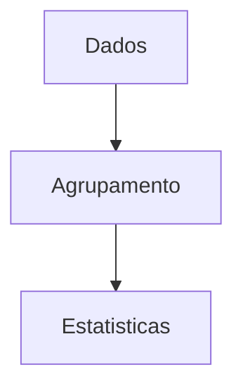
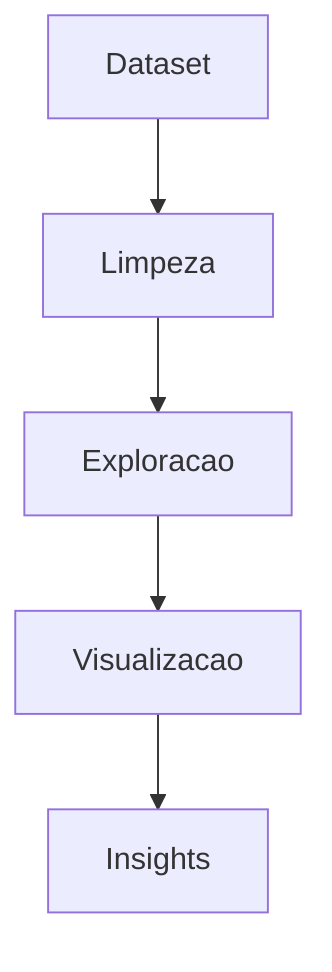

---

date: 2024-09-30
lastmod: 2024-09-30
showTableOfContents: true
tags: ["Python", "Pandas", "dados", "análise de dados", "tutorial"]
title: "Introdução à análise de dados com Python e Pandas"
description: "Aprenda conceitos fundamentais de análise de dados utilizando Python, Pandas e visualização de informações."
type: "post"
------------

Análise de dados se tornou uma das áreas mais importantes da computação moderna.

Atualmente, empresas e aplicações utilizam dados para:

* identificar padrões;
* gerar relatórios;
* automatizar decisões;
* construir modelos de machine learning;
* monitorar sistemas;
* apoiar análises de negócio.

Neste tutorial vamos explorar conceitos fundamentais de análise de dados utilizando Python.

O objetivo é compreender:

* leitura de datasets;
* manipulação de dados;
* limpeza;
* transformação;
* visualização;
* análise exploratória.

---

## Por que Python é tão usado em dados?

Python possui um ecossistema extremamente forte para análise de dados.

Algumas das principais vantagens são:

* simplicidade;
* produtividade;
* grande quantidade de bibliotecas;
* integração com machine learning;
* visualização de dados.

---

## Bibliotecas principais

| Biblioteca   | Objetivo              |
| ------------ | --------------------- |
| Pandas       | Manipulação de dados  |
| NumPy        | Operações numéricas   |
| Matplotlib   | Visualização          |
| Seaborn      | Gráficos estatísticos |
| Scikit-learn | Machine learning      |

---

## Instalando as bibliotecas

### Comando

```bash
pip install pandas matplotlib seaborn numpy
```

---

## O que é um dataset?

Datasets representam conjuntos de dados organizados.

Eles podem estar em formatos como:

* CSV;
* JSON;
* Excel;
* bancos de dados.

---

## Fluxo básico da análise de dados


---

## Lendo arquivos CSV

Uma das operações mais comuns é carregar arquivos CSV.

### Exemplo

```python
import pandas as pd

_df = pd.read_csv('dados.csv')
```

---

## Estrutura do DataFrame

O Pandas trabalha principalmente com DataFrames.

Um DataFrame funciona como uma tabela.

### Exemplo conceitual

| Nome | Idade | Cidade |
| ---- | ----- | ------ |
| Ana  | 20    | Natal  |
| João | 25    | Recife |

---

## Visualizando dados

### Primeiras linhas

```python
_df.head()
```

---

### Últimas linhas

```python
_df.tail()
```

---

## Informações gerais

```python
_df.info()
```

Essa função ajuda a identificar:

* quantidade de linhas;
* tipos de dados;
* valores nulos.

---

## Estatísticas básicas

```python
_df.describe()
```

---

## Selecionando colunas

### Exemplo

```python
_df['idade']
```

---

## Filtrando dados

Uma das operações mais importantes é filtrar informações.

### Exemplo

```python
_df[_df['idade'] > 18]
```

---

## Fluxo de filtragem


---

## Valores nulos

Datasets reais frequentemente possuem dados ausentes.

### Verificando valores nulos

```python
_df.isnull().sum()
```

---

## Removendo valores nulos

```python
_df.dropna()
```

---

## Substituindo valores

```python
_df.fillna(0)
```

---

## Limpeza de dados

Grande parte da análise de dados envolve limpeza.

### Problemas comuns

| Problema         | Exemplo                 |
| ---------------- | ----------------------- |
| Dados duplicados | Registros repetidos     |
| Valores ausentes | Campos vazios           |
| Tipos incorretos | Número salvo como texto |
| Inconsistência   | Formatos diferentes     |

---

## Removendo duplicatas

```python
_df.drop_duplicates()
```

---

## Conversão de tipos

```python
_df['idade'] = _df['idade'].astype(int)
```

---

## Agrupamento de dados

Agrupamentos ajudam a gerar análises estatísticas.

### Exemplo

```python
_df.groupby('cidade').mean()
```

---

## Fluxo de agrupamento



---

## Ordenando dados

```python
_df.sort_values(by='idade')
```

---

## Visualização de dados

Visualização é uma das partes mais importantes da análise.

Gráficos ajudam a identificar:

* padrões;
* tendências;
* anomalias.

---

## Criando gráficos

### Exemplo com Matplotlib

```python
import matplotlib.pyplot as plt

plt.plot([1,2,3],[4,5,6])
plt.show()
```

---

## Gráfico de barras

```python
_df['cidade'].value_counts().plot(kind='bar')
```

---

## Fluxo da visualização


---

## Análise exploratória de dados

EDA (*Exploratory Data Analysis*) é o processo de explorar dados antes da modelagem.

Ela ajuda a:

* entender padrões;
* detectar problemas;
* gerar hipóteses.

---

## Pipeline de análise exploratória



---

## Trabalhando com múltiplos arquivos

Em projetos reais, normalmente trabalhamos com vários datasets.

### Exemplo

```python
pd.concat([df1, df2])
```

---

## Salvando resultados

Depois da análise, podemos exportar os dados.

### Exemplo

```python
_df.to_csv('resultado.csv')
```

---

## Jupyter Notebook

Jupyter Notebook é bastante utilizado em análise de dados.

Ele permite:

* executar código em blocos;
* visualizar gráficos;
* documentar análises.

---

## Instalando Jupyter

```bash
pip install notebook
```

---

## Executando

```bash
jupyter notebook
```

---

## Possíveis aplicações

Análise de dados possui aplicações em:

* negócios;
* finanças;
* ciência;
* saúde;
* monitoramento;
* machine learning.

---

## Conceitos importantes aprendidos

Projetos de análise de dados ajudam bastante no aprendizado de:

* manipulação de datasets;
* estatística;
* visualização;
* automação;
* pipelines de dados.

---

## Possíveis evoluções

Depois da análise básica, várias evoluções podem ser adicionadas.

### Exemplos

* dashboards;
* machine learning;
* automação;
* pipelines ETL;
* integração com APIs;
* bancos de dados.

---

## Conclusão

Análise de dados é uma das áreas mais importantes da tecnologia moderna.

Mesmo projetos simples ajudam bastante no aprendizado de:

* limpeza de dados;
* transformação;
* visualização;
* exploração estatística.

Além disso, Python e Pandas tornaram o ecossistema de análise extremamente acessível.

Com o crescimento do volume de dados no mundo, compreender análise de dados se tornou uma habilidade cada vez mais relevante.

---

## Referências

* [https://pandas.pydata.org/](https://pandas.pydata.org/)
* [https://numpy.org/](https://numpy.org/)
* [https://matplotlib.org/](https://matplotlib.org/)
* [https://seaborn.pydata.org/](https://seaborn.pydata.org/)
* [https://jupyter.org/](https://jupyter.org/)
* [https://github.com/MariaCarolinass/analise-de-dados](https://github.com/MariaCarolinass/analise-de-dados)
