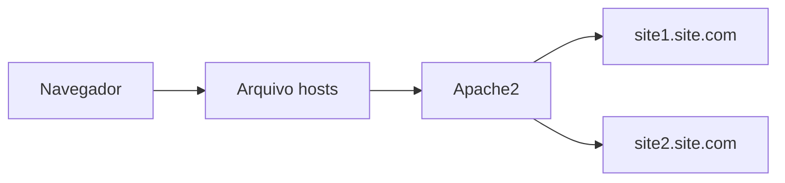

# Instalação da máquina virtual: VirtualBox

O VirtualBox é um virtualizador completo de uso geral.

Ele permite criar máquinas virtuais capazes de executar diferentes sistemas operacionais dentro do computador físico.

Uma máquina virtual simula um computador completo, permitindo estudar sistemas operacionais, servidores e redes sem alterar diretamente o ambiente principal.

## Links úteis

* [Download do VirtualBox](https://www.virtualbox.org/wiki/Downloads)
* [Documentação do VirtualBox](https://www.virtualbox.org/wiki/VirtualBox)

---

# Instalação da imagem do sistema operacional: Debian

Para configurar o VirtualBox precisamos baixar uma imagem ISO de um sistema operacional.

Neste tutorial utilizaremos o Debian, uma das distribuições Linux mais estáveis e utilizadas em servidores.

O Projeto Debian é uma comunidade que desenvolve software livre e mantém uma distribuição Linux focada em estabilidade, segurança e desempenho.

## Links úteis

* [Download do Debian](https://www.debian.org/distrib/)
* [Site oficial do Debian](https://www.debian.org/)
* [Guia Foca Linux](https://www.guiafoca.org/guiaonline/iniciante/)

---

# Fluxo da virtualização


---

# Criação da máquina virtual e instalação do Debian

## Criando a máquina virtual

### 1. Criar nova máquina virtual

Clique em **Novo** para criar a máquina virtual.

---

### 2. Escolher o sistema operacional

Escolha:

* tipo: `Linux`;
* versão: `Debian 32-bit` ou `Debian 64-bit`.

---

### 3. Configurar memória RAM

Utilize a memória recomendada de:

```text
1024 MB
```

para computadores com 2GB ou mais.

---

### 4. Criar disco rígido virtual

Deixe marcada a opção:

```text
Criar um novo disco rígido virtual agora
```

---

### 5. Escolher formato do disco

Selecione:

```text
VDI (VirtualBox Disk Image)
```

---

### 6. Tipo de armazenamento

Escolha:

```text
Tamanho fixo
```

Isso melhora o desempenho da máquina virtual.

---

### 7. Definir tamanho do disco

Utilize o tamanho recomendado:

```text
8 GB
```

---

### 8. Inicializar a máquina virtual

Após finalizar a criação da máquina, clique em:

```text
Iniciar
```

---

# Instalando o Debian na máquina virtual

## 1. Selecionar a imagem ISO

Ao iniciar a máquina virtual pela primeira vez:

* clique na pasta amarela;
* selecione a imagem ISO do Debian;
* clique em `Iniciar`.

---

## 2. Escolher instalação gráfica

Pressione:

```text
Enter
```

para selecionar:

```text
Graphical install
```

---

## 3. Selecionar idioma

Escolha:

```text
Portuguese (Brazil)
```

---

## 4. Selecionar localidade

Escolha:

```text
Brasil
```

---

## 5. Configurar teclado

Selecione:

```text
Português Brasileiro
```

---

## 6. Nome da máquina

Defina um nome para a máquina virtual.

---

## 7. Nome de domínio

O nome de domínio pode permanecer em branco.

---

## 8. Senha do root

Defina a senha do usuário administrador (`root`).

⚠️ Lembre-se dessa senha.

---

## 9. Confirmar senha do root

Digite novamente a senha.

---

## 10. Nome completo do usuário

Digite o nome completo do usuário.

---

## 11. Nome de usuário

Defina o usuário para acesso ao sistema.

---

## 12. Senha do usuário

Defina a senha do usuário.

⚠️ Lembre-se dessa senha.

---

## 13. Confirmar senha do usuário

Digite novamente a senha.

---

## 14. Configurar relógio

Escolha a localidade para configurar o horário.

---

# Particionamento do disco

## 15. Escolher particionamento

Selecione:

```text
Assistido - usar o disco inteiro
```

---

## 16. Selecionar disco

Escolha o disco disponível.

---

## 17. Estrutura de partições

Selecione:

```text
Todos os arquivos em uma partição (para iniciantes)
```

---

## 18. Finalizar particionamento

Selecione:

```text
Finalizar o particionamento e escrever as mudanças no disco
```

---

## 19. Confirmar alterações

Selecione:

```text
Sim
```

Aguarde a instalação do sistema básico.

---

## 20. Novos CDs/DVDs

Selecione:

```text
Não
```

---

## 21. Configurar espelho Debian

Escolha:

```text
Brasil
```

---

## 22. Servidor Debian

Escolha:

```text
deb.debian.org
```

---

## 23. Configuração de proxy

Não é necessário configurar proxy.

Pressione:

```text
Enter
```

---

## 24. Concurso de pacotes

Selecione:

```text
Não
```

---

## 25. Selecionar pacotes

Marque:

* Xfce;
* servidor de impressão;
* utilitários de sistema padrão.

Utilize:

```text
Espaço
```

para marcar as opções.

---

## 26. Instalar GRUB

Selecione:

```text
Sim
```

---

## 27. Selecionar dispositivo GRUB

Escolha:

```text
/dev/sda
```

---

## 28. Finalizar instalação

Selecione:

```text
Continuar
```

---

# Configurando e instalando o Apache2

Após iniciar o Debian, abra o terminal.

---

# Acessando como root

```bash
su
```

Digite a senha do usuário administrador.

---

# Instalando Apache2

```bash
apt-get install apache2
```

---

# Verificando status do Apache

```bash
systemctl status
```

---

# Configuração de rede da máquina virtual

No VirtualBox:

```text
Configurações > Rede > Conectado a: Host-only
```

Depois atualize a configuração de rede:

```bash
/sbin/dhclient
```

---

# Descobrindo o endereço IP

```bash
ip addr
```

O endereço IP estará na linha:

```text
inet
```

---

# Testando o servidor Apache

Digite o endereço IP da máquina virtual no navegador.

Se tudo estiver correto, a página padrão do Apache será exibida.

---

# Fluxo do servidor web


---

# Editando a página inicial

## Acessar diretório web

```bash
cd /var/www/html
```

---

## Renomear arquivo padrão

```bash
mv index.html _index.html
```

---

# Instalando editor de texto

Caso necessário:

```bash
apt-get install gedit
```

---

# Editando o arquivo HTML

Substitua o conteúdo do arquivo:

```html
<html>
<header><title>Teste</title></header>
<body><h1>Editando um site</h1></body>
</html>
```

---

# Reiniciando Apache

Caso necessário:

```bash
systemctl restart apache2
```

---

# Configurando dois sites no mesmo servidor

O Apache permite hospedar múltiplos sites utilizando Virtual Hosts.

---

# Criando diretórios dos sites

```bash
mkdir site1.site.com
mkdir site2.site.com
```

---

# Criando arquivos HTML

```bash
cd site1.site.com
nano index.html

cd site2.site.com
nano index.html
```

⚠️ Não esqueça de adicionar conteúdo nos arquivos.

---

# Criando arquivos de configuração

```bash
cd /etc/apache2/sites-available/

touch site1.site.com.conf

touch site2.site.com.conf
```

---

# Configuração do VirtualHost

Abra:

```bash
nano site1.site.com.conf
```

Adicione:

```apache
<VirtualHost *:80>
  ServerName site1.site.com
  DocumentRoot /var/www/site1.site.com
</VirtualHost>
```

Repita para o segundo site.

---

# Ativando os sites

```bash
/sbin/a2ensite site1.site.com
/sbin/a2ensite site2.site.com
```

---

# Reiniciando Apache após configuração

```bash
systemctl reload apache2
```

ou

```bash
systemctl restart apache2
```

---

# Configurando arquivo hosts

## Linux

```text
/etc/hosts
```

## Windows

```text
c:\Windows\System32\drivers\etc\hosts
```

---

# Adicionando domínios locais

Adicione ao final do arquivo:

```text
<Numero-do-seu-IP> site1.site.com
<Numero-do-seu-IP> site2.site.com
```

---

# Fluxo dos Virtual Hosts



---

# Conclusão

Neste tutorial configuramos uma máquina virtual Linux utilizando VirtualBox e Debian, instalamos o servidor Apache2 e hospedamos múltiplos sites utilizando Virtual Hosts.

Além de aprender conceitos de virtualização e servidores web, esse ambiente também serve como base para estudos de:

* redes;
* Linux;
* hospedagem;
* infraestrutura;
* DevOps;
* administração de sistemas.

Esse tipo de laboratório virtual é extremamente útil para aprender infraestrutura sem necessidade de utilizar servidores físicos.

---

# Referências

* [https://www.virtualbox.org/](https://www.virtualbox.org/)
* [https://www.debian.org/](https://www.debian.org/)
* [https://httpd.apache.org/](https://httpd.apache.org/)
* [https://www.guiafoca.org/](https://www.guiafoca.org/)
