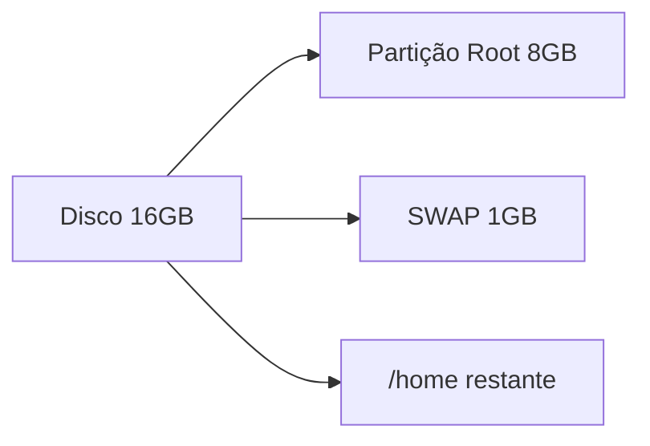
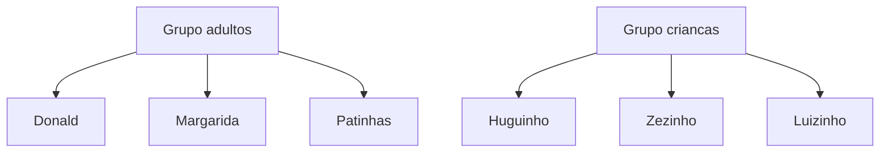
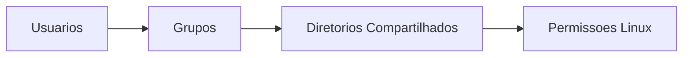

## Criação da máquina virtual

As configurações serão realizadas em uma máquina virtual criada no VirtualBox.

O sistema operacional utilizado será o Debian 32 bits.

### Especificações da máquina virtual

| Configuração  | Valor                 |
| ------------- | --------------------- |
| Memória RAM   | 512 MB                |
| Disco rígido  | 16 GB                 |
| Tipo de disco | VDI                   |
| Alocação      | Dinamicamente alocado |

---

## Fluxo do ambiente virtual


---

## Instalação da distribuição Linux Debian

Durante a instalação do Debian será necessário configurar o particionamento do disco.

O disco será dividido em três partições.

### Estrutura das partições

| Sistema de arquivos | Tipo de partição | Ponto de montagem | Tamanho         |
| ------------------- | ---------------- | ----------------- | --------------- |
| Ext4                | Primária         | `/`               | 8GB             |
| SWAP                | Lógica           | SWAP              | 1GB             |
| Ext4                | Lógica           | `/home`           | Espaço restante |

---

## Estrutura das partições



---

## Finalizando o particionamento

Após configurar as partições:

```text
Finalizar particionamento e escrever mudanças no disco
```

---

## Resultado esperado do particionamento


---

## Usuário principal do sistema

⚠️ Importante:

Durante a instalação do Debian, o nome do usuário deve ser:

```text
donald
```

Esse usuário será utilizado posteriormente nas configurações de cotas e permissões.

---

## Seleção de softwares

Na etapa de seleção de softwares, marque:

* Ambiente de área de trabalho Debian;
* Xfce;
* Utilitários de sistema padrão.

---

## Resultado da seleção de softwares


---

## Definição de cotas de armazenamento

Após finalizar a instalação do Debian, vamos configurar cotas de armazenamento para os usuários.

As cotas limitam o espaço em disco que cada usuário pode utilizar.

---

## Instalando quota

```bash
apt-get install quota
```

---

## Configurando `/etc/fstab`

Agora será necessário configurar onde o controle de cotas será aplicado.

Edite o arquivo:

```bash
nano /etc/fstab
```

Na linha referente ao ponto de montagem `/home`, adicione:

```text
,usrquota
```

logo após `defaults`.

---

## Resultado esperado do `/etc/fstab`


---

## Atualizando configurações de montagem

```bash
mount -o remount /home
```

---

## Inicializando cotas

```bash
quotacheck -cum /home
```

```bash
quotaon /home
```

---

## Definindo cotas do usuário modelo

Cada usuário terá:

| Tipo de cota | Valor |
| ------------ | ----- |
| Cota leve    | 1GB   |
| Cota rígida  | 1.1GB |

O usuário modelo será:

```text
donald
```

---

## Editando cotas do usuário

```bash
edquota -u donald
```

---

## Resultado esperado das cotas


---

## Verificando cotas

```bash
quota -s donald
```

---

## Configurando usuário padrão para cotas

Edite:

```bash
nano /etc/adduser.conf
```

Na linha:

```text
QUOTAUSER
```

adicione:

```text
donald
```

entre aspas.

---

## Resultado esperado da configuração


---

## Usuários e grupos

Agora serão criados novos usuários.

### Usuários

* margarida
* patinhas
* huguinho
* zezinho
* luizinho

---

## Criando usuários

```bash
adduser margarida
```

```bash
adduser patinhas
```

```bash
adduser huguinho
```

```bash
adduser zezinho
```

```bash
adduser luizinho
```

---

## Verificando cotas dos usuários

```bash
repquota -as
```

---

## Resultado do comando `repquota`


---

## Arquivo `/etc/passwd`

O arquivo `/etc/passwd` mostra os usuários criados.

### Editando arquivo

```bash
nano /etc/passwd
```

---

## Resultado do `/etc/passwd`


---

## Criando grupos

Serão criados os grupos:

* adultos;
* criancas.

---

## Criando grupos no sistema

```bash
addgroup adultos
```

```bash
addgroup criancas
```

---

## Divisão dos usuários

### Grupo adultos

* donald
* margarida
* patinhas

### Grupo criancas

* huguinho
* zezinho
* luizinho

---

## Adicionando usuários aos grupos

```bash
usermod -aG adultos donald
```

```bash
usermod -aG adultos margarida
```

```bash
usermod -aG adultos patinhas
```

```bash
usermod -aG criancas huguinho
```

```bash
usermod -aG criancas zezinho
```

```bash
usermod -aG criancas luizinho
```

---

## Fluxo de usuários e grupos



---

## Arquivo de grupos

```bash
nano /etc/groups
```

---

## Resultado dos grupos criados


---

## Verificando grupos dos usuários

```bash
groups <nome-do-usuario>
```

---

## Resultado do comando groups


---

## Diretórios compartilhados

Agora vamos configurar permissões de arquivos e diretórios compartilhados.

---

## Criando diretório compartilhado

```bash
mkdir compartilhado
```

---

## Entrando no diretório

```bash
cd compartilhado
```

---

## Criando diretórios dos grupos

```bash
mkdir adultos
```

```bash
mkdir criancas
```

---

## Associando grupos aos diretórios

```bash
chgrp adultos adultos
```

```bash
chgrp criancas criancas
```

---

## Permissões dos diretórios

| Diretório                 | Permissão                                                              |
| ------------------------- | ---------------------------------------------------------------------- |
| `/compartilhado/adultos`  | Apenas grupo adultos pode ler e escrever                               |
| `/compartilhado/criancas` | Grupo criancas pode ler e escrever; outros podem apenas ler e executar |

---

## Removendo permissões gerais

```bash
chmod a-rwx adultos
```

```bash
chmod a-rwx criancas
```

---

## Adicionando permissões para grupos

```bash
chmod g+rwx adultos
```

```bash
chmod g+rwx criancas
```

---

## Permissão extra para outros usuários

```bash
chmod o+rx criancas
```

---

## Verificando permissões

```bash
ls -l
```

---

## Resultado das permissões


---

## Fluxo de permissões



---

## Conclusão

Neste tutorial configuramos um ambiente Linux Debian completo utilizando máquina virtual.

Durante o processo foram praticados conceitos fundamentais de administração de sistemas Linux, incluindo:

* particionamento;
* gerenciamento de usuários;
* grupos;
* permissões;
* cotas de armazenamento;
* diretórios compartilhados.

Esses conceitos são amplamente utilizados em servidores Linux e ambientes corporativos.

Além de fortalecer conhecimentos em infraestrutura, esse tipo de laboratório também ajuda no aprendizado de segurança, administração de sistemas e ambientes multiusuário.

---

## Referências

* [https://www.debian.org/](https://www.debian.org/)
* [https://www.virtualbox.org/](https://www.virtualbox.org/)
* [https://wiki.debian.org/](https://wiki.debian.org/)
* [https://www.gnu.org/software/coreutils/](https://www.gnu.org/software/coreutils/)
