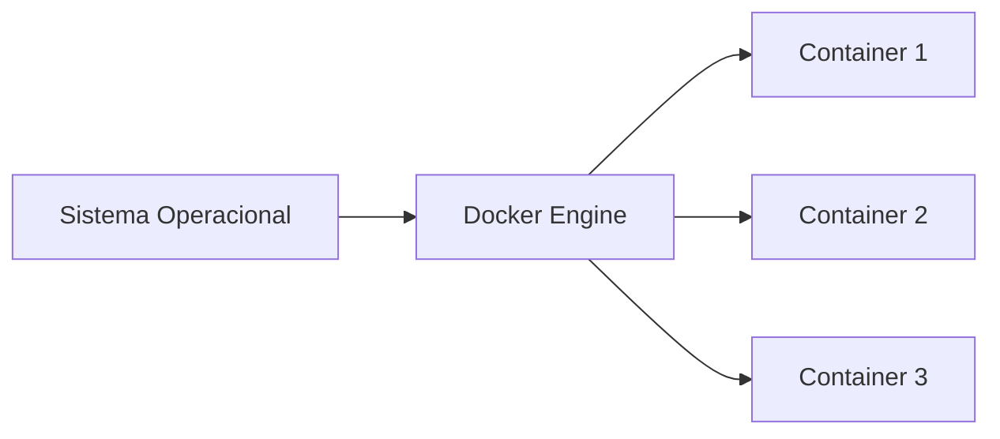

## O que é Docker?

Docker é uma plataforma de virtualização baseada em containers.

Os containers permitem executar aplicações em ambientes isolados, compartilhando o kernel do sistema operacional hospedeiro.

Isso torna os containers muito mais leves do que máquinas virtuais tradicionais.

### Docker e containers



---

## Instalação do Docker

### Debian/Ubuntu

```bash
su
apt-get update
apt-get install curl
curl -fsSL https://get.docker.com | bash
```

Documentação oficial:

* [https://docs.docker.com/engine/install/](https://docs.docker.com/engine/install/)

---

## Testando a instalação

Após instalar o Docker, podemos executar um container de teste.

```bash
docker container run -ti hello-world
```

Se tudo estiver correto, o Docker exibirá uma mensagem confirmando que o ambiente está funcionando.

---

## Conferindo a versão do Docker

```bash
docker version
```

---

## Containers

Containers são ambientes isolados utilizados para execução de aplicações.

Eles agrupam:

* bibliotecas;
* dependências;
* aplicações;
* arquivos de configuração.

### Executando um container CentOS

```bash
docker container run -ti centos
```

#### Explicando os parâmetros

| Parâmetro | Função                       |
| --------- | ---------------------------- |
| `run`     | Cria e executa um container  |
| `-t`      | Terminal interativo          |
| `-i`      | Mantém entrada padrão aberta |

---

## Acessando containers

### Attach

```bash
docker container attach id-container
```

O comando `attach` permite acessar um container já em execução.

---

### Exec

```bash
docker container exec -ti id-container ls /
```

O comando `exec` executa comandos dentro de um container já em execução.

---

## Containers em segundo plano

### Executando Nginx

```bash
docker container run -d nginx
```

O parâmetro `-d` executa o container em modo daemon (*background*).

---

## Fluxo básico do Docker


---

## Listando containers

### Containers ativos

```bash
docker container ls
```

---

### Todos os containers

```bash
docker container ls -a
```

---

## Inspecionando containers

```bash
docker container inspect id-container
```

---

## Estatísticas do container

```bash
docker container stats id-container
```

---

## Processos em execução

```bash
docker container top id-container
```

---

## Pause e unpause

### Pausando container

```bash
docker container pause id-container
```

---

### Retornando execução

```bash
docker container unpause id-container
```

---

## Start, stop e restart

### Parando container

```bash
docker container stop id-container
```

---

### Iniciando container

```bash
docker container start id-container
```

---

### Reiniciando container

```bash
docker container restart id-container
```

---

## Removendo containers

### Remoção simples

```bash
docker container rm id-container
```

---

### Remoção forçada

```bash
docker container rm -f id-container
```

---

## Limitação de recursos

### Memória

```bash
docker container run -d -m 128M nginx
```

---

### CPU

```bash
docker container run -d -m 128M --cpus 0.5 nginx
```

---

### Atualizando memória

```bash
docker container update --memory 64M id-container
```

---

### Atualizando CPU

```bash
docker container update --cpus 0.2 id-container
```

---

## Volumes

Volumes permitem persistir dados mesmo após remoção de containers.

Sem volumes, dados armazenados no container são perdidos.

---

## Criando volumes

```bash
docker volume create nome_volume
```

---

## Listando volumes

```bash
docker volume ls
```

---

## Inspecionando volumes

```bash
docker volume inspect nome_volume
```

---

## Bind mount

```bash
docker container run -ti \
--mount type=bind,src=documentos/projeto,dst=/projeto debian
```

---

## Volume mount

```bash
docker container run -ti \
--mount type=volume,src=nome_volume,dst=/projeto debian
```

---

## Persistência de dados


---

## Imagens Docker

Imagens funcionam como modelos para criação de containers.

Uma imagem pode conter:

* sistema base;
* dependências;
* bibliotecas;
* aplicações.

---

## Criando projeto Docker

```bash
mkdir projeto-docker
cd projeto-docker
nano Dockerfile
```

---

## Exemplo de Dockerfile

```Dockerfile
FROM debian

LABEL app="nome_app"
ENV Docker="nome_env"

RUN apt-get update && \
    apt-get install -y stress && \
    apt-get clean

CMD stress --cpu 1 --vm-bytes 64M --vm 1
```

---

## Build da imagem

```bash
docker image build -t nome_imagem:1.0 .
```

---

## Listando imagens

```bash
docker image ls
```

---

## Inspecionando imagens

```bash
docker image inspect id_image
```

---

## Removendo imagens

### Remoção simples

```bash
docker image rm id_image
```

---

### Remoção forçada

```bash
docker image rm -f id_image
```

---

## Dockerfile Apache

```Dockerfile
FROM debian

RUN apt-get update && \
    apt-get install -y apache2 && \
    apt-get clean

EXPOSE 80

CMD ["apachectl", "-D", "FOREGROUND"]
```

---

## Build da imagem Apache

```bash
docker image build -t meu_apache:1.0.0 .
```

---

## Executando Apache

```bash
docker container run -d -p 8080:80 meu_apache:1.0.0
```

---

## Mapeamento de portas


---

## Testando Apache

```bash
curl localhost:8080
```

---

## PostgreSQL com Docker

### Executando PostgreSQL

```bash
docker container run -d \
--name postgres \
-e POSTGRES_PASSWORD=123456 \
-p 5432:5432 \
postgres
```

---

### Acessando PostgreSQL

```bash
docker container exec -ti postgres bash
```

---

### Entrando no banco

```bash
psql -U postgres
```

---

## Docker Hub

Docker Hub é um repositório online de imagens.

---

## Login Docker Hub

```bash
docker login
```

---

## Tag da imagem

```bash
docker image tag id_image usuario/meu_apache:1.0.0
```

---

## Enviando imagem

```bash
docker push usuario/meu_apache:1.0.0
```

---

## Registry local

### Executando registry

```bash
docker container run -d \
-p 5000:5000 \
--restart=always \
--name registry \
registry:2
```

---

## Criando tag local

```bash
docker image tag imagem localhost:5000/minha_imagem
```

---

## Enviando imagem local

```bash
docker push localhost:5000/minha_imagem
```

---

## Backup de volumes

### Criando diretório

```bash
mkdir /opt/backup
```

---

### Criando backup

```bash
docker container run -ti \
--mount type=volume,src=dbdados,dst=/data \
--mount type=bind,src=/opt/backup/,dst=/backup \
debian tar -cvf /backup/bkp-banco.tar /data
```

---

## Removendo recursos não utilizados

### Containers parados

```bash
docker container prune
```

---

### Imagens não utilizadas

```bash
docker image prune
```

---

### Volumes não utilizados

```bash
docker volume prune
```

---

### Limpeza geral

```bash
docker system prune
```

---

## Vantagens do Docker

Docker trouxe diversas vantagens para desenvolvimento moderno.

| Vantagem       | Descrição                        |
| -------------- | -------------------------------- |
| Portabilidade  | Funciona em diferentes ambientes |
| Isolamento     | Containers independentes         |
| Escalabilidade | Fácil replicação                 |
| Deploy rápido  | Inicialização rápida             |
| Padronização   | Ambientes consistentes           |
| DevOps         | Integração contínua facilitada   |

---

## Docker vs máquinas virtuais

| Docker                | Máquina Virtual              |
| --------------------- | ---------------------------- |
| Compartilha kernel    | Sistema operacional completo |
| Mais leve             | Mais pesada                  |
| Inicialização rápida  | Inicialização lenta          |
| Menor consumo         | Maior consumo                |
| Escalabilidade rápida | Mais isolamento              |

---

## Quando utilizar Docker?

Docker é muito utilizado para:

* desenvolvimento local;
* microsserviços;
* CI/CD;
* ambientes de testes;
* aplicações em nuvem;
* automação de deploy.

---

## Conclusão

Docker se tornou uma das ferramentas mais importantes da computação moderna.

Através dos containers, é possível criar ambientes leves, isolados e portáveis para desenvolvimento e deploy de aplicações.

Além de facilitar testes e distribuição de software, Docker também contribui para automação, escalabilidade e integração entre equipes.

Compreender conceitos como containers, imagens, volumes e Dockerfiles é essencial para trabalhar com DevOps, cloud computing e infraestrutura moderna.

---

## Referências

* [https://docs.docker.com/](https://docs.docker.com/)
* [https://hub.docker.com/](https://hub.docker.com/)
* [https://docs.docker.com/engine/install/](https://docs.docker.com/engine/install/)
