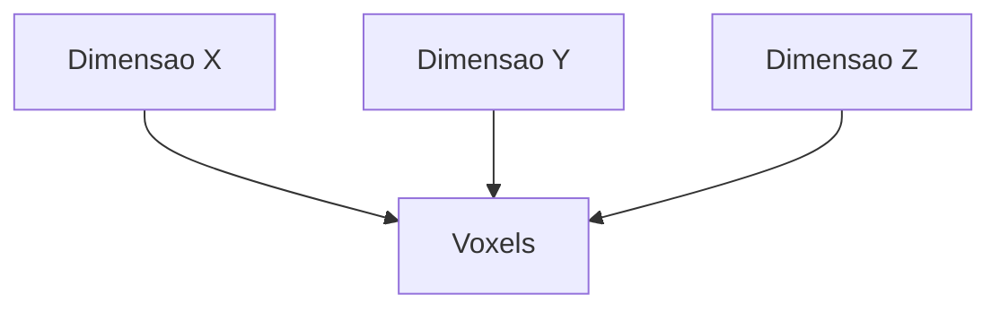
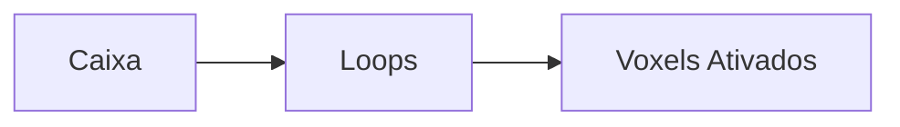
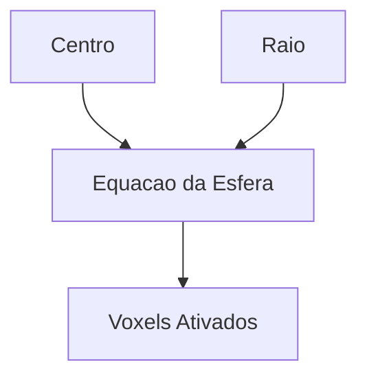
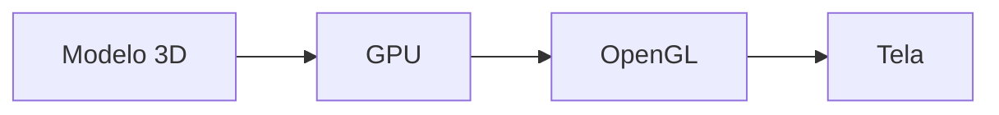

---

date: 2025-10-05
lastmod: 2025-05-12
showTableOfContents: true
tags: ["C++", "OpenGL", "computação gráfica", "3D", "tutorial"]
title: "Criando um escultor 3D em C++: introdução à computação gráfica"
description: "Aprenda conceitos fundamentais de computação gráfica criando um escultor 3D utilizando C++."
type: "post"
------------

# Criando um escultor 3D em C++: introdução à computação gráfica

Computação gráfica é uma área fascinante da computação responsável pela criação e manipulação de imagens digitais.

Grande parte das aplicações modernas de gráficos 3D depende de conceitos como:

* geometria computacional;
* renderização;
* modelagem tridimensional;
* processamento gráfico;
* manipulação de matrizes.

Neste tutorial vamos explorar conceitos fundamentais de modelagem 3D implementando um pequeno sistema de escultura digital em C++.

O objetivo é entender:

* voxels;
* modelagem volumétrica;
* manipulação de objetos 3D;
* geração de arquivos OFF;
* estruturação de projetos gráficos.

---

# O que é um escultor 3D?

Um escultor 3D é uma aplicação capaz de criar objetos tridimensionais a partir da manipulação de pequenos blocos chamados voxels.

Esses sistemas funcionam de forma semelhante a programas de modelagem volumétrica.

---

# O que são voxels?

Voxels (*volumetric pixels*) representam unidades cúbicas em um espaço tridimensional.

Enquanto imagens 2D utilizam pixels, ambientes 3D podem utilizar voxels.

## Comparação

| Estrutura | Dimensão |
| --------- | -------- |
| Pixel     | 2D       |
| Voxel     | 3D       |

---

# Representação espacial


---

# Estrutura do projeto

Uma abordagem comum é criar uma matriz tridimensional de voxels.

## Exemplo conceitual

```cpp
Voxel ***v;
```

Cada posição da matriz representa um pequeno bloco no espaço.

---

# Criando a estrutura Voxel

Primeiro criamos uma estrutura responsável por armazenar informações do voxel.

## Exemplo

```cpp
struct Voxel {
    float r, g, b;
    float a;
    bool isOn;
};
```

---

# Explicando os atributos

| Atributo | Objetivo                     |
| -------- | ---------------------------- |
| r        | Cor vermelha                 |
| g        | Cor verde                    |
| b        | Cor azul                     |
| a        | Transparência                |
| isOn     | Indica se o voxel está ativo |

---

# Criando a classe Sculptor

A classe principal será responsável por controlar o espaço tridimensional.

## Estrutura inicial

```cpp
class Sculptor {
private:
    Voxel ***v;
    int nx, ny, nz;

public:
    Sculptor(int nx, int ny, int nz);
    ~Sculptor();
};
```

---

# Entendendo a matriz 3D

A matriz tridimensional representa o volume da escultura.

## Fluxo simplificado



---

# Criando o construtor

O construtor será responsável por alocar dinamicamente os voxels.

## Exemplo

```cpp
Sculptor::Sculptor(int nx, int ny, int nz){
    this->nx = nx;
    this->ny = ny;
    this->nz = nz;
}
```

---

# Alocação dinâmica

Como estamos trabalhando com uma estrutura tridimensional, normalmente utilizamos alocação dinâmica de memória.

## Exemplo simplificado

```cpp
v = new Voxel**[nx];
```

---

# Destrutor

O destrutor é importante para liberar memória.

## Exemplo

```cpp
Sculptor::~Sculptor(){
    // liberar memoria
}
```

---

# Ativando voxels

Agora precisamos criar funções capazes de ativar voxels.

## Exemplo

```cpp
void putVoxel(int x, int y, int z);
```

---

# Implementando putVoxel

```cpp
void Sculptor::putVoxel(int x, int y, int z){
    v[x][y][z].isOn = true;
}
```

---

# Desativando voxels

Também podemos remover voxels.

## Exemplo

```cpp
void cutVoxel(int x, int y, int z){
    v[x][y][z].isOn = false;
}
```

---

# Trabalhando com cores

Uma função útil é permitir alteração das cores atuais.

## Exemplo

```cpp
void setColor(float r, float g, float b, float alpha);
```

---

# Implementação simplificada

```cpp
void Sculptor::setColor(float r, float g, float b, float alpha){
    this->r = r;
    this->g = g;
    this->b = b;
    this->a = alpha;
}
```

---

# Criando formas geométricas

Depois de manipular voxels individuais, podemos criar formas maiores.

## Exemplos

* caixas;
* esferas;
* elipsoides.

---

# Criando caixas

## Assinatura

```cpp
void putBox(int x0, int x1, int y0, int y1, int z0, int z1);
```

---

# Fluxo da criação de caixas



---

# Exemplo simplificado

```cpp
for(int i=x0; i<x1; i++){
    for(int j=y0; j<y1; j++){
        for(int k=z0; k<z1; k++){
            putVoxel(i,j,k);
        }
    }
}
```

---

# Criando esferas

Também podemos gerar esferas utilizando equações matemáticas.

## Assinatura

```cpp
void putSphere(int xcenter, int ycenter, int zcenter, int radius);
```

---

# Equação da esfera

A esfera pode ser definida pela equação:

$$
(x - x_c)^2 + (y - y_c)^2 + (z - z_c)^2 = r^2
$$

---

# Fluxo de geração da esfera



---

# Exportando modelos 3D

Depois da modelagem, precisamos exportar o objeto.

Um formato bastante utilizado em projetos acadêmicos é o OFF (*Object File Format*).

---

# Estrutura do arquivo OFF

```text
OFF
numero_vertices numero_faces numero_arestas
```

---

# Fluxo de exportação


---

# Visualização dos modelos

Após exportar o arquivo OFF, podemos abrir o modelo em visualizadores 3D.

## Exemplos

* MeshLab;
* Blender;
* ferramentas acadêmicas.

---

# Conceitos importantes aprendidos

Projetos desse tipo ajudam bastante no aprendizado de:

* programação orientada a objetos;
* alocação dinâmica;
* matrizes tridimensionais;
* geometria computacional;
* renderização;
* manipulação de arquivos.

---

# Possíveis melhorias

Depois da implementação básica, várias melhorias podem ser adicionadas.

## Exemplos

* interface gráfica;
* integração com OpenGL;
* iluminação;
* texturas;
* câmera 3D;
* shaders;
* exportação para outros formatos.

---

# OpenGL e renderização em tempo real

Uma evolução natural do projeto seria integrar OpenGL para renderizar os objetos em tempo real.

## Pipeline gráfico simplificado



---

# Conclusão

Criar um escultor 3D é uma ótima forma de estudar computação gráfica.

Mesmo sendo um projeto acadêmico relativamente simples, ele ajuda a compreender conceitos extremamente importantes relacionados a:

* geometria;
* renderização;
* modelagem;
* manipulação espacial;
* estruturas tridimensionais.

Além disso, projetos desse tipo ajudam bastante no desenvolvimento de raciocínio matemático e arquitetural.

Com o avanço de GPUs e aplicações gráficas, computação gráfica continua sendo uma das áreas mais fascinantes da computação moderna.

---

# Referências

* [https://agostinhobritojr.github.io/curso/progav-dca3303/escultor.html](https://agostinhobritojr.github.io/curso/progav-dca3303/escultor.html)
* [https://github.com/MariaCarolinass/escultor3D](https://github.com/MariaCarolinass/escultor3D)
* [https://learnopengl.com/](https://learnopengl.com/)
* [https://www.opengl.org/](https://www.opengl.org/)
* [https://www.khronos.org/opengl/](https://www.khronos.org/opengl/)
