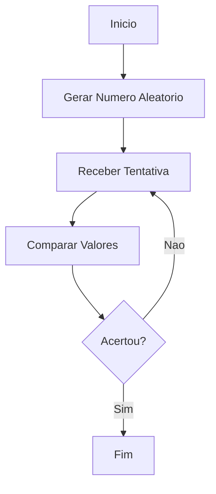
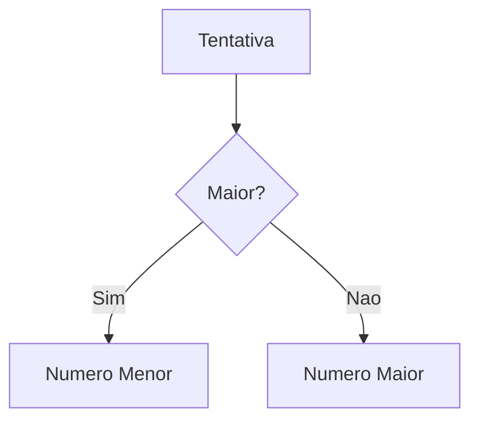
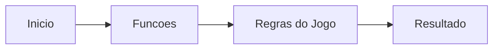

---

date: 2024-04-26
lastmod: 2024-04-26
showTableOfContents: true
tags: ["Python", "programação", "jogos", "lógica", "tutorial"]
title: "Criando um jogo da adivinhação em Python: aprendendo lógica de programação"
description: "Aprenda conceitos fundamentais de programação criando um jogo da adivinhação utilizando Python."
type: "post"
------------

## Criando um jogo da adivinhação em Python: aprendendo lógica de programação

Projetos simples são uma das melhores formas de aprender programação.

Mesmo aplicações pequenas ajudam bastante no entendimento de:

* lógica;
* estruturas condicionais;
* loops;
* entrada e saída de dados;
* organização de código.

Neste tutorial vamos criar um jogo da adivinhação utilizando Python.

O objetivo é desenvolver uma aplicação simples onde o jogador tenta descobrir um número aleatório gerado pelo sistema.

---

## O que vamos aprender?

Durante o projeto vamos explorar conceitos importantes como:

* variáveis;
* funções;
* condicionais;
* loops;
* números aleatórios;
* tratamento básico de entrada.

---

## Como funciona o jogo?

O sistema irá:

1. gerar um número aleatório;
2. pedir tentativas ao jogador;
3. informar se o número é maior ou menor;
4. encerrar quando o jogador acertar.

---

## Fluxo do jogo



---

## Instalando o Python

Antes de começar, é necessário ter o Python instalado.

### Verificando instalação

```bash
python --version
```

---

## Criando o arquivo do jogo

Crie um arquivo chamado:

```text
jogo.py
```

---

## Importando bibliotecas

Vamos utilizar o módulo `random` para gerar números aleatórios.

### Exemplo

```python
import random
```

---

## Gerando um número aleatório

Agora podemos gerar um número entre 1 e 100.

### Exemplo

```python
numero_secreto = random.randint(1, 100)
```

---

## O que é randint?

A função `randint()` gera um número inteiro aleatório dentro de um intervalo.

### Estrutura

```python
random.randint(inicio, fim)
```

---

## Recebendo entrada do usuário

Agora precisamos permitir que o jogador faça tentativas.

### Exemplo

```python
tentativa = input('Digite um número: ')
```

---

## Convertendo valores

A função `input()` retorna texto.

Por isso, precisamos converter para inteiro.

### Exemplo

```python
tentativa = int(input('Digite um número: '))
```

---

## Estruturas condicionais

Agora precisamos comparar a tentativa com o número secreto.

### Exemplo

```python
if tentativa == numero_secreto:
    print('Você acertou!')
```

---

## Comparando valores

Também podemos informar se o número é maior ou menor.

### Exemplo

```python
if tentativa > numero_secreto:
    print('O número é menor')
else:
    print('O número é maior')
```

---

## Fluxo de comparação



---

## Loops

Precisamos repetir as tentativas até o jogador acertar.

Para isso utilizamos loops.

### Exemplo com while

```python
while tentativa != numero_secreto:
    print('Tente novamente')
```

---

## Estrutura completa do loop

```python
while tentativa != numero_secreto:
    tentativa = int(input('Digite um número: '))
```

---

## Código completo

### Exemplo funcional

```python
import random

numero_secreto = random.randint(1, 100)

tentativa = 0

while tentativa != numero_secreto:
    tentativa = int(input('Digite um número: '))

    if tentativa == numero_secreto:
        print('Você acertou!')
    elif tentativa > numero_secreto:
        print('O número é menor')
    else:
        print('O número é maior')
```

---

## Executando o jogo

### Comando

```bash
python jogo.py
```

---

## Melhorando o jogo

Depois da versão inicial, podemos adicionar novas funcionalidades.

### Exemplos

* níveis de dificuldade;
* limite de tentativas;
* pontuação;
* interface gráfica;
* sons;
* multiplayer.

---

## Adicionando dificuldade

### Exemplo

```python
nivel = input('Escolha: fácil, médio ou difícil: ')
```

---

## Limitando tentativas

```python
for i in range(5):
    print('Tentativa')
```

---

## Trabalhando com funções

Uma boa prática é separar responsabilidades utilizando funções.

### Exemplo

```python
def jogar():
    print('Iniciando jogo')
```

---

## Organização do código



---

## Tratando erros

Usuários podem digitar valores inválidos.

### Exemplo

```python
try:
    tentativa = int(input('Digite um número: '))
except:
    print('Valor inválido')
```

---

## Conceitos importantes aprendidos

Mesmo um projeto simples ajuda bastante no aprendizado de:

* lógica de programação;
* estruturas condicionais;
* loops;
* funções;
* entrada e saída de dados;
* organização de código.

---

## Jogos simples e aprendizado

Projetos pequenos são extremamente importantes para iniciantes.

Eles ajudam a desenvolver:

* raciocínio lógico;
* resolução de problemas;
* entendimento de fluxo;
* prática de programação.

Além disso, jogos tornam o aprendizado mais divertido e interativo.

---

## Possíveis evoluções

Depois da versão inicial, várias melhorias podem ser adicionadas.

### Algumas ideias

* interface gráfica com Tkinter;
* ranking de jogadores;
* sistema de pontuação;
* modo multiplayer;
* salvamento de partidas.

---

## Conclusão

Criar um jogo da adivinhação é uma ótima forma de começar a aprender programação.

Mesmo sendo um projeto simples, ele ajuda a compreender conceitos extremamente importantes relacionados a:

* lógica;
* loops;
* condicionais;
* funções;
* interação com usuário.

Além disso, pequenos jogos ajudam bastante no desenvolvimento de raciocínio computacional.

Com o tempo, projetos simples como esse podem evoluir para aplicações muito maiores e mais complexas.

---

## Referências

* [https://docs.python.org/3/library/random.html](https://docs.python.org/3/library/random.html)
* [https://docs.python.org/3/tutorial/](https://docs.python.org/3/tutorial/)
* [https://github.com/MariaCarolinass/jogodaadivinhacao](https://github.com/MariaCarolinass/jogodaadivinhacao)
