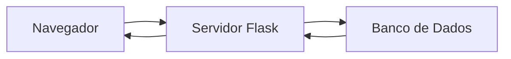
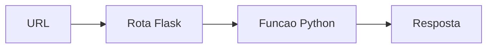
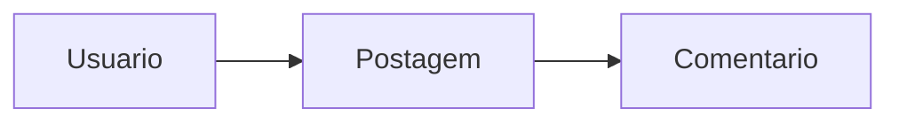
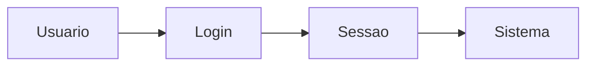
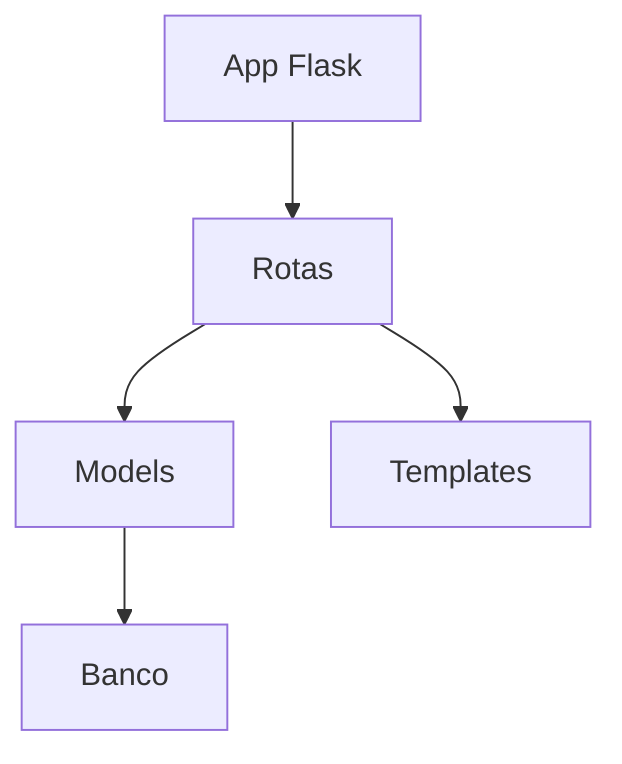

## O que é Flask?

Flask é um microframework web para Python.

Ele é bastante utilizado em:

* APIs;
* aplicações web;
* protótipos;
* sistemas acadêmicos;
* automação.

Uma das principais vantagens do Flask é sua simplicidade.

---

## Arquitetura básica de aplicações web

Aplicações web normalmente funcionam através da comunicação entre cliente e servidor.

### Fluxo simplificado



---

## Instalando o Flask

Primeiro, instale o Flask utilizando o pip.

### Comando

```bash
pip install flask
```

---

## Criando a estrutura do projeto

Uma organização simples para aplicações Flask pode ser:

```text
project/
├── app.py
├── templates/
├── static/
├── models/
├── routes/
├── forms/
└── database/
```

---

## Criando a aplicação Flask

Agora vamos criar o arquivo principal.

### app.py

```python
from flask import Flask

app = Flask(__name__)

@app.route('/')
def home():
    return 'Mini Twitter'

if __name__ == '__main__':
    app.run(debug=True)
```

---

## Executando a aplicação

### Comando

```bash
python app.py
```

Depois disso, o servidor ficará disponível em:

```text
http://127.0.0.1:5000
```

---

## O que são rotas?

Rotas definem quais funções serão executadas quando determinadas URLs forem acessadas.

### Exemplo

```python
@app.route('/perfil')
def perfil():
    return 'Página de perfil'
```

---

## Fluxo de rotas



---

## Templates HTML

O Flask utiliza o mecanismo Jinja2 para renderização de páginas HTML.

Os arquivos ficam normalmente dentro da pasta:

```text
templates/
```

---

## Criando um template

### templates/index.html

```html
<!DOCTYPE html>
<html>
<head>
    <title>Mini Twitter</title>
</head>
<body>
    <h1>Mini Twitter</h1>
</body>
</html>
```

---

## Renderizando templates

```python
from flask import render_template

@app.route('/')
def home():
    return render_template('index.html')
```

---

## Banco de dados

Aplicações sociais normalmente precisam armazenar:

* usuários;
* posts;
* comentários;
* seguidores.

Uma abordagem comum em Flask é utilizar SQLAlchemy.

---

## Instalando SQLAlchemy

```bash
pip install flask-sqlalchemy
```

---

## Criando modelos

Modelos representam tabelas do banco de dados.

### Exemplo

```python
from flask_sqlalchemy import SQLAlchemy

_db = SQLAlchemy()

class User(_db.Model):
    id = _db.Column(_db.Integer, primary_key=True)
    username = _db.Column(_db.String(80))
```

---

## Relacionamento entre entidades

Em redes sociais, entidades normalmente possuem relacionamentos.

### Exemplo simplificado



---

## CRUD

Grande parte das aplicações web utiliza operações CRUD.

| Operação | Objetivo        |
| -------- | --------------- |
| Create   | Criar dados     |
| Read     | Ler dados       |
| Update   | Atualizar dados |
| Delete   | Remover dados   |

---

## Criando postagens

Uma funcionalidade básica é permitir publicação de posts.

### Exemplo de rota

```python
@app.route('/postar')
def postar():
    return 'Nova postagem'
```

---

## Formulários

Aplicações web normalmente utilizam formulários HTML.

### Exemplo

```html
<form method="POST">
    <textarea name="mensagem"></textarea>
    <button type="submit">Postar</button>
</form>
```

---

## Recebendo dados no Flask

```python
from flask import request

@app.route('/postar', methods=['POST'])
def postar():
    mensagem = request.form['mensagem']
```

---

## Autenticação de usuários

Uma rede social normalmente precisa controlar login.

### Fluxo simplificado



---

## Sessões

Sessões permitem manter usuários autenticados.

### Exemplo

```python
from flask import session

session['usuario'] = 'maria'
```

---

## Arquivos estáticos

Arquivos CSS e imagens normalmente ficam dentro de:

```text
static/
```

---

## CSS básico

### static/style.css

```css
body {
    font-family: Arial;
}
```

---

## Melhorando organização

Projetos Flask crescem rapidamente.

Por isso, separar responsabilidades é importante.

### Estrutura modular

```text
project/
├── routes/
├── services/
├── models/
├── templates/
├── static/
└── forms/
```

---

## Blueprint no Flask

Blueprints ajudam a modularizar aplicações.

### Exemplo

```python
from flask import Blueprint

usuarios = Blueprint('usuarios', __name__)
```

---

## Fluxo modular



---

## Segurança básica

Mesmo aplicações simples precisam de cuidados.

### Alguns pontos importantes

* hash de senha;
* validação de formulários;
* controle de sessão;
* proteção CSRF;
* tratamento de erros.

---

## Deploy

Depois da aplicação pronta, podemos realizar deploy.

### Opções comuns

* Render;
* Railway;
* Heroku;
* GitHub Pages.

---

## Possíveis melhorias

Depois da versão inicial, várias funcionalidades podem ser adicionadas.

### Exemplos

* curtidas;
* seguidores;
* upload de imagens;
* API REST;
* notificações;
* feed em tempo real.

---

## O que aprendemos?

Projetos de redes sociais ajudam bastante no aprendizado de:

* arquitetura web;
* backend;
* banco de dados;
* autenticação;
* CRUD;
* integração frontend/backend.

Além disso, são ótimos projetos para praticar organização de aplicações reais.

---

## Conclusão

Criar um mini Twitter é uma ótima forma de estudar desenvolvimento web.

Mesmo aplicações relativamente simples ajudam a compreender conceitos extremamente importantes relacionados a:

* rotas;
* templates;
* banco de dados;
* autenticação;
* arquitetura backend.

Além disso, projetos desse tipo servem como excelente base para aplicações maiores.

Com o crescimento do desenvolvimento web moderno, compreender como aplicações funcionam internamente continua sendo uma habilidade muito importante.

---

## Referências

* [https://flask.palletsprojects.com/](https://flask.palletsprojects.com/)
* [https://jinja.palletsprojects.com/](https://jinja.palletsprojects.com/)
* [https://www.sqlalchemy.org/](https://www.sqlalchemy.org/)
* [https://github.com/MariaCarolinass/Mini-Twitter](https://github.com/MariaCarolinass/Mini-Twitter)
